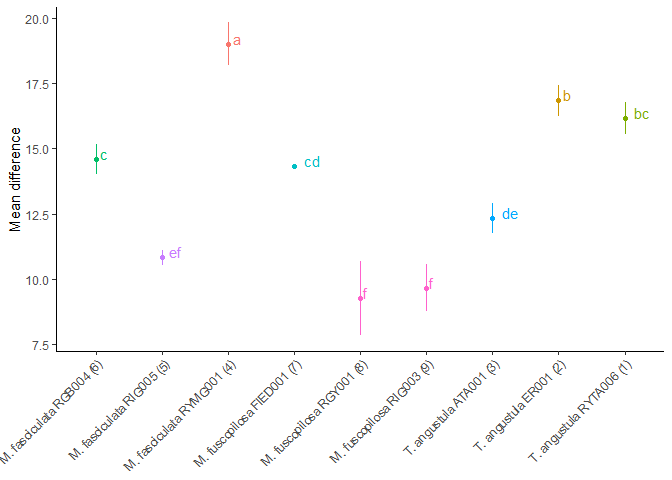
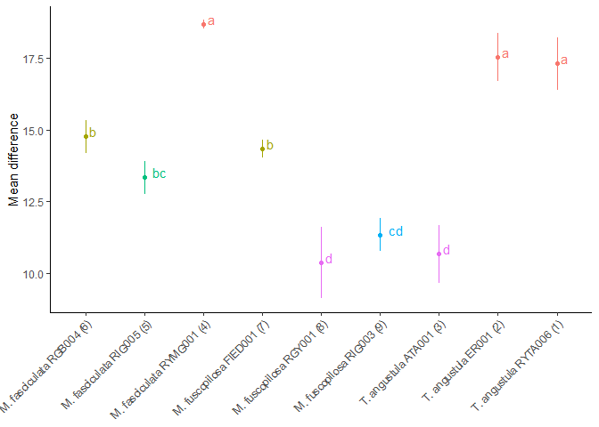

Chemical characterization of volatile compounds and biological activity
of stingless bee honeys from the Ecuadorian Amazon using Headspace Gas
Chromatography-Mass Spectrometry - Statistics of antimicrobial activity
================
Jefferson Pastuña
2025-06-17

- <a href="#introduction" id="toc-introduction">Introduction</a>
- <a href="#before-to-start" id="toc-before-to-start">Before to start</a>
- <a href="#data-normality-test" id="toc-data-normality-test">Data
  normality test</a>
- <a href="#data-homoscedasticity-test"
  id="toc-data-homoscedasticity-test">Data homoscedasticity test</a>
- <a href="#parametric-statistical-test"
  id="toc-parametric-statistical-test">Parametric statistical test</a>
  - <a href="#anova-test" id="toc-anova-test">ANOVA test</a>
  - <a href="#tukey-test" id="toc-tukey-test">Tukey test</a>
- <a href="#nonparametric-statistical-test"
  id="toc-nonparametric-statistical-test">Nonparametric statistical
  test</a>
  - <a href="#kruskal-wallis-test"
    id="toc-kruskal-wallis-test">Kruskal-Wallis test</a>
  - <a href="#dunn-test" id="toc-dunn-test">Dunn test</a>

# Introduction

Description…

# Before to start

Description…

# Data normality test

First, the antimicrobial data normality was evaluated using the
Shapiro-Wilk test.

``` r
# Loading the "readxl" package
library(readxl)
# Loading the antimicrobial activity data
all_bacteria <- read_excel("Data/Antimicrobial_of_honey.xlsx", sheet = 2)
# Deleting the group column to perform Shapiro-Wilk test in batch
no_group <- all_bacteria[,-1]
# Perform the Shapiro-Wilk test
shapiro <- do.call(rbind, lapply(no_group,
                                 function(x) shapiro.test(x)[c("statistic", "p.value")]))
shapiro
```

    ##                 statistic p.value     
    ## E_coli_100      0.8894981 0.007754756 
    ## E_coli_75       0.910591  0.0235632   
    ## K_pneumonia_50  0.9506033 0.2217358   
    ## K_pneumonia_75  0.9520331 0.2400907   
    ## K_pneumonia_100 0.8965943 0.01118818  
    ## P_mirabilis_50  0.9317354 0.07623142  
    ## P_mirabilis_75  0.9404336 0.1248864   
    ## P_mirabilis_100 0.9253929 0.05333025  
    ## S_aureus_25     0.7805308 6.412762e-05
    ## S_aureus_50     0.8894501 0.007735745 
    ## S_aureus_75     0.8934946 0.009524042 
    ## S_aureus_100    0.896372  0.01105921

# Data homoscedasticity test

Second, the antimicrobial data homoscedasticity was evaluated using the
Bartlett test.

``` r
cols_aa <- names(all_bacteria)[2:ncol(all_bacteria)]
# Perform the Bartlett test test
bartlett <- lapply(cols_aa,
                   function(x) bartlett.test(reformulate("Group", x), data = all_bacteria))
bartlett
```

    ## [[1]]
    ## 
    ##  Bartlett test of homogeneity of variances
    ## 
    ## data:  E_coli_100 by Group
    ## Bartlett's K-squared = Inf, df = 8, p-value < 2.2e-16
    ## 
    ## 
    ## [[2]]
    ## 
    ##  Bartlett test of homogeneity of variances
    ## 
    ## data:  E_coli_75 by Group
    ## Bartlett's K-squared = Inf, df = 8, p-value < 2.2e-16
    ## 
    ## 
    ## [[3]]
    ## 
    ##  Bartlett test of homogeneity of variances
    ## 
    ## data:  K_pneumonia_50 by Group
    ## Bartlett's K-squared = Inf, df = 8, p-value < 2.2e-16
    ## 
    ## 
    ## [[4]]
    ## 
    ##  Bartlett test of homogeneity of variances
    ## 
    ## data:  K_pneumonia_75 by Group
    ## Bartlett's K-squared = Inf, df = 8, p-value < 2.2e-16
    ## 
    ## 
    ## [[5]]
    ## 
    ##  Bartlett test of homogeneity of variances
    ## 
    ## data:  K_pneumonia_100 by Group
    ## Bartlett's K-squared = Inf, df = 8, p-value < 2.2e-16
    ## 
    ## 
    ## [[6]]
    ## 
    ##  Bartlett test of homogeneity of variances
    ## 
    ## data:  P_mirabilis_50 by Group
    ## Bartlett's K-squared = Inf, df = 8, p-value < 2.2e-16
    ## 
    ## 
    ## [[7]]
    ## 
    ##  Bartlett test of homogeneity of variances
    ## 
    ## data:  P_mirabilis_75 by Group
    ## Bartlett's K-squared = 11.854, df = 8, p-value = 0.1578
    ## 
    ## 
    ## [[8]]
    ## 
    ##  Bartlett test of homogeneity of variances
    ## 
    ## data:  P_mirabilis_100 by Group
    ## Bartlett's K-squared = 7.6566, df = 8, p-value = 0.4677
    ## 
    ## 
    ## [[9]]
    ## 
    ##  Bartlett test of homogeneity of variances
    ## 
    ## data:  S_aureus_25 by Group
    ## Bartlett's K-squared = Inf, df = 8, p-value < 2.2e-16
    ## 
    ## 
    ## [[10]]
    ## 
    ##  Bartlett test of homogeneity of variances
    ## 
    ## data:  S_aureus_50 by Group
    ## Bartlett's K-squared = 14.086, df = 8, p-value = 0.07954
    ## 
    ## 
    ## [[11]]
    ## 
    ##  Bartlett test of homogeneity of variances
    ## 
    ## data:  S_aureus_75 by Group
    ## Bartlett's K-squared = 4.4201, df = 8, p-value = 0.8174
    ## 
    ## 
    ## [[12]]
    ## 
    ##  Bartlett test of homogeneity of variances
    ## 
    ## data:  S_aureus_100 by Group
    ## Bartlett's K-squared = Inf, df = 8, p-value < 2.2e-16

The result showed that only the microorganism *P. mirabilis* at 75 and
100 % v/v have a normal distribution (Shapiro-Wilk test p-value \> 0.05)
and equality of variance (Bartlett test p-value \> 0.05). Therefore, the
parametric statistical test was performed on the *P. mirabilis* data,
and nonparametric tests were performed on the rest of the data.

# Parametric statistical test

For statistical analysis of *P. mirabilis* at 75 and 100 % v/v, the
analysis of variance ANOVA and Tukey’s honest significant difference
(HSD) test were used.

## ANOVA test

``` r
# ANOVA test of P. mirabilis at 75 % v/v
oneway.test(all_bacteria$P_mirabilis_75 ~ all_bacteria$Group,
            data = all_bacteria, var.equal = TRUE)
```

    ## 
    ##  One-way analysis of means
    ## 
    ## data:  all_bacteria$P_mirabilis_75 and all_bacteria$Group
    ## F = 62.017, num df = 8, denom df = 18, p-value = 1.579e-11

``` r
# ANOVA test of P. mirabilis at 100 % v/v
oneway.test(all_bacteria$P_mirabilis_100 ~ all_bacteria$Group,
            data = all_bacteria, var.equal = TRUE)
```

    ## 
    ##  One-way analysis of means
    ## 
    ## data:  all_bacteria$P_mirabilis_100 and all_bacteria$Group
    ## F = 49.616, num df = 8, denom df = 18, p-value = 1.062e-10

The ANOVA test showed that the antimicrobial activity of honey from
three different bee species collected from three different colonies was
significantly different.

## Tukey test

The Tukey test was performed to inspect which groups have significantly
different means.

``` r
# "agricolae" package installation and library loadding
#install.packages("agricolae", repos = "https://cran.r-project.org")
library(agricolae)
# Loading the "ggplot2" package
library(ggplot2)
# Tukey test of P. mirabilis at 75 % v/v
modelo_pm75 <- aov(all_bacteria$P_mirabilis_75 ~ all_bacteria$Group,
                  data = all_bacteria)
tukey_pm75 <- HSD.test(modelo_pm75, "all_bacteria$Group",
                       group = TRUE, console = TRUE)
```

    ## 
    ## Study: modelo_pm75 ~ "all_bacteria$Group"
    ## 
    ## HSD Test for all_bacteria$P_mirabilis_75 
    ## 
    ## Mean Square Error:  0.5514815 
    ## 
    ## all_bacteria$Group,  means
    ## 
    ##                            all_bacteria.P_mirabilis_75        std r        se
    ## M. fasciculata RGB004 (6)                    14.600000 0.81853528 3 0.4287507
    ## M. fasciculata RIG005 (5)                    10.833333 0.57735027 3 0.4287507
    ## M. fasciculata RYMG001 (4)                   19.000000 0.60827625 3 0.4287507
    ## M. fuscopilosa FIED001 (7)                   14.333333 0.57735027 3 0.4287507
    ## M. fuscopilosa RGY001 (8)                     9.266667 0.05773503 3 0.4287507
    ## M. fuscopilosa RIG003 (9)                     9.666667 0.57735027 3 0.4287507
    ## T. angustula ATA001 (3)                      12.333333 0.28867513 3 0.4287507
    ## T. angustula ER001 (2)                       16.833333 0.90184995 3 0.4287507
    ## T. angustula RYTA006 (1)                     16.166667 1.42243922 3 0.4287507
    ##                             Min  Max   Q25  Q50   Q75
    ## M. fasciculata RGB004 (6)  13.9 15.5 14.15 14.4 14.95
    ## M. fasciculata RIG005 (5)  10.5 11.5 10.50 10.5 11.00
    ## M. fasciculata RYMG001 (4) 18.3 19.4 18.80 19.3 19.35
    ## M. fuscopilosa FIED001 (7) 14.0 15.0 14.00 14.0 14.50
    ## M. fuscopilosa RGY001 (8)   9.2  9.3  9.25  9.3  9.30
    ## M. fuscopilosa RIG003 (9)   9.0 10.0  9.50 10.0 10.00
    ## T. angustula ATA001 (3)    12.0 12.5 12.25 12.5 12.50
    ## T. angustula ER001 (2)     15.9 17.7 16.40 16.9 17.30
    ## T. angustula RYTA006 (1)   15.2 17.8 15.35 15.5 16.65
    ## 
    ## Alpha: 0.05 ; DF Error: 18 
    ## Critical Value of Studentized Range: 4.955209 
    ## 
    ## Minimun Significant Difference: 2.124549 
    ## 
    ## Treatments with the same letter are not significantly different.
    ## 
    ##                            all_bacteria$P_mirabilis_75 groups
    ## M. fasciculata RYMG001 (4)                   19.000000      a
    ## T. angustula ER001 (2)                       16.833333      b
    ## T. angustula RYTA006 (1)                     16.166667     bc
    ## M. fasciculata RGB004 (6)                    14.600000      c
    ## M. fuscopilosa FIED001 (7)                   14.333333     cd
    ## T. angustula ATA001 (3)                      12.333333     de
    ## M. fasciculata RIG005 (5)                    10.833333     ef
    ## M. fuscopilosa RIG003 (9)                     9.666667      f
    ## M. fuscopilosa RGY001 (8)                     9.266667      f

``` r
# Plotting result
ggplot(tukey_pm75$groups,
                   aes(rownames(tukey_pm75[["groups"]]),
                       tukey_pm75$groups$`all_bacteria$P_mirabilis_75`,
                       color = tukey_pm75[["groups"]][["groups"]],
                       label = tukey_pm75[["groups"]][["groups"]])) +
  geom_point() +
  geom_text(hjust = -0.6, vjust = 0) +
  geom_errorbar(aes(ymin = tukey_pm75$groups$`all_bacteria$P_mirabilis_75`-tukey_pm75[["means"]][["std"]],
                    ymax = tukey_pm75$groups$`all_bacteria$P_mirabilis_75`+tukey_pm75[["means"]][["std"]]),
                width = 0, position = position_dodge(0.05)) +
  theme_classic() +
  labs(x = NULL, y = "Mean difference") +
  theme(plot.title = element_text(face = "italic"),
        axis.text.x = element_text(angle = 45, hjust = 1)) +
  theme(legend.position="none")
```

<!-- -->

``` r
# Tukey test of of P. mirabilis at 100 % v/v
modelo_pm100 <- aov(all_bacteria$P_mirabilis_100 ~ all_bacteria$Group,
                    data = all_bacteria)
tukey_pm100 <- HSD.test(modelo_pm100, "all_bacteria$Group",
                        group = TRUE, console = TRUE)
```

    ## 
    ## Study: modelo_pm100 ~ "all_bacteria$Group"
    ## 
    ## HSD Test for all_bacteria$P_mirabilis_100 
    ## 
    ## Mean Square Error:  0.582963 
    ## 
    ## all_bacteria$Group,  means
    ## 
    ##                            all_bacteria.P_mirabilis_100       std r        se
    ## M. fasciculata RGB004 (6)                      14.76667 0.1527525 3 0.4408185
    ## M. fasciculata RIG005 (5)                      13.33333 0.8326664 3 0.4408185
    ## M. fasciculata RYMG001 (4)                     18.66667 0.9237604 3 0.4408185
    ## M. fuscopilosa FIED001 (7)                     14.33333 0.5773503 3 0.4408185
    ## M. fuscopilosa RGY001 (8)                      10.36667 0.3214550 3 0.4408185
    ## M. fuscopilosa RIG003 (9)                      11.33333 0.5773503 3 0.4408185
    ## T. angustula ATA001 (3)                        10.66667 0.5773503 3 0.4408185
    ## T. angustula ER001 (2)                         17.53333 1.0016653 3 0.4408185
    ## T. angustula RYTA006 (1)                       17.30000 1.2529964 3 0.4408185
    ##                             Min  Max   Q25  Q50   Q75
    ## M. fasciculata RGB004 (6)  14.6 14.9 14.70 14.8 14.85
    ## M. fasciculata RIG005 (5)  12.4 14.0 13.00 13.6 13.80
    ## M. fasciculata RYMG001 (4) 17.6 19.2 18.40 19.2 19.20
    ## M. fuscopilosa FIED001 (7) 14.0 15.0 14.00 14.0 14.50
    ## M. fuscopilosa RGY001 (8)  10.0 10.6 10.25 10.5 10.55
    ## M. fuscopilosa RIG003 (9)  11.0 12.0 11.00 11.0 11.50
    ## T. angustula ATA001 (3)    10.0 11.0 10.50 11.0 11.00
    ## T. angustula ER001 (2)     16.5 18.5 17.05 17.6 18.05
    ## T. angustula RYTA006 (1)   16.1 18.6 16.65 17.2 17.90
    ## 
    ## Alpha: 0.05 ; DF Error: 18 
    ## Critical Value of Studentized Range: 4.955209 
    ## 
    ## Minimun Significant Difference: 2.184348 
    ## 
    ## Treatments with the same letter are not significantly different.
    ## 
    ##                            all_bacteria$P_mirabilis_100 groups
    ## M. fasciculata RYMG001 (4)                     18.66667      a
    ## T. angustula ER001 (2)                         17.53333      a
    ## T. angustula RYTA006 (1)                       17.30000      a
    ## M. fasciculata RGB004 (6)                      14.76667      b
    ## M. fuscopilosa FIED001 (7)                     14.33333      b
    ## M. fasciculata RIG005 (5)                      13.33333     bc
    ## M. fuscopilosa RIG003 (9)                      11.33333     cd
    ## T. angustula ATA001 (3)                        10.66667      d
    ## M. fuscopilosa RGY001 (8)                      10.36667      d

``` r
# Plotting result
ggplot(tukey_pm100$groups,
                   aes(rownames(tukey_pm100[["groups"]]),
                       tukey_pm100$groups$`all_bacteria$P_mirabilis_100`,
                       color = tukey_pm100[["groups"]][["groups"]],
                       label = tukey_pm100[["groups"]][["groups"]])) +
  geom_point() +
  geom_text(hjust = -0.6, vjust = 0) +
  geom_errorbar(aes(ymin = tukey_pm100$groups$`all_bacteria$P_mirabilis_100`-tukey_pm100[["means"]][["std"]],
                    ymax = tukey_pm100$groups$`all_bacteria$P_mirabilis_100`+tukey_pm100[["means"]][["std"]]),
                width = 0, position = position_dodge(0.05)) +
  theme_classic() +
  labs(x = NULL, y = "Mean difference") +
  theme(plot.title = element_text(face = "italic"),
        axis.text.x = element_text(angle = 45, hjust = 1)) +
  theme(legend.position="none")
```

<!-- -->

# Nonparametric statistical test

## Kruskal-Wallis test

``` r
# Kruskal-Wallis test of S. aureus (Honey at 25 % v/v)
kruskal.test(all_bacteria$S_aureus_25 ~ all_bacteria$Group, data = all_bacteria)
```

    ## 
    ##  Kruskal-Wallis rank sum test
    ## 
    ## data:  all_bacteria$S_aureus_25 by all_bacteria$Group
    ## Kruskal-Wallis chi-squared = 24.02, df = 8, p-value = 0.002275

``` r
# Kruskal-Wallis test of S. aureus (Honey at 50 % v/v)
kruskal.test(all_bacteria$S_aureus_50 ~ all_bacteria$Group, data = all_bacteria)
```

    ## 
    ##  Kruskal-Wallis rank sum test
    ## 
    ## data:  all_bacteria$S_aureus_50 by all_bacteria$Group
    ## Kruskal-Wallis chi-squared = 24.922, df = 8, p-value = 0.001603

``` r
# Kruskal-Wallis test of K. pneumoniae (Honey at 50 % v/v)
kruskal.test(all_bacteria$K_pneumonia_50 ~ all_bacteria$Group, data = all_bacteria)
```

    ## 
    ##  Kruskal-Wallis rank sum test
    ## 
    ## data:  all_bacteria$K_pneumonia_50 by all_bacteria$Group
    ## Kruskal-Wallis chi-squared = 24.798, df = 8, p-value = 0.001682

``` r
# Kruskal-Wallis test of P. mirabilis (Honey at 50 % v/v)
kruskal.test(all_bacteria$P_mirabilis_50 ~ all_bacteria$Group, data = all_bacteria)
```

    ## 
    ##  Kruskal-Wallis rank sum test
    ## 
    ## data:  all_bacteria$P_mirabilis_50 by all_bacteria$Group
    ## Kruskal-Wallis chi-squared = 24.718, df = 8, p-value = 0.001735

``` r
# Kruskal-Wallis test of E. coli (Honey at 75 % v/v)
kruskal.test(all_bacteria$E_coli_75 ~ all_bacteria$Group, data = all_bacteria)
```

    ## 
    ##  Kruskal-Wallis rank sum test
    ## 
    ## data:  all_bacteria$E_coli_75 by all_bacteria$Group
    ## Kruskal-Wallis chi-squared = 24.427, df = 8, p-value = 0.001943

``` r
# Kruskal-Wallis test of S. aureus (Honey at 75 % v/v)
kruskal.test(all_bacteria$S_aureus_75 ~ all_bacteria$Group, data = all_bacteria)
```

    ## 
    ##  Kruskal-Wallis rank sum test
    ## 
    ## data:  all_bacteria$S_aureus_75 by all_bacteria$Group
    ## Kruskal-Wallis chi-squared = 25.139, df = 8, p-value = 0.001472

``` r
# Kruskal-Wallis test of K. pneumoniae (Honey at 75 % v/v)
kruskal.test(all_bacteria$K_pneumonia_75 ~ all_bacteria$Group, data = all_bacteria)
```

    ## 
    ##  Kruskal-Wallis rank sum test
    ## 
    ## data:  all_bacteria$K_pneumonia_75 by all_bacteria$Group
    ## Kruskal-Wallis chi-squared = 24.331, df = 8, p-value = 0.002016

``` r
# Kruskal-Wallis test of E. coli (Honey at 100 % v/v)
kruskal.test(all_bacteria$E_coli_100 ~ all_bacteria$Group, data = all_bacteria)
```

    ## 
    ##  Kruskal-Wallis rank sum test
    ## 
    ## data:  all_bacteria$E_coli_100 by all_bacteria$Group
    ## Kruskal-Wallis chi-squared = 22.45, df = 8, p-value = 0.004147

``` r
# Kruskal-Wallis test of S. aureus (Honey at 100 % v/v)
kruskal.test(all_bacteria$S_aureus_100 ~ all_bacteria$Group, data = all_bacteria)
```

    ## 
    ##  Kruskal-Wallis rank sum test
    ## 
    ## data:  all_bacteria$S_aureus_100 by all_bacteria$Group
    ## Kruskal-Wallis chi-squared = 25.058, df = 8, p-value = 0.00152

``` r
# Kruskal-Wallis test of K. pneumoniae (Honey at 100 % v/v)
kruskal.test(all_bacteria$K_pneumonia_100 ~ all_bacteria$Group, data = all_bacteria)
```

    ## 
    ##  Kruskal-Wallis rank sum test
    ## 
    ## data:  all_bacteria$K_pneumonia_100 by all_bacteria$Group
    ## Kruskal-Wallis chi-squared = 22.095, df = 8, p-value = 0.004743

The Kruskal-Wallis test showed that the antimicrobial activity of honey
from three different bee species collected from three different colonies
was significantly different.

## Dunn test

The Dunn test was performed to inspect which groups have significantly
different means.

``` r
# dunn.test library loadding
library(dunn.test)
# FSA library loadding
library(FSA)
# rcompanion library loadding
library(rcompanion)
# Dunn test of S. aureus (Honey at 25 % v/v)
test <- dunn.test(all_bacteria$S_aureus_25, all_bacteria$Group, method = "bh", list = TRUE, table = FALSE)
```

    ##   Kruskal-Wallis rank sum test
    ## 
    ## data: x and group
    ## Kruskal-Wallis chi-squared = 24.0196, df = 8, p-value = 0
    ## 
    ## 
    ##                            Comparison of x by group                            
    ##                              (Benjamini-Hochberg)                              
    ## 
    ## List of pairwise comparisons: Z statistic (adjusted p-value)
    ## -----------------------------------------------------------------------------
    ## M. fasciculata RGB004 (6) - M. fasciculata RIG005 (5)   :  2.317027 (0.0527)
    ## M. fasciculata RGB004 (6) - M. fasciculata RYMG001 (4)  : -0.463405 (0.3405)
    ## M. fasciculata RIG005 (5) - M. fasciculata RYMG001 (4)  : -2.780432 (0.0195)*
    ## M. fasciculata RGB004 (6) - M. fuscopilosa FIED001 (7)  :  0.463405 (0.3508)
    ## M. fasciculata RIG005 (5) - M. fuscopilosa FIED001 (7)  : -1.853621 (0.0957)
    ## M. fasciculata RYMG001 (4) - M. fuscopilosa FIED001 (7) :  0.926810 (0.2549)
    ## M. fasciculata RGB004 (6) - M. fuscopilosa RGY001 (8)   :  3.243837 (0.0106)*
    ## M. fasciculata RIG005 (5) - M. fuscopilosa RGY001 (8)   :  0.926810 (0.2655)
    ## M. fasciculata RYMG001 (4) - M. fuscopilosa RGY001 (8)  :  3.707243 (0.0038)*
    ## M. fuscopilosa FIED001 (7) - M. fuscopilosa RGY001 (8)  :  2.780432 (0.0244)*
    ## M. fasciculata RGB004 (6) - M. fuscopilosa RIG003 (9)   :  1.132768 (0.2105)
    ## M. fasciculata RIG005 (5) - M. fuscopilosa RIG003 (9)   : -1.184258 (0.2127)
    ## M. fasciculata RYMG001 (4) - M. fuscopilosa RIG003 (9)  :  1.596174 (0.1243)
    ## M. fuscopilosa FIED001 (7) - M. fuscopilosa RIG003 (9)  :  0.669363 (0.3124)
    ## M. fuscopilosa RGY001 (8) - M. fuscopilosa RIG003 (9)   : -2.111069 (0.0695)
    ## M. fasciculata RGB004 (6) - T. angustula ATA001 (3)     :  2.522984 (0.0349)
    ## M. fasciculata RIG005 (5) - T. angustula ATA001 (3)     :  0.205957 (0.4304)
    ## M. fasciculata RYMG001 (4) - T. angustula ATA001 (3)    :  2.986390 (0.0169)*
    ## M. fuscopilosa FIED001 (7) - T. angustula ATA001 (3)    :  2.059579 (0.0645)
    ## M. fuscopilosa RGY001 (8) - T. angustula ATA001 (3)     : -0.720852 (0.3028)
    ## M. fuscopilosa RIG003 (9) - T. angustula ATA001 (3)     :  1.390216 (0.1645)
    ## M. fasciculata RGB004 (6) - T. angustula ER001 (2)      :  1.596174 (0.1325)
    ## M. fasciculata RIG005 (5) - T. angustula ER001 (2)      : -0.720852 (0.3140)
    ## M. fasciculata RYMG001 (4) - T. angustula ER001 (2)     :  2.059579 (0.0710)
    ## M. fuscopilosa FIED001 (7) - T. angustula ER001 (2)     :  1.132768 (0.2206)
    ## M. fuscopilosa RGY001 (8) - T. angustula ER001 (2)      : -1.647663 (0.1278)
    ## M. fuscopilosa RIG003 (9) - T. angustula ER001 (2)      :  0.463405 (0.3617)
    ## T. angustula ATA001 (3) - T. angustula ER001 (2)        : -0.926810 (0.2771)
    ## M. fasciculata RGB004 (6) - T. angustula RYTA006 (1)    :  1.699153 (0.1236)
    ## M. fasciculata RIG005 (5) - T. angustula RYTA006 (1)    : -0.617873 (0.3220)
    ## M. fasciculata RYMG001 (4) - T. angustula RYTA006 (1)   :  2.162558 (0.0688)
    ## M. fuscopilosa FIED001 (7) - T. angustula RYTA006 (1)   :  1.235747 (0.2052)
    ## M. fuscopilosa RGY001 (8) - T. angustula RYTA006 (1)    : -1.544684 (0.1296)
    ## M. fuscopilosa RIG003 (9) - T. angustula RYTA006 (1)    :  0.566384 (0.3316)
    ## T. angustula ATA001 (3) - T. angustula RYTA006 (1)      : -0.823831 (0.2839)
    ## T. angustula ER001 (2) - T. angustula RYTA006 (1)       :  0.102978 (0.4590)
    ## 
    ## alpha = 0.05
    ## Reject Ho if p <= alpha/2

``` r
# Compact letter display
dunn_sa25 = dunnTest(all_bacteria$S_aureus_25 ~ all_bacteria$Group,
                     data = all_bacteria,
                     method = "bh")
dunn_sa25_pt = dunn_sa25$res
cldList(P.adj ~ Comparison,
        data = dunn_sa25_pt,
        threshold = 0.05)
```

    ##                   Group Letter MonoLetter
    ## 1  M.fasciculataRGB4(6)     ab        ab 
    ## 2  M.fasciculataRIG5(5)     ac        a c
    ## 3 M.fasciculataRYMG1(4)      b         b 
    ## 4 M.fuscopilosaFIED1(7)     ab        ab 
    ## 5  M.fuscopilosaRGY1(8)      c          c
    ## 6  M.fuscopilosaRIG3(9)    abc        abc
    ## 7    T.angustulaATA1(3)     ac        a c
    ## 8     T.angustulaER1(2)    abc        abc
    ## 9   T.angustulaRYTA6(1)    abc        abc

``` r
# Dunn test of S. aureus (Honey at 50 % v/v)
dunn.test(all_bacteria$S_aureus_50, all_bacteria$Group, method = "bh", list = TRUE, table = FALSE)
```

    ##   Kruskal-Wallis rank sum test
    ## 
    ## data: x and group
    ## Kruskal-Wallis chi-squared = 24.9216, df = 8, p-value = 0
    ## 
    ## 
    ##                            Comparison of x by group                            
    ##                              (Benjamini-Hochberg)                              
    ## 
    ## List of pairwise comparisons: Z statistic (adjusted p-value)
    ## -----------------------------------------------------------------------------
    ## M. fasciculata RGB004 (6) - M. fasciculata RIG005 (5)   :  2.396461 (0.0331)
    ## M. fasciculata RGB004 (6) - M. fasciculata RYMG001 (4)  : -0.463831 (0.3506)
    ## M. fasciculata RIG005 (5) - M. fasciculata RYMG001 (4)  : -2.860292 (0.0190)*
    ## M. fasciculata RGB004 (6) - M. fuscopilosa FIED001 (7)  :  0.721515 (0.3137)
    ## M. fasciculata RIG005 (5) - M. fuscopilosa FIED001 (7)  : -1.674946 (0.1127)
    ## M. fasciculata RYMG001 (4) - M. fuscopilosa FIED001 (7) :  1.185346 (0.1930)
    ## M. fasciculata RGB004 (6) - M. fuscopilosa RGY001 (8)   :  3.246818 (0.0105)*
    ## M. fasciculata RIG005 (5) - M. fuscopilosa RGY001 (8)   :  0.850357 (0.2845)
    ## M. fasciculata RYMG001 (4) - M. fuscopilosa RGY001 (8)  :  3.710650 (0.0037)*
    ## M. fuscopilosa FIED001 (7) - M. fuscopilosa RGY001 (8)  :  2.525303 (0.0347)
    ## M. fasciculata RGB004 (6) - M. fuscopilosa RIG003 (9)   :  1.958398 (0.0821)
    ## M. fasciculata RIG005 (5) - M. fuscopilosa RIG003 (9)   : -0.438062 (0.3501)
    ## M. fasciculata RYMG001 (4) - M. fuscopilosa RIG003 (9)  :  2.422229 (0.0347)
    ## M. fuscopilosa FIED001 (7) - M. fuscopilosa RIG003 (9)  :  1.236883 (0.1853)
    ## M. fuscopilosa RGY001 (8) - M. fuscopilosa RIG003 (9)   : -1.288420 (0.1872)
    ## M. fasciculata RGB004 (6) - T. angustula ATA001 (3)     :  2.602608 (0.0333)
    ## M. fasciculata RIG005 (5) - T. angustula ATA001 (3)     :  0.206147 (0.4303)
    ## M. fasciculata RYMG001 (4) - T. angustula ATA001 (3)    :  3.066440 (0.0130)*
    ## M. fuscopilosa FIED001 (7) - T. angustula ATA001 (3)    :  1.881093 (0.0899)
    ## M. fuscopilosa RGY001 (8) - T. angustula ATA001 (3)     : -0.644210 (0.3117)
    ## M. fuscopilosa RIG003 (9) - T. angustula ATA001 (3)     :  0.644210 (0.3224)
    ## M. fasciculata RGB004 (6) - T. angustula ER001 (2)      :  0.773052 (0.3043)
    ## M. fasciculata RIG005 (5) - T. angustula ER001 (2)      : -1.623409 (0.1176)
    ## M. fasciculata RYMG001 (4) - T. angustula ER001 (2)     :  1.236883 (0.1945)
    ## M. fuscopilosa FIED001 (7) - T. angustula ER001 (2)     :  0.051536 (0.4794)
    ## M. fuscopilosa RGY001 (8) - T. angustula ER001 (2)      : -2.473766 (0.0344)
    ## M. fuscopilosa RIG003 (9) - T. angustula ER001 (2)      : -1.185346 (0.1846)
    ## T. angustula ATA001 (3) - T. angustula ER001 (2)        : -1.829556 (0.0932)
    ## M. fasciculata RGB004 (6) - T. angustula RYTA006 (1)    :  1.288420 (0.1976)
    ## M. fasciculata RIG005 (5) - T. angustula RYTA006 (1)    : -1.108041 (0.2009)
    ## M. fasciculata RYMG001 (4) - T. angustula RYTA006 (1)   :  1.752251 (0.1025)
    ## M. fuscopilosa FIED001 (7) - T. angustula RYTA006 (1)   :  0.566904 (0.3314)
    ## M. fuscopilosa RGY001 (8) - T. angustula RYTA006 (1)    : -1.958398 (0.0903)
    ## M. fuscopilosa RIG003 (9) - T. angustula RYTA006 (1)    : -0.669978 (0.3233)
    ## T. angustula ATA001 (3) - T. angustula RYTA006 (1)      : -1.314188 (0.1999)
    ## T. angustula ER001 (2) - T. angustula RYTA006 (1)       :  0.515368 (0.3410)
    ## 
    ## alpha = 0.05
    ## Reject Ho if p <= alpha/2

``` r
# Compact letter display
dunn_sa50 = dunnTest(all_bacteria$S_aureus_50 ~ all_bacteria$Group,
                     data = all_bacteria,
                     method = "bh")
dunn_sa50_pt = dunn_sa50$res
cldList(P.adj ~ Comparison,
        data = dunn_sa50_pt,
        threshold = 0.05)
```

    ##                   Group Letter MonoLetter
    ## 1  M.fasciculataRGB4(6)     ab        ab 
    ## 2  M.fasciculataRIG5(5)     ac        a c
    ## 3 M.fasciculataRYMG1(4)      b         b 
    ## 4 M.fuscopilosaFIED1(7)    abc        abc
    ## 5  M.fuscopilosaRGY1(8)      c          c
    ## 6  M.fuscopilosaRIG3(9)    abc        abc
    ## 7    T.angustulaATA1(3)     ac        a c
    ## 8     T.angustulaER1(2)    abc        abc
    ## 9   T.angustulaRYTA6(1)    abc        abc

``` r
# Dunn test of K. pneumoniae (Honey at 50 % v/v)
dunn.test(all_bacteria$K_pneumonia_50, all_bacteria$Group, method = "bh", list = TRUE, table = FALSE)
```

    ##   Kruskal-Wallis rank sum test
    ## 
    ## data: x and group
    ## Kruskal-Wallis chi-squared = 24.7979, df = 8, p-value = 0
    ## 
    ## 
    ##                            Comparison of x by group                            
    ##                              (Benjamini-Hochberg)                              
    ## 
    ## List of pairwise comparisons: Z statistic (adjusted p-value)
    ## -----------------------------------------------------------------------------
    ## M. fasciculata RGB004 (6) - M. fasciculata RIG005 (5)   :  3.399866 (0.0061)*
    ## M. fasciculata RGB004 (6) - M. fasciculata RYMG001 (4)  :  1.674176 (0.1059)
    ## M. fasciculata RIG005 (5) - M. fasciculata RYMG001 (4)  : -1.725689 (0.1013)
    ## M. fasciculata RGB004 (6) - M. fuscopilosa FIED001 (7)  :  0.927236 (0.2547)
    ## M. fasciculata RIG005 (5) - M. fuscopilosa FIED001 (7)  : -2.472630 (0.0345)
    ## M. fasciculata RYMG001 (4) - M. fuscopilosa FIED001 (7) : -0.746940 (0.3034)
    ## M. fasciculata RGB004 (6) - M. fuscopilosa RGY001 (8)   :  2.936248 (0.0199)*
    ## M. fasciculata RIG005 (5) - M. fuscopilosa RGY001 (8)   : -0.463618 (0.3507)
    ## M. fasciculata RYMG001 (4) - M. fuscopilosa RGY001 (8)  :  1.262071 (0.1862)
    ## M. fuscopilosa FIED001 (7) - M. fuscopilosa RGY001 (8)  :  2.009012 (0.0802)
    ## M. fasciculata RGB004 (6) - M. fuscopilosa RIG003 (9)   :  3.399866 (0.0121)*
    ## M. fasciculata RIG005 (5) - M. fuscopilosa RIG003 (9)   :  0.000000 (0.5000)
    ## M. fasciculata RYMG001 (4) - M. fuscopilosa RIG003 (9)  :  1.725689 (0.1085)
    ## M. fuscopilosa FIED001 (7) - M. fuscopilosa RIG003 (9)  :  2.472630 (0.0402)
    ## M. fuscopilosa RGY001 (8) - M. fuscopilosa RIG003 (9)   :  0.463618 (0.3616)
    ## M. fasciculata RGB004 (6) - T. angustula ATA001 (3)     :  2.318090 (0.0409)
    ## M. fasciculata RIG005 (5) - T. angustula ATA001 (3)     : -1.081775 (0.2186)
    ## M. fasciculata RYMG001 (4) - T. angustula ATA001 (3)    :  0.643914 (0.3340)
    ## M. fuscopilosa FIED001 (7) - T. angustula ATA001 (3)    :  1.390854 (0.1556)
    ## M. fuscopilosa RGY001 (8) - T. angustula ATA001 (3)     : -0.618157 (0.3330)
    ## M. fuscopilosa RIG003 (9) - T. angustula ATA001 (3)     : -1.081775 (0.2286)
    ## M. fasciculata RGB004 (6) - T. angustula ER001 (2)      :  1.519637 (0.1362)
    ## M. fasciculata RIG005 (5) - T. angustula ER001 (2)      : -1.880229 (0.0901)
    ## M. fasciculata RYMG001 (4) - T. angustula ER001 (2)     : -0.154539 (0.4511)
    ## M. fuscopilosa FIED001 (7) - T. angustula ER001 (2)     :  0.592401 (0.3321)
    ## M. fuscopilosa RGY001 (8) - T. angustula ER001 (2)      : -1.416611 (0.1566)
    ## M. fuscopilosa RIG003 (9) - T. angustula ER001 (2)      : -1.880229 (0.0983)
    ## T. angustula ATA001 (3) - T. angustula ER001 (2)        : -0.798453 (0.2940)
    ## M. fasciculata RGB004 (6) - T. angustula RYTA006 (1)    :  0.515131 (0.3521)
    ## M. fasciculata RIG005 (5) - T. angustula RYTA006 (1)    : -2.884735 (0.0141)*
    ## M. fasciculata RYMG001 (4) - T. angustula RYTA006 (1)   : -1.159045 (0.2112)
    ## M. fuscopilosa FIED001 (7) - T. angustula RYTA006 (1)   : -0.412105 (0.3601)
    ## M. fuscopilosa RGY001 (8) - T. angustula RYTA006 (1)    : -2.421117 (0.0348)
    ## M. fuscopilosa RIG003 (9) - T. angustula RYTA006 (1)    : -2.884735 (0.0176)*
    ## T. angustula ATA001 (3) - T. angustula RYTA006 (1)      : -1.802959 (0.0989)
    ## T. angustula ER001 (2) - T. angustula RYTA006 (1)       : -1.004506 (0.2364)
    ## 
    ## alpha = 0.05
    ## Reject Ho if p <= alpha/2

``` r
# Compact letter display
dunn_kp50 = dunnTest(all_bacteria$K_pneumonia_50 ~ all_bacteria$Group,
                     data = all_bacteria,
                     method = "bh")
dunn_kp50_pt = dunn_kp50$res
cldList(P.adj ~ Comparison,
        data = dunn_kp50_pt,
        threshold = 0.05)
```

    ##                   Group Letter MonoLetter
    ## 1  M.fasciculataRGB4(6)      a        a  
    ## 2  M.fasciculataRIG5(5)      b         b 
    ## 3 M.fasciculataRYMG1(4)    abc        abc
    ## 4 M.fuscopilosaFIED1(7)    abc        abc
    ## 5  M.fuscopilosaRGY1(8)     bc         bc
    ## 6  M.fuscopilosaRIG3(9)      b         b 
    ## 7    T.angustulaATA1(3)    abc        abc
    ## 8     T.angustulaER1(2)    abc        abc
    ## 9   T.angustulaRYTA6(1)     ac        a c

``` r
# Dunn test of P. mirabilis (Honey at 50 % v/v)
dunn.test(all_bacteria$P_mirabilis_50, all_bacteria$Group, method = "bh", list = TRUE, table = FALSE)
```

    ##   Kruskal-Wallis rank sum test
    ## 
    ## data: x and group
    ## Kruskal-Wallis chi-squared = 24.7183, df = 8, p-value = 0
    ## 
    ## 
    ##                            Comparison of x by group                            
    ##                              (Benjamini-Hochberg)                              
    ## 
    ## List of pairwise comparisons: Z statistic (adjusted p-value)
    ## -----------------------------------------------------------------------------
    ## M. fasciculata RGB004 (6) - M. fasciculata RIG005 (5)   :  1.416611 (0.1658)
    ## M. fasciculata RGB004 (6) - M. fasciculata RYMG001 (4)  : -1.313584 (0.1620)
    ## M. fasciculata RIG005 (5) - M. fasciculata RYMG001 (4)  : -2.730195 (0.0190)*
    ## M. fasciculata RGB004 (6) - M. fuscopilosa FIED001 (7)  : -0.025756 (0.4897)
    ## M. fasciculata RIG005 (5) - M. fuscopilosa FIED001 (7)  : -1.442367 (0.1678)
    ## M. fasciculata RYMG001 (4) - M. fuscopilosa FIED001 (7) :  1.287828 (0.1618)
    ## M. fasciculata RGB004 (6) - M. fuscopilosa RGY001 (8)   :  2.086281 (0.0665)
    ## M. fasciculata RIG005 (5) - M. fuscopilosa RGY001 (8)   :  0.669670 (0.3018)
    ## M. fasciculata RYMG001 (4) - M. fuscopilosa RGY001 (8)  :  3.399866 (0.0061)*
    ## M. fuscopilosa FIED001 (7) - M. fuscopilosa RGY001 (8)  :  2.112038 (0.0694)
    ## M. fasciculata RGB004 (6) - M. fuscopilosa RIG003 (9)   :  1.519637 (0.1543)
    ## M. fasciculata RIG005 (5) - M. fuscopilosa RIG003 (9)   :  0.103026 (0.4860)
    ## M. fasciculata RYMG001 (4) - M. fuscopilosa RIG003 (9)  :  2.833222 (0.0207)*
    ## M. fuscopilosa FIED001 (7) - M. fuscopilosa RIG003 (9)  :  1.545393 (0.1572)
    ## M. fuscopilosa RGY001 (8) - M. fuscopilosa RIG003 (9)   : -0.566644 (0.3315)
    ## M. fasciculata RGB004 (6) - T. angustula ATA001 (3)     :  0.746940 (0.2926)
    ## M. fasciculata RIG005 (5) - T. angustula ATA001 (3)     : -0.669670 (0.3122)
    ## M. fasciculata RYMG001 (4) - T. angustula ATA001 (3)    :  2.060525 (0.0644)
    ## M. fuscopilosa FIED001 (7) - T. angustula ATA001 (3)    :  0.772696 (0.2931)
    ## M. fuscopilosa RGY001 (8) - T. angustula ATA001 (3)     : -1.339341 (0.1624)
    ## M. fuscopilosa RIG003 (9) - T. angustula ATA001 (3)     : -0.772696 (0.3044)
    ## M. fasciculata RGB004 (6) - T. angustula ER001 (2)      : -0.515131 (0.3411)
    ## M. fasciculata RIG005 (5) - T. angustula ER001 (2)      : -1.931742 (0.0739)
    ## M. fasciculata RYMG001 (4) - T. angustula ER001 (2)     :  0.798453 (0.3057)
    ## M. fuscopilosa FIED001 (7) - T. angustula ER001 (2)     : -0.489374 (0.3407)
    ## M. fuscopilosa RGY001 (8) - T. angustula ER001 (2)      : -2.601413 (0.0239)*
    ## M. fuscopilosa RIG003 (9) - T. angustula ER001 (2)      : -2.034768 (0.0628)
    ## T. angustula ATA001 (3) - T. angustula ER001 (2)        : -1.262071 (0.1619)
    ## M. fasciculata RGB004 (6) - T. angustula RYTA006 (1)    : -1.365097 (0.1722)
    ## M. fasciculata RIG005 (5) - T. angustula RYTA006 (1)    : -2.781709 (0.0195)*
    ## M. fasciculata RYMG001 (4) - T. angustula RYTA006 (1)   : -0.051513 (0.4932)
    ## M. fuscopilosa FIED001 (7) - T. angustula RYTA006 (1)   : -1.339341 (0.1710)
    ## M. fuscopilosa RGY001 (8) - T. angustula RYTA006 (1)    : -3.451379 (0.0100)*
    ## M. fuscopilosa RIG003 (9) - T. angustula RYTA006 (1)    : -2.884735 (0.0235)*
    ## T. angustula ATA001 (3) - T. angustula RYTA006 (1)      : -2.112038 (0.0780)
    ## T. angustula ER001 (2) - T. angustula RYTA006 (1)       : -0.849966 (0.2965)
    ## 
    ## alpha = 0.05
    ## Reject Ho if p <= alpha/2

``` r
# Compact letter display
dunn_pm50 = dunnTest(all_bacteria$P_mirabilis_50 ~ all_bacteria$Group,
                     data = all_bacteria,
                     method = "bh")
dunn_pm50_pt = dunn_pm50$res
cldList(P.adj ~ Comparison,
        data = dunn_pm50_pt,
        threshold = 0.05)
```

    ##                   Group Letter MonoLetter
    ## 1  M.fasciculataRGB4(6)    abc        abc
    ## 2  M.fasciculataRIG5(5)     ab        ab 
    ## 3 M.fasciculataRYMG1(4)      c          c
    ## 4 M.fuscopilosaFIED1(7)    abc        abc
    ## 5  M.fuscopilosaRGY1(8)      a        a  
    ## 6  M.fuscopilosaRIG3(9)     ab        ab 
    ## 7    T.angustulaATA1(3)    abc        abc
    ## 8     T.angustulaER1(2)     bc         bc
    ## 9   T.angustulaRYTA6(1)      c          c

``` r
# Dunn test of E. coli (Honey at 75 % v/v)
dunn.test(all_bacteria$E_coli_75, all_bacteria$Group, method = "bh", list = TRUE, table = FALSE)
```

    ##   Kruskal-Wallis rank sum test
    ## 
    ## data: x and group
    ## Kruskal-Wallis chi-squared = 24.4267, df = 8, p-value = 0
    ## 
    ## 
    ##                            Comparison of x by group                            
    ##                              (Benjamini-Hochberg)                              
    ## 
    ## List of pairwise comparisons: Z statistic (adjusted p-value)
    ## -----------------------------------------------------------------------------
    ## M. fasciculata RGB004 (6) - M. fasciculata RIG005 (5)   :  0.025776 (0.4897)
    ## M. fasciculata RGB004 (6) - M. fasciculata RYMG001 (4)  : -2.010551 (0.0799)
    ## M. fasciculata RIG005 (5) - M. fasciculata RYMG001 (4)  : -2.036328 (0.0834)
    ## M. fasciculata RGB004 (6) - M. fuscopilosa FIED001 (7)  : -0.773289 (0.2727)
    ## M. fasciculata RIG005 (5) - M. fuscopilosa FIED001 (7)  : -0.799065 (0.2828)
    ## M. fasciculata RYMG001 (4) - M. fuscopilosa FIED001 (7) :  1.237262 (0.2046)
    ## M. fasciculata RGB004 (6) - M. fuscopilosa RGY001 (8)   :  1.546578 (0.1291)
    ## M. fasciculata RIG005 (5) - M. fuscopilosa RGY001 (8)   :  1.520801 (0.1283)
    ## M. fasciculata RYMG001 (4) - M. fuscopilosa RGY001 (8)  :  3.557130 (0.0067)*
    ## M. fuscopilosa FIED001 (7) - M. fuscopilosa RGY001 (8)  :  2.319867 (0.0458)
    ## M. fasciculata RGB004 (6) - M. fuscopilosa RIG003 (9)   :  1.185710 (0.2021)
    ## M. fasciculata RIG005 (5) - M. fuscopilosa RIG003 (9)   :  1.159933 (0.2013)
    ## M. fasciculata RYMG001 (4) - M. fuscopilosa RIG003 (9)  :  3.196261 (0.0125)*
    ## M. fuscopilosa FIED001 (7) - M. fuscopilosa RIG003 (9)  :  1.958999 (0.0752)
    ## M. fuscopilosa RGY001 (8) - M. fuscopilosa RIG003 (9)   : -0.360868 (0.3917)
    ## M. fasciculata RGB004 (6) - T. angustula ATA001 (3)     :  0.979499 (0.2562)
    ## M. fasciculata RIG005 (5) - T. angustula ATA001 (3)     :  0.953723 (0.2552)
    ## M. fasciculata RYMG001 (4) - T. angustula ATA001 (3)    :  2.990051 (0.0126)*
    ## M. fuscopilosa FIED001 (7) - T. angustula ATA001 (3)    :  1.752788 (0.1024)
    ## M. fuscopilosa RGY001 (8) - T. angustula ATA001 (3)     : -0.567078 (0.3314)
    ## M. fuscopilosa RIG003 (9) - T. angustula ATA001 (3)     : -0.206210 (0.4429)
    ## M. fasciculata RGB004 (6) - T. angustula ER001 (2)      : -1.546578 (0.1372)
    ## M. fasciculata RIG005 (5) - T. angustula ER001 (2)      : -1.572354 (0.1390)
    ## M. fasciculata RYMG001 (4) - T. angustula ER001 (2)     :  0.463973 (0.3615)
    ## M. fuscopilosa FIED001 (7) - T. angustula ER001 (2)     : -0.773289 (0.2824)
    ## M. fuscopilosa RGY001 (8) - T. angustula ER001 (2)      : -3.093156 (0.0119)*
    ## M. fuscopilosa RIG003 (9) - T. angustula ER001 (2)      : -2.732288 (0.0226)*
    ## T. angustula ATA001 (3) - T. angustula ER001 (2)        : -2.526077 (0.0346)
    ## M. fasciculata RGB004 (6) - T. angustula RYTA006 (1)    : -0.799065 (0.2937)
    ## M. fasciculata RIG005 (5) - T. angustula RYTA006 (1)    : -0.824841 (0.2948)
    ## M. fasciculata RYMG001 (4) - T. angustula RYTA006 (1)   :  1.211486 (0.2031)
    ## M. fuscopilosa FIED001 (7) - T. angustula RYTA006 (1)   : -0.025776 (0.5037)
    ## M. fuscopilosa RGY001 (8) - T. angustula RYTA006 (1)    : -2.345643 (0.0488)
    ## M. fuscopilosa RIG003 (9) - T. angustula RYTA006 (1)    : -1.984775 (0.0772)
    ## T. angustula ATA001 (3) - T. angustula RYTA006 (1)      : -1.778565 (0.1043)
    ## T. angustula ER001 (2) - T. angustula RYTA006 (1)       :  0.747512 (0.2729)
    ## 
    ## alpha = 0.05
    ## Reject Ho if p <= alpha/2

``` r
# Compact letter display
dunn_ec75 = dunnTest(all_bacteria$E_coli_75 ~ all_bacteria$Group,
                     data = all_bacteria,
                     method = "bh")
dunn_ec75_pt = dunn_ec75$res
cldList(P.adj ~ Comparison,
        data = dunn_ec75_pt,
        threshold = 0.05)
```

    ##                   Group Letter MonoLetter
    ## 1  M.fasciculataRGB4(6)    abc        abc
    ## 2  M.fasciculataRIG5(5)    abc        abc
    ## 3 M.fasciculataRYMG1(4)      a        a  
    ## 4 M.fuscopilosaFIED1(7)    abc        abc
    ## 5  M.fuscopilosaRGY1(8)      b         b 
    ## 6  M.fuscopilosaRIG3(9)      b         b 
    ## 7    T.angustulaATA1(3)     bc         bc
    ## 8     T.angustulaER1(2)     ac        a c
    ## 9   T.angustulaRYTA6(1)    abc        abc

``` r
# Dunn test of S. aureus (Honey at 75 % v/v)
dunn.test(all_bacteria$S_aureus_75, all_bacteria$Group, method = "bh", list = TRUE, table = FALSE)
```

    ##   Kruskal-Wallis rank sum test
    ## 
    ## data: x and group
    ## Kruskal-Wallis chi-squared = 25.1389, df = 8, p-value = 0
    ## 
    ## 
    ##                            Comparison of x by group                            
    ##                              (Benjamini-Hochberg)                              
    ## 
    ## List of pairwise comparisons: Z statistic (adjusted p-value)
    ## -----------------------------------------------------------------------------
    ## M. fasciculata RGB004 (6) - M. fasciculata RIG005 (5)   :  1.956002 (0.0908)
    ## M. fasciculata RGB004 (6) - M. fasciculata RYMG001 (4)  : -0.463263 (0.3405)
    ## M. fasciculata RIG005 (5) - M. fasciculata RYMG001 (4)  : -2.419266 (0.0311)
    ## M. fasciculata RGB004 (6) - M. fuscopilosa FIED001 (7)  :  1.389791 (0.1743)
    ## M. fasciculata RIG005 (5) - M. fuscopilosa FIED001 (7)  : -0.566211 (0.3213)
    ## M. fasciculata RYMG001 (4) - M. fuscopilosa FIED001 (7) :  1.853054 (0.0821)
    ## M. fasciculata RGB004 (6) - M. fuscopilosa RGY001 (8)   :  3.242845 (0.0107)*
    ## M. fasciculata RIG005 (5) - M. fuscopilosa RGY001 (8)   :  1.286843 (0.1877)
    ## M. fasciculata RYMG001 (4) - M. fuscopilosa RGY001 (8)  :  3.706109 (0.0038)*
    ## M. fuscopilosa FIED001 (7) - M. fuscopilosa RGY001 (8)  :  1.853054 (0.0884)
    ## M. fasciculata RGB004 (6) - M. fuscopilosa RIG003 (9)   :  2.470739 (0.0347)
    ## M. fasciculata RIG005 (5) - M. fuscopilosa RIG003 (9)   :  0.514737 (0.3309)
    ## M. fasciculata RYMG001 (4) - M. fuscopilosa RIG003 (9)  :  2.934003 (0.0151)*
    ## M. fuscopilosa FIED001 (7) - M. fuscopilosa RIG003 (9)  :  1.080948 (0.2189)
    ## M. fuscopilosa RGY001 (8) - M. fuscopilosa RIG003 (9)   : -0.772106 (0.2934)
    ## M. fasciculata RGB004 (6) - T. angustula ATA001 (3)     :  2.522213 (0.0350)
    ## M. fasciculata RIG005 (5) - T. angustula ATA001 (3)     :  0.566211 (0.3317)
    ## M. fasciculata RYMG001 (4) - T. angustula ATA001 (3)    :  2.985477 (0.0170)*
    ## M. fuscopilosa FIED001 (7) - T. angustula ATA001 (3)    :  1.132422 (0.2106)
    ## M. fuscopilosa RGY001 (8) - T. angustula ATA001 (3)     : -0.720632 (0.3029)
    ## M. fuscopilosa RIG003 (9) - T. angustula ATA001 (3)     :  0.051473 (0.4795)
    ## M. fasciculata RGB004 (6) - T. angustula ER001 (2)      :  0.566211 (0.3428)
    ## M. fasciculata RIG005 (5) - T. angustula ER001 (2)      : -1.389791 (0.1646)
    ## M. fasciculata RYMG001 (4) - T. angustula ER001 (2)     :  1.029474 (0.2274)
    ## M. fuscopilosa FIED001 (7) - T. angustula ER001 (2)     : -0.823579 (0.2840)
    ## M. fuscopilosa RGY001 (8) - T. angustula ER001 (2)      : -2.676634 (0.0268)
    ## M. fuscopilosa RIG003 (9) - T. angustula ER001 (2)      : -1.904528 (0.0853)
    ## T. angustula ATA001 (3) - T. angustula ER001 (2)        : -1.956002 (0.0826)
    ## M. fasciculata RGB004 (6) - T. angustula RYTA006 (1)    :  0.823579 (0.2953)
    ## M. fasciculata RIG005 (5) - T. angustula RYTA006 (1)    : -1.132422 (0.2207)
    ## M. fasciculata RYMG001 (4) - T. angustula RYTA006 (1)   :  1.286843 (0.1783)
    ## M. fuscopilosa FIED001 (7) - T. angustula RYTA006 (1)   : -0.566211 (0.3546)
    ## M. fuscopilosa RGY001 (8) - T. angustula RYTA006 (1)    : -2.419266 (0.0350)
    ## M. fuscopilosa RIG003 (9) - T. angustula RYTA006 (1)    : -1.647159 (0.1120)
    ## T. angustula ATA001 (3) - T. angustula RYTA006 (1)      : -1.698633 (0.1073)
    ## T. angustula ER001 (2) - T. angustula RYTA006 (1)       :  0.257368 (0.4098)
    ## 
    ## alpha = 0.05
    ## Reject Ho if p <= alpha/2

``` r
# Compact letter display
dunn_sa75 = dunnTest(all_bacteria$S_aureus_75 ~ all_bacteria$Group,
                     data = all_bacteria,
                     method = "bh")
dunn_sa75_pt = dunn_sa75$res
cldList(P.adj ~ Comparison,
        data = dunn_sa75_pt,
        threshold = 0.05)
```

    ##                   Group Letter MonoLetter
    ## 1  M.fasciculataRGB4(6)     ab        ab 
    ## 2  M.fasciculataRIG5(5)    abc        abc
    ## 3 M.fasciculataRYMG1(4)      a        a  
    ## 4 M.fuscopilosaFIED1(7)    abc        abc
    ## 5  M.fuscopilosaRGY1(8)      c          c
    ## 6  M.fuscopilosaRIG3(9)     bc         bc
    ## 7    T.angustulaATA1(3)     bc         bc
    ## 8     T.angustulaER1(2)    abc        abc
    ## 9   T.angustulaRYTA6(1)    abc        abc

``` r
# Dunn test of K. pneumoniae (Honey at 75 % v/v)
dunn.test(all_bacteria$K_pneumonia_75, all_bacteria$Group, method = "bh", list = TRUE, table = FALSE)
```

    ##   Kruskal-Wallis rank sum test
    ## 
    ## data: x and group
    ## Kruskal-Wallis chi-squared = 24.3312, df = 8, p-value = 0
    ## 
    ## 
    ##                            Comparison of x by group                            
    ##                              (Benjamini-Hochberg)                              
    ## 
    ## List of pairwise comparisons: Z statistic (adjusted p-value)
    ## -----------------------------------------------------------------------------
    ## M. fasciculata RGB004 (6) - M. fasciculata RIG005 (5)   :  2.400880 (0.0368)
    ## M. fasciculata RGB004 (6) - M. fasciculata RYMG001 (4)  :  0.851925 (0.2839)
    ## M. fasciculata RIG005 (5) - M. fasciculata RYMG001 (4)  : -1.548955 (0.1285)
    ## M. fasciculata RGB004 (6) - M. fuscopilosa FIED001 (7)  :  1.316611 (0.1781)
    ## M. fasciculata RIG005 (5) - M. fuscopilosa FIED001 (7)  : -1.084268 (0.2277)
    ## M. fasciculata RYMG001 (4) - M. fuscopilosa FIED001 (7) :  0.464686 (0.3729)
    ## M. fasciculata RGB004 (6) - M. fuscopilosa RGY001 (8)   :  2.917198 (0.0159)*
    ## M. fasciculata RIG005 (5) - M. fuscopilosa RGY001 (8)   :  0.516318 (0.3634)
    ## M. fasciculata RYMG001 (4) - M. fuscopilosa RGY001 (8)  :  2.065273 (0.0583)
    ## M. fuscopilosa FIED001 (7) - M. fuscopilosa RGY001 (8)  :  1.600586 (0.1232)
    ## M. fasciculata RGB004 (6) - M. fuscopilosa RIG003 (9)   :  2.091089 (0.0598)
    ## M. fasciculata RIG005 (5) - M. fuscopilosa RIG003 (9)   : -0.309791 (0.3892)
    ## M. fasciculata RYMG001 (4) - M. fuscopilosa RIG003 (9)  :  1.239164 (0.1938)
    ## M. fuscopilosa FIED001 (7) - M. fuscopilosa RIG003 (9)  :  0.774477 (0.2924)
    ## M. fuscopilosa RGY001 (8) - M. fuscopilosa RIG003 (9)   : -0.826109 (0.2830)
    ## M. fasciculata RGB004 (6) - T. angustula ATA001 (3)     :  2.504144 (0.0316)
    ## M. fasciculata RIG005 (5) - T. angustula ATA001 (3)     :  0.103263 (0.4589)
    ## M. fasciculata RYMG001 (4) - T. angustula ATA001 (3)    :  1.652218 (0.1182)
    ## M. fuscopilosa FIED001 (7) - T. angustula ATA001 (3)    :  1.187532 (0.2014)
    ## M. fuscopilosa RGY001 (8) - T. angustula ATA001 (3)     : -0.413054 (0.3707)
    ## M. fuscopilosa RIG003 (9) - T. angustula ATA001 (3)     :  0.413054 (0.3823)
    ## M. fasciculata RGB004 (6) - T. angustula ER001 (2)      : -0.542134 (0.3648)
    ## M. fasciculata RIG005 (5) - T. angustula ER001 (2)      : -2.943014 (0.0195)*
    ## M. fasciculata RYMG001 (4) - T. angustula ER001 (2)     : -1.394059 (0.1633)
    ## M. fuscopilosa FIED001 (7) - T. angustula ER001 (2)     : -1.858746 (0.0873)
    ## M. fuscopilosa RGY001 (8) - T. angustula ER001 (2)      : -3.459332 (0.0097)*
    ## M. fuscopilosa RIG003 (9) - T. angustula ER001 (2)      : -2.633223 (0.0304)
    ## T. angustula ATA001 (3) - T. angustula ER001 (2)        : -3.046278 (0.0209)*
    ## M. fasciculata RGB004 (6) - T. angustula RYTA006 (1)    :  0.309791 (0.4006)
    ## M. fasciculata RIG005 (5) - T. angustula RYTA006 (1)    : -2.091089 (0.0657)
    ## M. fasciculata RYMG001 (4) - T. angustula RYTA006 (1)   : -0.542134 (0.3778)
    ## M. fuscopilosa FIED001 (7) - T. angustula RYTA006 (1)   : -1.006820 (0.2458)
    ## M. fuscopilosa RGY001 (8) - T. angustula RYTA006 (1)    : -2.607407 (0.0274)
    ## M. fuscopilosa RIG003 (9) - T. angustula RYTA006 (1)    : -1.781298 (0.0963)
    ## T. angustula ATA001 (3) - T. angustula RYTA006 (1)      : -2.194352 (0.0564)
    ## T. angustula ER001 (2) - T. angustula RYTA006 (1)       :  0.851925 (0.2957)
    ## 
    ## alpha = 0.05
    ## Reject Ho if p <= alpha/2

``` r
# Compact letter display
dunn_kp75 = dunnTest(all_bacteria$K_pneumonia_75 ~ all_bacteria$Group,
                     data = all_bacteria,
                     method = "bh")
dunn_kp75_pt = dunn_kp75$res
cldList(P.adj ~ Comparison,
        data = dunn_kp75_pt,
        threshold = 0.05)
```

    ##                   Group Letter MonoLetter
    ## 1  M.fasciculataRGB4(6)     ab        ab 
    ## 2  M.fasciculataRIG5(5)     ac        a c
    ## 3 M.fasciculataRYMG1(4)    abc        abc
    ## 4 M.fuscopilosaFIED1(7)    abc        abc
    ## 5  M.fuscopilosaRGY1(8)      c          c
    ## 6  M.fuscopilosaRIG3(9)    abc        abc
    ## 7    T.angustulaATA1(3)     ac        a c
    ## 8     T.angustulaER1(2)      b         b 
    ## 9   T.angustulaRYTA6(1)    abc        abc

``` r
# Dunn test of E. coli (Honey at 100 % v/v)
dunn.test(all_bacteria$E_coli_100, all_bacteria$Group, method = "bh", list = TRUE, table = FALSE)
```

    ##   Kruskal-Wallis rank sum test
    ## 
    ## data: x and group
    ## Kruskal-Wallis chi-squared = 22.4498, df = 8, p-value = 0
    ## 
    ## 
    ##                            Comparison of x by group                            
    ##                              (Benjamini-Hochberg)                              
    ## 
    ## List of pairwise comparisons: Z statistic (adjusted p-value)
    ## -----------------------------------------------------------------------------
    ## M. fasciculata RGB004 (6) - M. fasciculata RIG005 (5)   :  0.543305 (0.3522)
    ## M. fasciculata RGB004 (6) - M. fasciculata RYMG001 (4)  : -2.043863 (0.0737)
    ## M. fasciculata RIG005 (5) - M. fasciculata RYMG001 (4)  : -2.587168 (0.0348)
    ## M. fasciculata RGB004 (6) - M. fuscopilosa FIED001 (7)  : -0.620920 (0.3319)
    ## M. fasciculata RIG005 (5) - M. fuscopilosa FIED001 (7)  : -1.164225 (0.2199)
    ## M. fasciculata RYMG001 (4) - M. fuscopilosa FIED001 (7) :  1.422942 (0.1639)
    ## M. fasciculata RGB004 (6) - M. fuscopilosa RGY001 (8)   :  1.397070 (0.1624)
    ## M. fasciculata RIG005 (5) - M. fuscopilosa RGY001 (8)   :  0.853765 (0.2831)
    ## M. fasciculata RYMG001 (4) - M. fuscopilosa RGY001 (8)  :  3.440933 (0.0104)*
    ## M. fuscopilosa FIED001 (7) - M. fuscopilosa RGY001 (8)  :  2.017991 (0.0713)
    ## M. fasciculata RGB004 (6) - M. fuscopilosa RIG003 (9)   :  0.983123 (0.2664)
    ## M. fasciculata RIG005 (5) - M. fuscopilosa RIG003 (9)   :  0.439818 (0.3713)
    ## M. fasciculata RYMG001 (4) - M. fuscopilosa RIG003 (9)  :  3.026987 (0.0222)*
    ## M. fuscopilosa FIED001 (7) - M. fuscopilosa RIG003 (9)  :  1.604044 (0.1505)
    ## M. fuscopilosa RGY001 (8) - M. fuscopilosa RIG003 (9)   : -0.413946 (0.3703)
    ## M. fasciculata RGB004 (6) - T. angustula ATA001 (3)     :  0.620920 (0.3437)
    ## M. fasciculata RIG005 (5) - T. angustula ATA001 (3)     :  0.077615 (0.4691)
    ## M. fasciculata RYMG001 (4) - T. angustula ATA001 (3)    :  2.664783 (0.0347)
    ## M. fuscopilosa FIED001 (7) - T. angustula ATA001 (3)    :  1.241840 (0.2030)
    ## M. fuscopilosa RGY001 (8) - T. angustula ATA001 (3)     : -0.776150 (0.3030)
    ## M. fuscopilosa RIG003 (9) - T. angustula ATA001 (3)     : -0.362203 (0.3797)
    ## M. fasciculata RGB004 (6) - T. angustula ER001 (2)      : -1.578172 (0.1472)
    ## M. fasciculata RIG005 (5) - T. angustula ER001 (2)      : -2.121478 (0.0678)
    ## M. fasciculata RYMG001 (4) - T. angustula ER001 (2)     :  0.465690 (0.3724)
    ## M. fuscopilosa FIED001 (7) - T. angustula ER001 (2)     : -0.957252 (0.2649)
    ## M. fuscopilosa RGY001 (8) - T. angustula ER001 (2)      : -2.975243 (0.0176)*
    ## M. fuscopilosa RIG003 (9) - T. angustula ER001 (2)      : -2.561296 (0.0313)
    ## T. angustula ATA001 (3) - T. angustula ER001 (2)        : -2.199093 (0.0627)
    ## M. fasciculata RGB004 (6) - T. angustula RYTA006 (1)    : -0.931380 (0.2637)
    ## M. fasciculata RIG005 (5) - T. angustula RYTA006 (1)    : -1.474685 (0.1578)
    ## M. fasciculata RYMG001 (4) - T. angustula RYTA006 (1)   :  1.112482 (0.2279)
    ## M. fuscopilosa FIED001 (7) - T. angustula RYTA006 (1)   : -0.310460 (0.3889)
    ## M. fuscopilosa RGY001 (8) - T. angustula RYTA006 (1)    : -2.328451 (0.0511)
    ## M. fuscopilosa RIG003 (9) - T. angustula RYTA006 (1)    : -1.914504 (0.0833)
    ## T. angustula ATA001 (3) - T. angustula RYTA006 (1)      : -1.552301 (0.1447)
    ## T. angustula ER001 (2) - T. angustula RYTA006 (1)       :  0.646792 (0.3452)
    ## 
    ## alpha = 0.05
    ## Reject Ho if p <= alpha/2

``` r
# Compact letter display
dunn_ec100 = dunnTest(all_bacteria$E_coli_100 ~ all_bacteria$Group,
                     data = all_bacteria,
                     method = "bh")
dunn_ec100_pt = dunn_ec100$res
cldList(P.adj ~ Comparison,
        data = dunn_ec100_pt,
        threshold = 0.05)
```

    ##                   Group Letter MonoLetter
    ## 1  M.fasciculataRGB4(6)    abc        abc
    ## 2  M.fasciculataRIG5(5)    abc        abc
    ## 3 M.fasciculataRYMG1(4)      a        a  
    ## 4 M.fuscopilosaFIED1(7)    abc        abc
    ## 5  M.fuscopilosaRGY1(8)      b         b 
    ## 6  M.fuscopilosaRIG3(9)     bc         bc
    ## 7    T.angustulaATA1(3)    abc        abc
    ## 8     T.angustulaER1(2)     ac        a c
    ## 9   T.angustulaRYTA6(1)    abc        abc

``` r
# Dunn test of S. aureus (Honey at 100 % v/v)
dunn.test(all_bacteria$S_aureus_100, all_bacteria$Group, method = "bh", list = TRUE, table = FALSE)
```

    ##   Kruskal-Wallis rank sum test
    ## 
    ## data: x and group
    ## Kruskal-Wallis chi-squared = 25.058, df = 8, p-value = 0
    ## 
    ## 
    ##                            Comparison of x by group                            
    ##                              (Benjamini-Hochberg)                              
    ## 
    ## List of pairwise comparisons: Z statistic (adjusted p-value)
    ## -----------------------------------------------------------------------------
    ## M. fasciculata RGB004 (6) - M. fasciculata RIG005 (5)   :  1.622663 (0.1177)
    ## M. fasciculata RGB004 (6) - M. fasciculata RYMG001 (4)  : -0.798453 (0.2730)
    ## M. fasciculata RIG005 (5) - M. fasciculata RYMG001 (4)  : -2.421117 (0.0348)
    ## M. fasciculata RGB004 (6) - M. fuscopilosa FIED001 (7)  :  0.901479 (0.2645)
    ## M. fasciculata RIG005 (5) - M. fuscopilosa FIED001 (7)  : -0.721183 (0.2825)
    ## M. fasciculata RYMG001 (4) - M. fuscopilosa FIED001 (7) :  1.699933 (0.1146)
    ## M. fasciculata RGB004 (6) - M. fuscopilosa RGY001 (8)   :  2.910491 (0.0162)*
    ## M. fasciculata RIG005 (5) - M. fuscopilosa RGY001 (8)   :  1.287828 (0.1874)
    ## M. fasciculata RYMG001 (4) - M. fuscopilosa RGY001 (8)  :  3.708945 (0.0037)*
    ## M. fuscopilosa FIED001 (7) - M. fuscopilosa RGY001 (8)  :  2.009012 (0.0729)
    ## M. fasciculata RGB004 (6) - M. fuscopilosa RIG003 (9)   :  2.446873 (0.0371)
    ## M. fasciculata RIG005 (5) - M. fuscopilosa RIG003 (9)   :  0.824210 (0.2837)
    ## M. fasciculata RYMG001 (4) - M. fuscopilosa RIG003 (9)  :  3.245327 (0.0106)*
    ## M. fuscopilosa FIED001 (7) - M. fuscopilosa RIG003 (9)  :  1.545393 (0.1223)
    ## M. fuscopilosa RGY001 (8) - M. fuscopilosa RIG003 (9)   : -0.463618 (0.3507)
    ## M. fasciculata RGB004 (6) - T. angustula ATA001 (3)     :  1.828716 (0.0934)
    ## M. fasciculata RIG005 (5) - T. angustula ATA001 (3)     :  0.206052 (0.4303)
    ## M. fasciculata RYMG001 (4) - T. angustula ATA001 (3)    :  2.627169 (0.0258)
    ## M. fuscopilosa FIED001 (7) - T. angustula ATA001 (3)    :  0.927236 (0.2654)
    ## M. fuscopilosa RGY001 (8) - T. angustula ATA001 (3)     : -1.081775 (0.2394)
    ## M. fuscopilosa RIG003 (9) - T. angustula ATA001 (3)     : -0.618157 (0.3115)
    ## M. fasciculata RGB004 (6) - T. angustula ER001 (2)      :  0.798453 (0.2635)
    ## M. fasciculata RIG005 (5) - T. angustula ER001 (2)      : -0.824210 (0.2732)
    ## M. fasciculata RYMG001 (4) - T. angustula ER001 (2)     :  1.596907 (0.1168)
    ## M. fuscopilosa FIED001 (7) - T. angustula ER001 (2)     : -0.103026 (0.4590)
    ## M. fuscopilosa RGY001 (8) - T. angustula ER001 (2)      : -2.112038 (0.0694)
    ## M. fuscopilosa RIG003 (9) - T. angustula ER001 (2)      : -1.648420 (0.1191)
    ## T. angustula ATA001 (3) - T. angustula ER001 (2)        : -1.030262 (0.2478)
    ## M. fasciculata RGB004 (6) - T. angustula RYTA006 (1)    : -0.206052 (0.4430)
    ## M. fasciculata RIG005 (5) - T. angustula RYTA006 (1)    : -1.828716 (0.1012)
    ## M. fasciculata RYMG001 (4) - T. angustula RYTA006 (1)   :  0.592401 (0.3114)
    ## M. fuscopilosa FIED001 (7) - T. angustula RYTA006 (1)   : -1.107532 (0.2413)
    ## M. fuscopilosa RGY001 (8) - T. angustula RYTA006 (1)    : -3.116544 (0.0110)*
    ## M. fuscopilosa RIG003 (9) - T. angustula RYTA006 (1)    : -2.652926 (0.0287)
    ## T. angustula ATA001 (3) - T. angustula RYTA006 (1)      : -2.034768 (0.0754)
    ## T. angustula ER001 (2) - T. angustula RYTA006 (1)       : -1.004506 (0.2466)
    ## 
    ## alpha = 0.05
    ## Reject Ho if p <= alpha/2

``` r
# Compact letter display
dunn_sa100 = dunnTest(all_bacteria$S_aureus_100 ~ all_bacteria$Group,
                     data = all_bacteria,
                     method = "bh")
dunn_sa100_pt = dunn_sa100$res
cldList(P.adj ~ Comparison,
        data = dunn_sa100_pt,
        threshold = 0.05)
```

    ##                   Group Letter MonoLetter
    ## 1  M.fasciculataRGB4(6)     ab        ab 
    ## 2  M.fasciculataRIG5(5)    abc        abc
    ## 3 M.fasciculataRYMG1(4)      a        a  
    ## 4 M.fuscopilosaFIED1(7)    abc        abc
    ## 5  M.fuscopilosaRGY1(8)      c          c
    ## 6  M.fuscopilosaRIG3(9)     bc         bc
    ## 7    T.angustulaATA1(3)    abc        abc
    ## 8     T.angustulaER1(2)    abc        abc
    ## 9   T.angustulaRYTA6(1)     ab        ab

``` r
# Dunn test of K. pneumoniae (Honey at 100 % v/v)
dunn.test(all_bacteria$K_pneumonia_100, all_bacteria$Group, method = "bh", list = TRUE, table = FALSE)
```

    ##   Kruskal-Wallis rank sum test
    ## 
    ## data: x and group
    ## Kruskal-Wallis chi-squared = 22.0948, df = 8, p-value = 0
    ## 
    ## 
    ##                            Comparison of x by group                            
    ##                              (Benjamini-Hochberg)                              
    ## 
    ## List of pairwise comparisons: Z statistic (adjusted p-value)
    ## -----------------------------------------------------------------------------
    ## M. fasciculata RGB004 (6) - M. fasciculata RIG005 (5)   :  1.956600 (0.0648)
    ## M. fasciculata RGB004 (6) - M. fasciculata RYMG001 (4)  :  0.231702 (0.4594)
    ## M. fasciculata RIG005 (5) - M. fasciculata RYMG001 (4)  : -1.724897 (0.0951)
    ## M. fasciculata RGB004 (6) - M. fuscopilosa FIED001 (7)  :  1.364471 (0.1552)
    ## M. fasciculata RIG005 (5) - M. fuscopilosa FIED001 (7)  : -0.592129 (0.3834)
    ## M. fasciculata RYMG001 (4) - M. fuscopilosa FIED001 (7) :  1.132768 (0.2105)
    ## M. fasciculata RGB004 (6) - M. fuscopilosa RGY001 (8)   :  2.497240 (0.0322)
    ## M. fasciculata RIG005 (5) - M. fuscopilosa RGY001 (8)   :  0.540639 (0.3925)
    ## M. fasciculata RYMG001 (4) - M. fuscopilosa RGY001 (8)  :  2.265537 (0.0528)
    ## M. fuscopilosa FIED001 (7) - M. fuscopilosa RGY001 (8)  :  1.132768 (0.2206)
    ## M. fasciculata RGB004 (6) - M. fuscopilosa RIG003 (9)   :  1.982345 (0.0712)
    ## M. fasciculata RIG005 (5) - M. fuscopilosa RIG003 (9)   :  0.025744 (0.5037)
    ## M. fasciculata RYMG001 (4) - M. fuscopilosa RIG003 (9)  :  1.750642 (0.0960)
    ## M. fuscopilosa FIED001 (7) - M. fuscopilosa RIG003 (9)  :  0.617873 (0.3864)
    ## M. fuscopilosa RGY001 (8) - M. fuscopilosa RIG003 (9)   : -0.514894 (0.3900)
    ## M. fasciculata RGB004 (6) - T. angustula ATA001 (3)     :  2.883411 (0.0236)*
    ## M. fasciculata RIG005 (5) - T. angustula ATA001 (3)     :  0.926810 (0.2771)
    ## M. fasciculata RYMG001 (4) - T. angustula ATA001 (3)    :  2.651708 (0.0360)
    ## M. fuscopilosa FIED001 (7) - T. angustula ATA001 (3)    :  1.518939 (0.1364)
    ## M. fuscopilosa RGY001 (8) - T. angustula ATA001 (3)     :  0.386171 (0.4341)
    ## M. fuscopilosa RIG003 (9) - T. angustula ATA001 (3)     :  0.901066 (0.2757)
    ## M. fasciculata RGB004 (6) - T. angustula ER001 (2)      :  0.000000 (0.5000)
    ## M. fasciculata RIG005 (5) - T. angustula ER001 (2)      : -1.956600 (0.0698)
    ## M. fasciculata RYMG001 (4) - T. angustula ER001 (2)     : -0.231702 (0.4743)
    ## M. fuscopilosa FIED001 (7) - T. angustula ER001 (2)     : -1.364471 (0.1633)
    ## M. fuscopilosa RGY001 (8) - T. angustula ER001 (2)      : -2.497240 (0.0375)
    ## M. fuscopilosa RIG003 (9) - T. angustula ER001 (2)      : -1.982345 (0.0776)
    ## T. angustula ATA001 (3) - T. angustula ER001 (2)        : -2.883411 (0.0354)*
    ## M. fasciculata RGB004 (6) - T. angustula RYTA006 (1)    : -0.025744 (0.5185)
    ## M. fasciculata RIG005 (5) - T. angustula RYTA006 (1)    : -1.982345 (0.0854)
    ## M. fasciculata RYMG001 (4) - T. angustula RYTA006 (1)   : -0.257447 (0.4781)
    ## M. fuscopilosa FIED001 (7) - T. angustula RYTA006 (1)   : -1.390216 (0.1645)
    ## M. fuscopilosa RGY001 (8) - T. angustula RYTA006 (1)    : -2.522984 (0.0419)
    ## M. fuscopilosa RIG003 (9) - T. angustula RYTA006 (1)    : -2.008090 (0.0893)
    ## T. angustula ATA001 (3) - T. angustula RYTA006 (1)      : -2.909156 (0.0652)*
    ## T. angustula ER001 (2) - T. angustula RYTA006 (1)       : -0.025744 (0.5343)
    ## 
    ## alpha = 0.05
    ## Reject Ho if p <= alpha/2

``` r
# Compact letter display
dunn_kp100 = dunnTest(all_bacteria$K_pneumonia_100 ~ all_bacteria$Group,
                     data = all_bacteria,
                     method = "bh")
dunn_kp100_pt = dunn_kp100$res
cldList(P.adj ~ Comparison,
        data = dunn_kp100_pt,
        threshold = 0.05)
```

    ##                   Group Letter MonoLetter
    ## 1  M.fasciculataRGB4(6)      a         a 
    ## 2  M.fasciculataRIG5(5)     ab         ab
    ## 3 M.fasciculataRYMG1(4)     ab         ab
    ## 4 M.fuscopilosaFIED1(7)     ab         ab
    ## 5  M.fuscopilosaRGY1(8)     ab         ab
    ## 6  M.fuscopilosaRIG3(9)     ab         ab
    ## 7    T.angustulaATA1(3)      b          b
    ## 8     T.angustulaER1(2)     ab         ab
    ## 9   T.angustulaRYTA6(1)     ab         ab
