HS_GCMS_Spectral_Deconvolution
================
Angiely Camacho, José Abata, Jefferson Pastuna
2024-04-12

- <a href="#introduction" id="toc-introduction">Introduction</a>
- <a href="#before-to-start" id="toc-before-to-start">Before to start</a>
- <a href="#erah-package-workflow" id="toc-erah-package-workflow">eRah
  package workflow</a>
- <a href="references" id="toc-references">References</a>

### Introduction
The present document aims to record the procedure given for the statistical analysis of metabolites present in the honeys of 3 native bee species (tetragonisca angustula, melipona fasciculata, melipona fuscopilosa) from 3 different localities in the Chontapunta parish.

Honey bee contains a variety of volatile compounds that contribute to its characteristic aroma, flavor, and potential health benefits. These compounds originate from the nectar of the flowers that bees visit and undergo various transformations during the honey making process. Among the compounds commonly found in honeys are terpenes, esters, norisoprenoids, benzene derivatives, furans, ketones, hydrocarbons, alcohols, aldehydes and acids.

### Before to start
The eRah package is a computational tool developed in the R programming language and freely available from the CRAN public repository, used for preprocessing, annotation and analysis of liquid chromatography-mass spectrometry (LC-MS) and gas chromatography-GC-MS mass spectrometry data. It facilitates automatic peak detection, peak alignment, feature extraction and compound identification.
(Domingo-Almenara et al., 2016).
### eRah package workflow

The eRah workflow is based on 5 steps: (i) data pre-processing, (ii) spectral deconvolution, (iii) spectral alignment, (iv) retrieval of missing compounds, and (v) compound identification.
(Domingo-Almenara et al., 2016).
To use Erah is needed to install the Erah packages and call it using library(erah)
``` r
# eRah package installation
#install.packages('erah')
# eRah library call
library(erah)
```

To proceed, it is necessary to delete the unwanted files in a specific path and create a directory with the wanted files

``` r
# Delete all file that are not in folders
unlink('Data/Data_to_eRah/*')
# Data folder path
createdt('Data/Data_to_eRah/')
```

Load and process the necesary data from the CSV files, with the relevant information to proceed the the study about the volatilome of honey from different Amazonian stingless bees 

``` r
instrumental <- read.csv('Data/Metadata_to_eRah/HS_GCMS_Data_inst.csv')
phenotype <- read.csv('Data/Metadata_to_eRah/HS_GCMS_Data_pheno.csv')

ex <- newExp(instrumental = instrumental,
             phenotype = phenotype,
             info = 'Amazonia honey')
```

# Compound deconvolution

Is a mathematical and computational technique used to invert the convolution process in order to recover an original signal that has been altered by some kind of distortion or noise.

### Parameter
Set up the parameters with the minumun height and width of the peak, the threshold noise and the mz signals compounds wanted to exclude.
``` r
ex.dec.par <- setDecPar(min.peak.width = 2,
                        min.peak.height = 450,
                        noise.threshold = 45,
                        avoid.processing.mz = c(30:69,73:75,147:149))
```

To run the parallel processing is necesary to use the the package "future" (reminder: Adjusts the number of "workers" with the equipped cores of the pc.)

``` r
plan(future::multisession,
     workers = 16)
```

### Deconvolution

The spectral deconvolution method uses multivariate techniques based on blind source separation (BSS), alignment of spectra between samples, quantification and automated identification of metabolites by comparison with spectral libraries.

To preceed use funtion "deconvolveComp" in raw data (refer to ex) using the parameters previously specified (ex.dec.par), and saved the result in "ex".
``` r
ex <- deconvolveComp(ex,
                     ex.dec.par)
```

    ## 
    ##  Deconvolving compounds from Data/Data_to_eRah/Blank/4_Blanco.mzXML ... Processing 1 / 37

    ## 
    ##  Deconvolving compounds from Data/Data_to_eRah/Quality_Control/15_QC1_4.mzXML ... Processing 2 / 37

    ## 
    ##  Deconvolving compounds from Data/Data_to_eRah/Quality_Control/21_Qc2_2.mzXML ... Processing 3 / 37

    ## 
    ##  Deconvolving compounds from Data/Data_to_eRah/Quality_Control/28_Qc3_3.mzXML ... Processing 4 / 37

    ## 
    ##  Deconvolving compounds from Data/Data_to_eRah/Quality_Control/34_Qc1_2.mzXML ... Processing 5 / 37

    ## 
    ##  Deconvolving compounds from Data/Data_to_eRah/Quality_Control/41_Qc2_4.mzXML ... Processing 6 / 37

    ## 
    ##  Deconvolving compounds from Data/Data_to_eRah/Quality_Control/44_Qc2_5.mzXML ... Processing 7 / 37

    ## 
    ##  Deconvolving compounds from Data/Data_to_eRah/Quality_Control/45_Qc3_2.mzXML ... Processing 8 / 37

    ## 
    ##  Deconvolving compounds from Data/Data_to_eRah/Quality_Control/7_Qc1_5.mzXML ... Processing 9 / 37

    ## 
    ##  Deconvolving compounds from Data/Data_to_eRah/Quality_Control/8_Qc2_3.mzXML ... Processing 10 / 37

    ## 
    ##  Deconvolving compounds from Data/Data_to_eRah/Samples/10_RIG003_1.mzXML ... Processing 11 / 37

    ## 
    ##  Deconvolving compounds from Data/Data_to_eRah/Samples/11_Sample_FIED001_2.mzXML ... Processing 12 / 37

    ## 
    ##  Deconvolving compounds from Data/Data_to_eRah/Samples/12_Sample_RGY001_3.mzXML ... Processing 13 / 37

    ## 
    ##  Deconvolving compounds from Data/Data_to_eRah/Samples/13_Sample_RIG003_3.mzXML ... Processing 14 / 37

    ## 
    ##  Deconvolving compounds from Data/Data_to_eRah/Samples/14_Sample_RYTA006_2.mzXML ... Processing 15 / 37

    ## 
    ##  Deconvolving compounds from Data/Data_to_eRah/Samples/16_Sample_RYMG001_3.mzXML ... Processing 16 / 37

    ## 
    ##  Deconvolving compounds from Data/Data_to_eRah/Samples/17_Sample_RGY001_1.mzXML ... Processing 17 / 37

    ## 
    ##  Deconvolving compounds from Data/Data_to_eRah/Samples/18_Sample_FIED001_1.mzXML ... Processing 18 / 37

    ## 
    ##  Deconvolving compounds from Data/Data_to_eRah/Samples/19_Sample_RYMG001_2.mzXML ... Processing 19 / 37

    ## 
    ##  Deconvolving compounds from Data/Data_to_eRah/Samples/20_Sample_ER001_1.mzXML ... Processing 20 / 37

    ## 
    ##  Deconvolving compounds from Data/Data_to_eRah/Samples/22_Sample_ATA001_2.mzXML ... Processing 21 / 37

    ## 
    ##  Deconvolving compounds from Data/Data_to_eRah/Samples/23_RIG003_2.mzXML ... Processing 22 / 37

    ## 
    ##  Deconvolving compounds from Data/Data_to_eRah/Samples/25_Sample_RYTA006_3.mzXML ... Processing 23 / 37

    ## 
    ##  Deconvolving compounds from Data/Data_to_eRah/Samples/26_Sample_RYTA006_1.mzXML ... Processing 24 / 37

    ## 
    ##  Deconvolving compounds from Data/Data_to_eRah/Samples/27_Sample_RIG005_3.mzXML ... Processing 25 / 37

    ## 
    ##  Deconvolving compounds from Data/Data_to_eRah/Samples/29_Sample_RGB004_1.mzXML ... Processing 26 / 37

    ## 
    ##  Deconvolving compounds from Data/Data_to_eRah/Samples/30_Sample_RGB004_3.mzXML ... Processing 27 / 37

    ## 
    ##  Deconvolving compounds from Data/Data_to_eRah/Samples/31_Sample_FIED001_3.mzXML ... Processing 28 / 37

    ## 
    ##  Deconvolving compounds from Data/Data_to_eRah/Samples/32_Sample_ATA001_3.mzXML ... Processing 29 / 37

    ## 
    ##  Deconvolving compounds from Data/Data_to_eRah/Samples/33_Sample_ATA001_1.mzXML ... Processing 30 / 37

    ## 
    ##  Deconvolving compounds from Data/Data_to_eRah/Samples/35_Sample_RGY001_2.mzXML ... Processing 31 / 37

    ## 
    ##  Deconvolving compounds from Data/Data_to_eRah/Samples/36_Sample_RGB004_2.mzXML ... Processing 32 / 37

    ## 
    ##  Deconvolving compounds from Data/Data_to_eRah/Samples/37_Sample_RIG005_1.mzXML ... Processing 33 / 37

    ## 
    ##  Deconvolving compounds from Data/Data_to_eRah/Samples/38_Sample_ER001_2.mzXML ... Processing 34 / 37

    ## 
    ##  Deconvolving compounds from Data/Data_to_eRah/Samples/40_Sample_RYMG001_1.mzXML ... Processing 35 / 37

    ## 
    ##  Deconvolving compounds from Data/Data_to_eRah/Samples/42_Sample_RIG005_2.mzXML ... Processing 36 / 37

    ## 
    ##  Deconvolving compounds from Data/Data_to_eRah/Samples/43_Sample_ER001_3.mzXML ... Processing 37 / 37

    ## Compounds deconvolved

### Alignment
Correcting for retention time variation of eluting compounds, facilitating relative quantification and comparison of compounds between samples, is done by grouping compounds within these limits of retention time distance and spectral similarity.
``` r
# Alignment parameters
ex.al.par <- setAlPar(min.spectra.cor = 0.90,
                      max.time.dist = 3,
                      mz.range = 70:550)
# Alignment
ex <- alignComp(ex,
                alParameters = ex.al.par)
```

#### Missing compound recovery
Missing Compound Recovery is a function that aims to identify and recover information about compounds that may have been missed or undetected in the initial analysis due to various reasons, such as background noise, low signal intensity or overlapping peaks.

To recover missing compound is necessary to use the function "recMissComp" and save the result in "ex"

``` r
ex <- recMissComp(ex,
                  min.samples = 3)
```

    ## 
    ##  Updating alignment table... 
    ## Model fitted!

# Identification
To proceed is necesary to upload the library NIST using the function "importMSP" from NIST20EI_2R.MSP
``` r
# Loading NIST 20 (*.msp) library
nist.database <- importMSP(filename = "E:/NIST_20_Library/Result/NIST20EI_2R.MSP",
                           DB.name = "NIST",
                           DB.version = "NIST20",
                           DB.info = "NIST_MS_Search_Export")
# Save library for a posterior faster loading
save(nist.database, file= "Data/Library/NIST20EI_2R.rda")
# Load R library
load("Data/Library/NIST20EI_2R.rda")
mslib <- nist.database
# Identification
ex <- identifyComp(ex,
                   id.database = mslib,
                   mz.range = NULL,
                   n.putative = 10)
```

    ## Constructing matrix database... 
    ## Comparing spectra... 
    ## Done!

``` r
# Identified compound
id.list <- idList(ex)
head(id.list[,1:4], n = 8)
# Export id_list
write.csv(id.list, file = "Result/id_list.csv", row.names = FALSE)
```

    ## # A tibble: 8 x 4
    ##   AlignID tmean FoundIn Name.1                                                 
    ##     <dbl> <dbl>   <dbl> <chr>                                                  
    ## 1       1  3.55      37 Silanediol, dimethyl-                                  
    ## 2       2  3.57      37 Silanediol, dimethyl-                                  
    ## 3       3  3.64      37 Silanediol, dimethyl-                                  
    ## 4       5  3.73      37 Urea, ethyl-                                           
    ## 5       7  3.77      37 Hexane, 2,4-dimethyl-                                  
    ## 6       8  3.77      37 Heptane, 2,4-dimethyl-                                 
    ## 7      13  4.19      37 (2-Methyl-[1,3]dioxolan-2-yl)-acetic acid, phenyl ester
    ## 8      23  4.27      37 Furfural

```r
Exporting spectra to NIST
export2MSP(ex,
           store.path = "Result/eRah_Result",
           alg.version = 2)
## Spectra saved at: Result/eRah_Result/ExportMSP
```
Exporting feature list to statistical analysis.
```r
# Extracting alignment feature list
feat_list <- alignList(ex,
                       by.area = FALSE)
#Exporting alignment feature list
write.csv(feat_list,
          file = "Result/eRah_Result/erah_Export_2Notame.csv")
```

# Identification of metabolites

Installation of R package to calculate linear retention index (RI).
```r
# Install remotes package if not already installed
if (!requireNamespace("remotes", quietly = TRUE)) install.packages("remotes")

# Install MetaboCoreUtils package from GitHub
remotes::install_github("rformassspectrometry/MetaboCoreUtils")

# Load MetaboCoreUtils library
library("MetaboCoreUtils")
```

Read of retention time list of n-alkanes
```r
# Loadding rt of each n-alkane
rti <- data.frame(rtime = c(7.557, 10.006, 12.569, 15.111, 17.581, 19.937,
                            22.190, 24.338, 26.399, 28.813, 32.000, 36.327,
                            39.949, 42.506, 44.557, 46.309, 47.852, 49.257,
                            50.554, 51.781, 52.936, 54.182, 55.604),
                  rindex = c(1100, 1200, 1300, 1400, 1500, 1600, 1700, 1800,
                             1900, 2000, 2100, 2200, 2300, 2400, 2500, 2600,
                             2700, 2800, 2900, 3000, 3100, 3200, 3300))
```

Peak compound view

``` r
plotProfile(ex, 7)
```

<!-- -->

Mirror plot of identified compounds

``` r
plotSpectra(ex, 7, 1, draw.color = "red")
```

<!-- -->

Exporting spectra to NIST

``` r
export2MSP(ex,
           store.path = "Result/eRah_Result",
           alg.version = 2)
```

    ## Spectra saved at: Result/eRah_Result/ExportMSP
# List of identified compounds
 ## Compound level 2
 Compounds that have supposedly been identified, for example, without reference standards
 The compound with an MS2 Score over 700 and RI difference (-10:10)
(Aron et al., 2020) 
 ### 2-Heptanol
Mirror plot of alignID number 38

``` r
plotSpectra(ex, 38, 2,
            draw.color = "red", xlim = c(50,110))
```

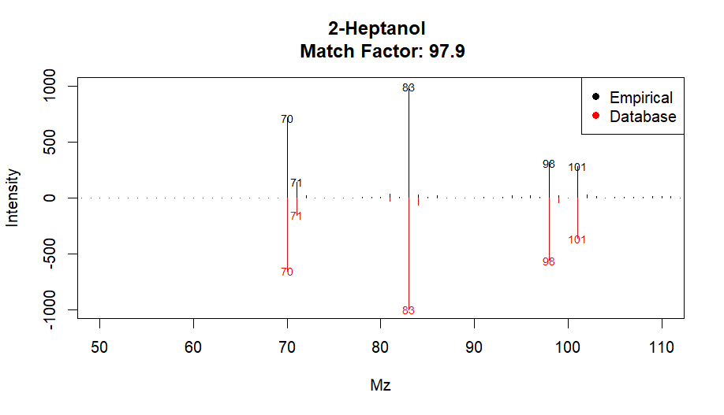<!-- -->


``` r
# Experimental Retention Index (RI)
indexRtime(5.3613, rti)
```

``` r 

# Experimental RI = 903 (Calculated by GCMSsolution software)
# Literature RI = 900 (NIST#: 20310)
# ΔRI = 3
```

#### Benzaldehyde
Mirror plot of alignID number 46

``` r
plotSpectra(ex, 46, 2,
            draw.color = "red", xlim = c(50,110))
```

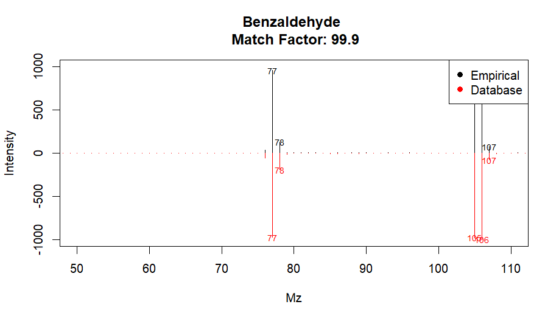<!-- -->

``` r
# Experimental Retention Index (RI)
indexRtime(6.5074, rti)
```

``` r 
# Experimental RI = 965 (Calculated by GCMSsolution software)
# Literature RI = 962 (NIST#: 411571)
# ΔRI = 3
```
### Benzyl alcohol
Mirror plot of alignID number  62

``` r
plotSpectra(ex, 62, 2,
            draw.color = "red", xlim = c(50,110))
```

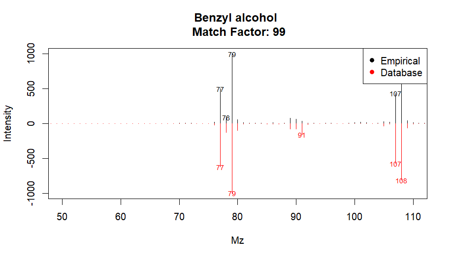<!-- -->

``` r
# Experimental Retention Index (RI)
indexRtime(7.9683, rti)
```

``` r 
# Experimental RI = 1042 (Calculated by GCMSsolution software)
# Literature RI = 1036 (NIST#: 379408)
# ΔRI = 6
```
### Benzeneacetaldehyde
Mirror plot of alignID number 71 

``` r
plotSpectra(ex, 71, 1,
            draw.color = "red", xlim = c(50,110))
```

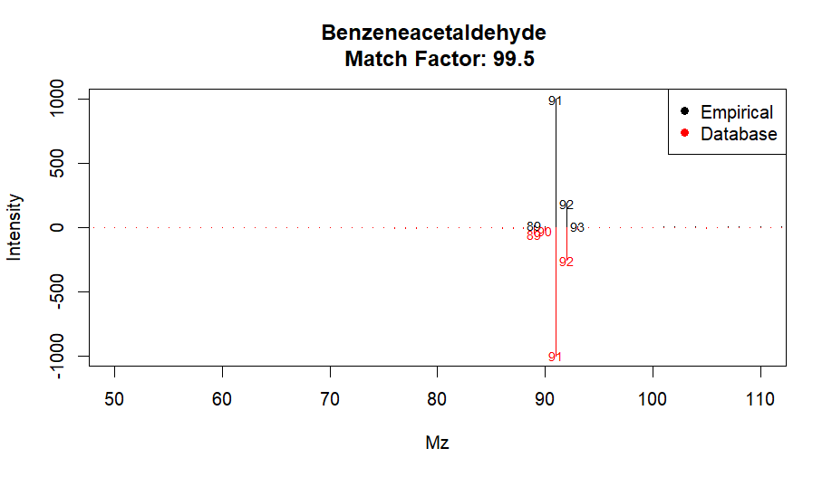<!-- -->

``` r
# Experimental Retention Index (RI)
indexRtime(8.0364, rti)
```

``` r 
# Experimental RI = 1046 (Calculated by GCMSsolution software)
# Literature RI = 1045 (NIST#: 114847)
# ΔRI = 1
```
### Benzenemethanol, α-methyl-
Mirror plot of alignID number 74

``` r
plotSpectra(ex, 74, 2,
            draw.color = "red", xlim = c(50,110))
```

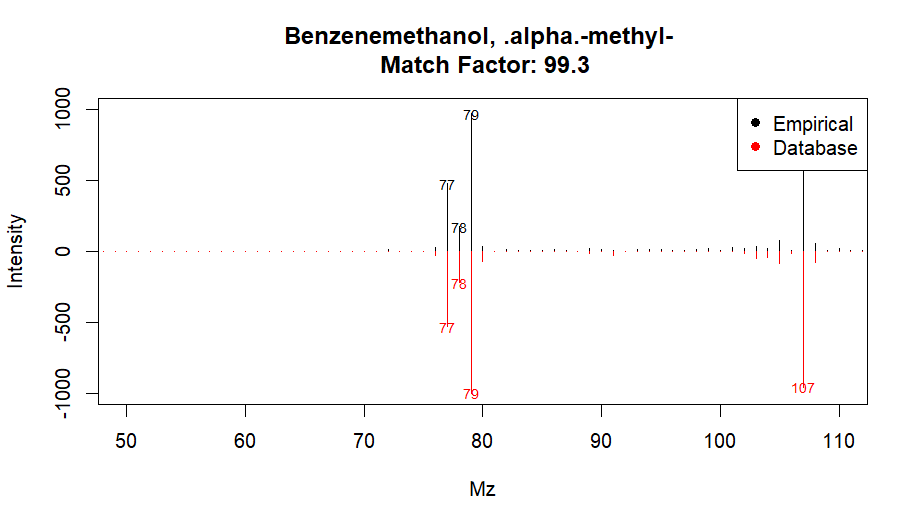<!-- -->

``` r
# Experimental Retention Index (RI)
indexRtime(8.3525, rti)
```

``` r 
# Experimental RI = 1062 (Calculated by GCMSsolution software)
# Literature RI = 1061 (NIST#: 423818)
# ΔRI = 1
```
### 2-Furanmethanol, 5-ethenyltetrahydro-α,α,5-trimethyl-, cis-
Mirror plot of alignID number 79 

``` r
plotSpectra(ex, 79, 2,
            draw.color = "red", xlim = c(50,110))
```

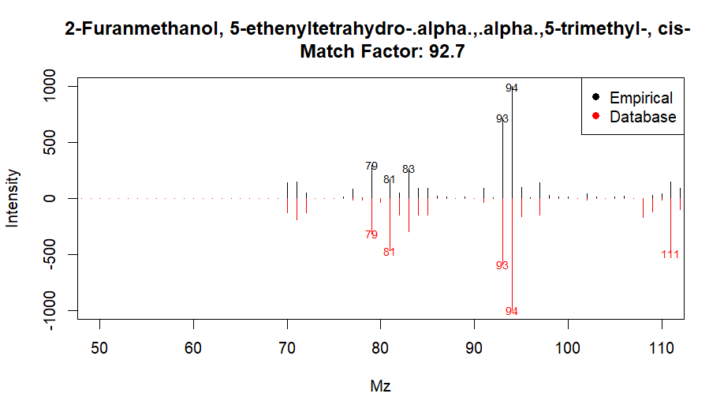<!-- -->

``` r
# Experimental Retention Index (RI)
indexRtime(8.556, rti)
```

``` r 
# Experimental RI = 1073 (Calculated by GCMSsolution software)
# Literature RI = 1074 (NIST#: 384130)
# ΔRI = 1
```
### trans-Linalool oxide (furanoid)
Mirror plot of alignID number 86 

``` r
plotSpectra(ex, 86, 1,
            draw.color = "red", xlim = c(50,110))
```

.png)<!-- -->

``` r
# Experimental Retention Index (RI)
indexRtime(8.8565, rti)
```

``` r 
# Experimental RI = 1086 (Calculated by GCMSsolution software)
# Literature RI = 1086 (NIST#: 384131)
# ΔRI = 0
```
### Linalool
Mirror plot of alignID number 92 

``` r
plotSpectra(ex, 92, 1,
            draw.color = "red", xlim = c(50,110))
```

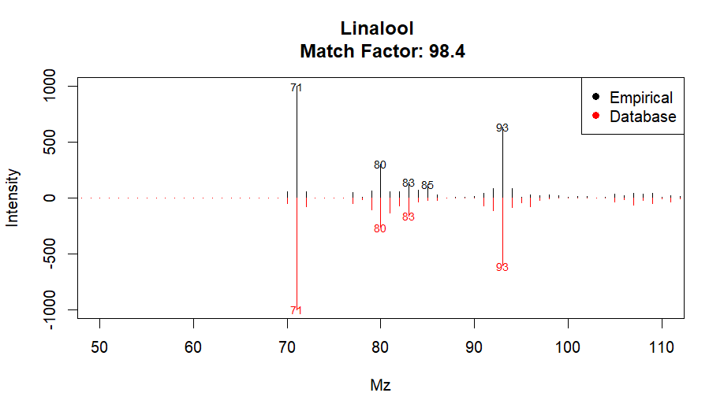<!-- -->

``` r
# Experimental Retention Index (RI)
indexRtime(9.095, rti)
```

``` r 
# Experimental RI = 1102 (Calculated by GCMSsolution software)
# Literature RI = 1099 (NIST#: 374223)
# ΔRI = 3
```
### 1,5,7-Octatrien-3-ol, 3,7-dimethyl-
Mirror plot of alignID number 94 

``` r
plotSpectra(ex, 94, 1,
            draw.color = "red", xlim = c(50,110))
```

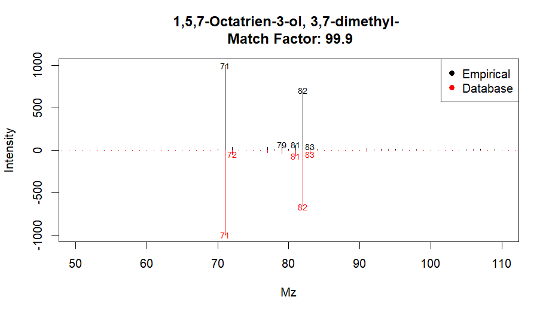<!-- -->

``` r
# Experimental Retention Index (RI)
indexRtime(9.1327, rti)
```

``` r 
# Experimental RI = 1103 (Calculated by GCMSsolution software)
# Literature RI = 1107 (NIST#: 107014)
# ΔRI = 4
```
### Butanoic acid, 3-methyl-, 3-methylbutyl ester
Mirror plot of alignID number 98

``` r
plotSpectra(ex, 98, 1,
            draw.color = "red", xlim = c(50,110))
```

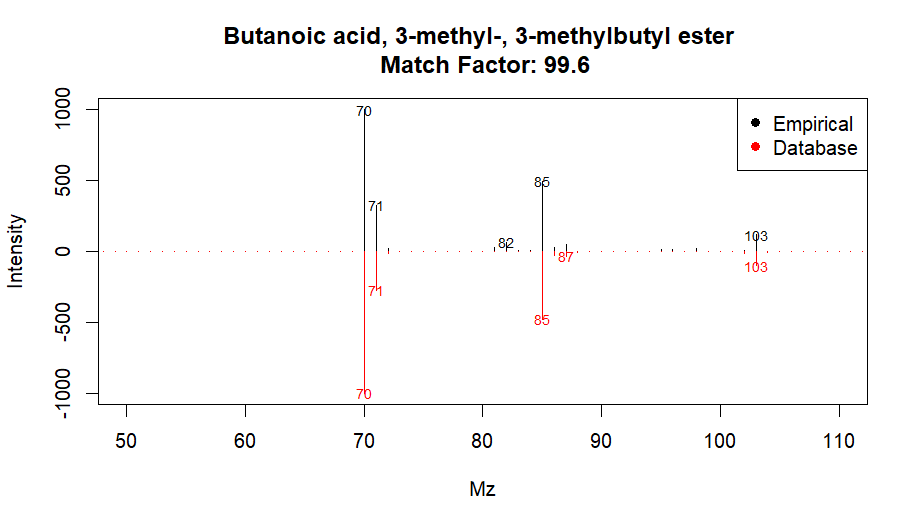<!-- -->


``` r
# Experimental Retention Index (RI)
indexRtime(9.1435, rti)
```

``` r 
# Experimental RI = 1104 (Calculated by GCMSsolution software)
# Literature RI = 1104 (NIST#: 428865)
# ΔRI = 0
```
### Phenylethyl Alcohol
Mirror plot of alignID number 101 

``` r
plotSpectra(ex, 101, 1,
            draw.color = "red", xlim = c(50,110))
```

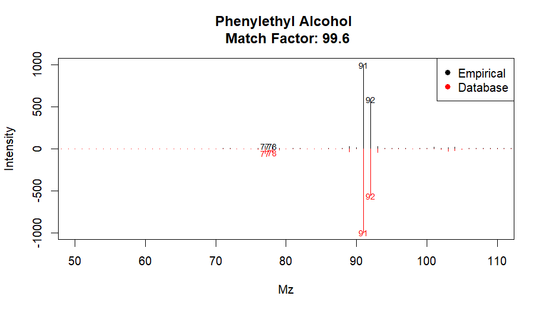<!-- -->

``` r
# Experimental Retention Index (RI)
indexRtime(9.4149, rti)
```

``` r 
# Experimental RI = 1118 (Calculated by GCMSsolution software)
# Literature RI = 1116 (NIST#: 229405)
# ΔRI = 2
```
### 2,6-Dimethyl-1,3,5,7-octatetraene, E,E-
Mirror plot of alignID number 110 

``` r
plotSpectra(ex, 110, 1,
            draw.color = "red", xlim = c(50,110))
```

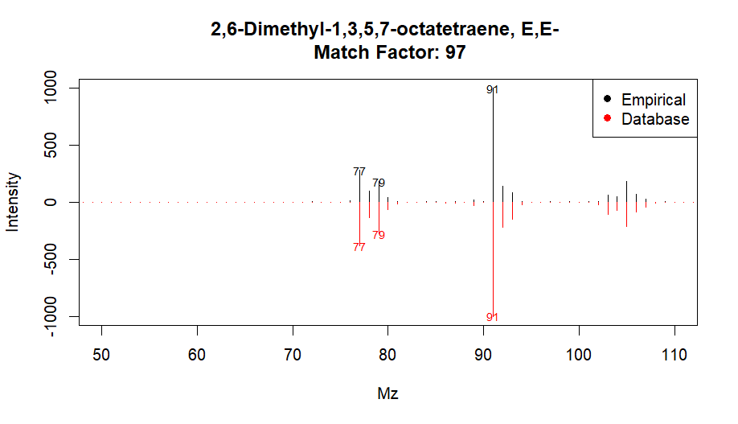<!-- -->

``` r
# Experimental Retention Index (RI)
indexRtime(9.6486, rti)
```

``` r 
# Experimental RI = 1131 (Calculated by GCMSsolution software)
# Literature RI = 1131 (NIST#: 141120)
# ΔRI = 0
```
### 2H-Pyran, 3,6-dihydro-4-methyl-2-(2-methyl-1-propenyl)-
Mirror plot of alignID number 113 

``` r
plotSpectra(ex, 113, 1,
            draw.color = "red", xlim = c(50,110))
```

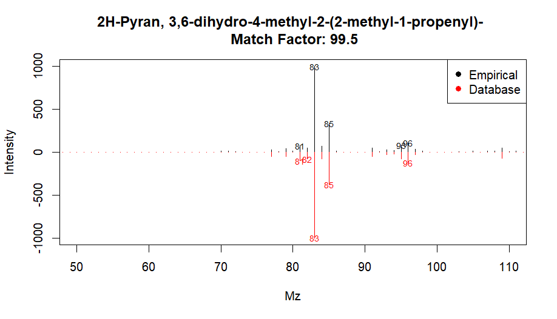<!-- -->

``` r
# Experimental Retention Index (RI)
indexRtime(10.0588, rti)
```

``` r 
# Experimental RI = 1153 (Calculated by GCMSsolution software)
# Literature RI = 1154 (NIST#: 430702)
# ΔRI = 1
```
### 1-Nonanol
Mirror plot of alignID number 120 

``` r
plotSpectra(ex, 120, 1,
            draw.color = "red", xlim = c(50,110))
```

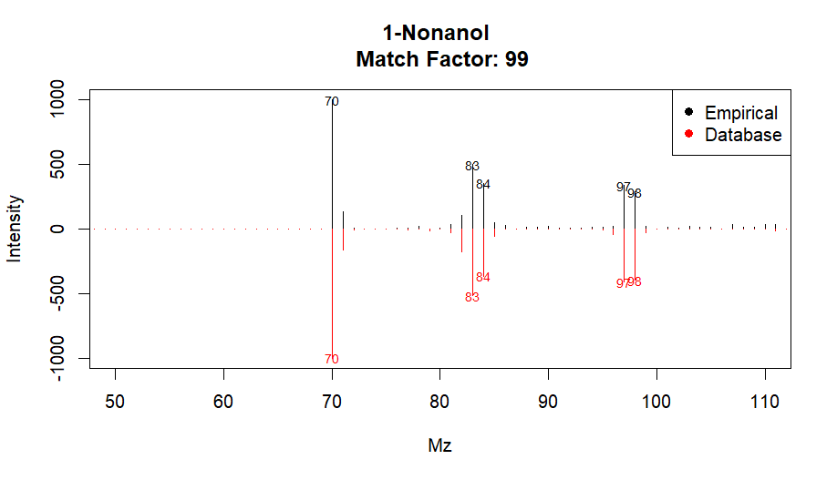<!-- -->

``` r
# Experimental Retention Index (RI)
indexRtime(10.4074, rti)
```

``` r 
# Experimental RI = 1171 (Calculated by GCMSsolution software)
# Literature RI = 1173 (NIST#: 249226)
# ΔRI = 2
```
### 3-Cyclohexene-1-acetaldehyde, α,4-dimethyl-
Mirror plot of alignID number 131 

``` r
plotSpectra(ex, 131, 1,
            draw.color = "red", xlim = c(50,110))
```

<!-- -->

``` r
# Experimental Retention Index (RI)
indexRtime(11.3502, rti)
```

``` r 
# Experimental RI = 1223 (Calculated by GCMSsolution software)
# Literature RI = 1225 (NIST#: 21533)
# ΔRI = 2
```
### Benzenemethanol, 4-methoxy-
Mirror plot of alignID number 137 

``` r
plotSpectra(ex, 137, 1,
            draw.color = "red", xlim = c(50,110))
```

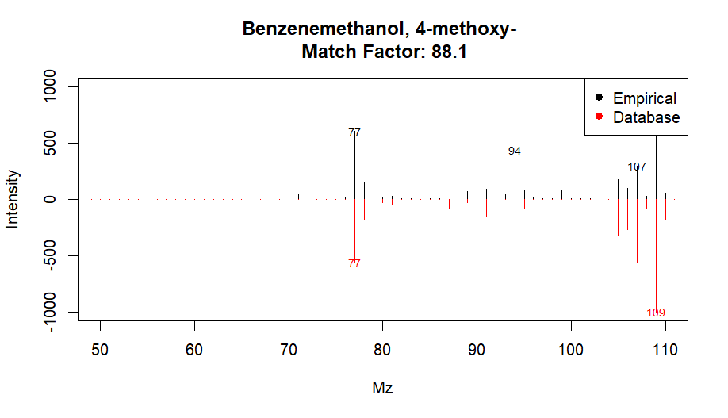<!-- -->

``` r
# Experimental Retention Index (RI)
indexRtime(12.4924, rti)
```

``` r 
# Experimental RI = 1287 (Calculated by GCMSsolution software)
# Literature RI = 1285 (NIST#: 461113)
# ΔRI = 2
```
### 1-Dodecanol
Mirror plot of alignID number 158 

``` r
plotSpectra(ex, 158, 7,
            draw.color = "red", xlim = c(50,110))
```

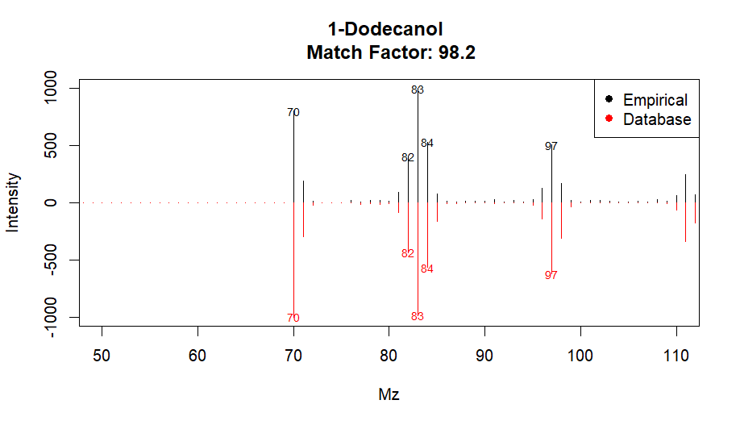<!-- -->

``` r
# Experimental Retention Index (RI)
indexRtime(15.3866, rti)
```

``` r 
# Experimental RI = 1476 (Calculated by GCMSsolution software)
# Literature RI = 1474 (NIST#: 53416)
# ΔRI = 2
```
### 2H-Pyran-2-one, tetrahydro-6-pentyl-
Mirror plot of alignID number 161 

``` r
plotSpectra(ex, 161, 1,
            draw.color = "red", xlim = c(50,110))
```

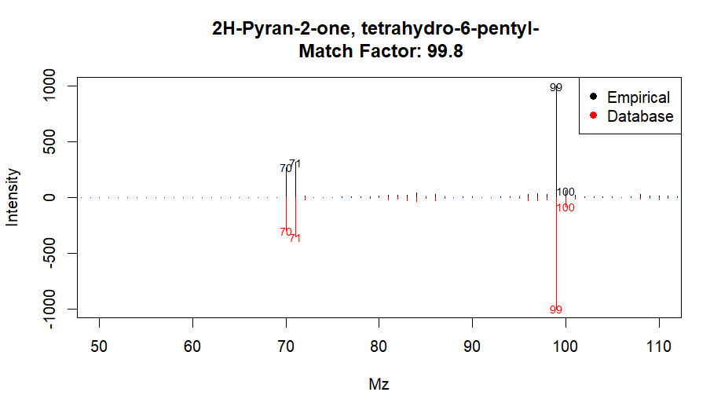<!-- -->

``` r
# Experimental Retention Index (RI)
indexRtime(15.6766, rti)
```

``` r 
# Experimental RI = 1497 (Calculated by GCMSsolution software)
# Literature RI = 1497 (NIST#: 22022)
# ΔRI = 0
```
### References
1. 
2. Domingo-Almenara, X., Brezmes, J., Vinaixa, M., Samino, S., Ramirez, N., Ramon-Krauel, M., Lerin, C., Díaz, M., Ibáñez, L., Correig, X., Perera-Lluna, A., & Yanes, O. (2016). eRah: A Computational Tool Integrating Spectral Deconvolution and Alignment with Quantification and Identification of Metabolites in GC/MS-Based Metabolomics. Analytical Chemistry, 88(19), 9821-9829. https://doi.org/10.1021/acs.analchem.6b02927
3. Aron, A.T., Gentry, E.C., McPhail, K.L. et al. Reproducible molecular networking of untargeted mass spectrometry data using GNPS. Nat Protoc 15, 1954–1991 (2020). https://doi.org/10.1038/s41596-020-0317-5

