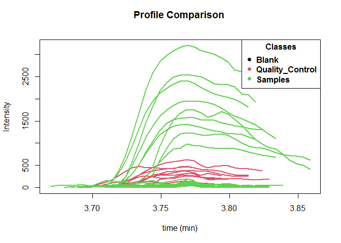

HS_GCMS_Spectral_Deconvolution
================
Angiely Camacho, Jefferson Pastuna
2024-04-12

- <a href="#introduction" id="toc-introduction">Introduction</a>
- <a href="#before-to-start" id="toc-before-to-start">Before to start</a>
- <a href="#erah-package-workflow" id="toc-erah-package-workflow">eRah
  package workflow</a>

### Introduction
The present document aims to record the procedure given for the statistical analysis of metabolites present in the honeys of 3 native bee species (tetragonisca angustula, melipona fasciculata, melipona fuscopilosa) from 3 different localities in the Chontapunta parish.

Honey bee contains a variety of volatile compounds that contribute to its characteristic aroma, flavor, and potential health benefits. These compounds originate from the nectar of the flowers that bees visit and undergo various transformations during the honey making process. Among the compounds commonly found in honeys are terpenes, esters, norisoprenoids, benzene derivatives, furans, ketones, hydrocarbons, alcohols, aldehydes and acids.

### Before to start
The eRah package is a computational tool developed in the R programming language and freely available from the CRAN public repository, used for preprocessing, annotation and analysis of liquid chromatography-mass spectrometry (LC-MS) and gas chromatography-GC-MS mass spectrometry data. It facilitates automatic peak detection, peak alignment, feature extraction and compound identification.

### eRah package workflow

How to star.

``` r
# eRah package installation
#install.packages('erah')
# eRah library call
library(erah)
```

Folder files

``` r
# Delete all file that are not in folders
unlink('Data/Data_to_eRah/*')
# Data folder path
createdt('Data/Data_to_eRah/')
```

New experiment.

``` r
instrumental <- read.csv('Data/Metadata_to_eRah/HS_GCMS_Data_inst.csv')
phenotype <- read.csv('Data/Metadata_to_eRah/HS_GCMS_Data_pheno.csv')

ex <- newExp(instrumental = instrumental,
             phenotype = phenotype,
             info = 'Amazonia honey')
```

Compound deconvolution

Parameter

``` r
ex.dec.par <- setDecPar(min.peak.width = 2,
                        min.peak.height = 450,
                        noise.threshold = 45,
                        avoid.processing.mz = c(30:69,73:75,147:149))
```

parallel processing

#el numero dependera de los cores que tenga tu computadora, la del lab tiene 16, pero la mia 4, por ende le cambio a 4 para procesar
``` r
plan(future::multisession,
     workers = 16)
```

Deconvolution

``` r
ex <- deconvolveComp(ex,
                     ex.dec.par)
```

    ## 
    ##  Deconvolving compounds from Data/Data_to_eRah/Blank/4_Blanco.mzXML ... Processing 1 / 37

    ## 
    ##  Deconvolving compounds from Data/Data_to_eRah/Quality_Control/15_QC1_4.mzXML ... Processing 2 / 37

    ## 
    ##  Deconvolving compounds from Data/Data_to_eRah/Quality_Control/21_Qc2_2.mzXML ... Processing 3 / 37

    ## 
    ##  Deconvolving compounds from Data/Data_to_eRah/Quality_Control/28_Qc3_3.mzXML ... Processing 4 / 37

    ## 
    ##  Deconvolving compounds from Data/Data_to_eRah/Quality_Control/34_Qc1_2.mzXML ... Processing 5 / 37

    ## 
    ##  Deconvolving compounds from Data/Data_to_eRah/Quality_Control/41_Qc2_4.mzXML ... Processing 6 / 37

    ## 
    ##  Deconvolving compounds from Data/Data_to_eRah/Quality_Control/44_Qc2_5.mzXML ... Processing 7 / 37

    ## 
    ##  Deconvolving compounds from Data/Data_to_eRah/Quality_Control/45_Qc3_2.mzXML ... Processing 8 / 37

    ## 
    ##  Deconvolving compounds from Data/Data_to_eRah/Quality_Control/7_Qc1_5.mzXML ... Processing 9 / 37

    ## 
    ##  Deconvolving compounds from Data/Data_to_eRah/Quality_Control/8_Qc2_3.mzXML ... Processing 10 / 37

    ## 
    ##  Deconvolving compounds from Data/Data_to_eRah/Samples/10_RIG003_1.mzXML ... Processing 11 / 37

    ## 
    ##  Deconvolving compounds from Data/Data_to_eRah/Samples/11_Sample_FIED001_2.mzXML ... Processing 12 / 37

    ## 
    ##  Deconvolving compounds from Data/Data_to_eRah/Samples/12_Sample_RGY001_3.mzXML ... Processing 13 / 37

    ## 
    ##  Deconvolving compounds from Data/Data_to_eRah/Samples/13_Sample_RIG003_3.mzXML ... Processing 14 / 37

    ## 
    ##  Deconvolving compounds from Data/Data_to_eRah/Samples/14_Sample_RYTA006_2.mzXML ... Processing 15 / 37

    ## 
    ##  Deconvolving compounds from Data/Data_to_eRah/Samples/16_Sample_RYMG001_3.mzXML ... Processing 16 / 37

    ## 
    ##  Deconvolving compounds from Data/Data_to_eRah/Samples/17_Sample_RGY001_1.mzXML ... Processing 17 / 37

    ## 
    ##  Deconvolving compounds from Data/Data_to_eRah/Samples/18_Sample_FIED001_1.mzXML ... Processing 18 / 37

    ## 
    ##  Deconvolving compounds from Data/Data_to_eRah/Samples/19_Sample_RYMG001_2.mzXML ... Processing 19 / 37

    ## 
    ##  Deconvolving compounds from Data/Data_to_eRah/Samples/20_Sample_ER001_1.mzXML ... Processing 20 / 37

    ## 
    ##  Deconvolving compounds from Data/Data_to_eRah/Samples/22_Sample_ATA001_2.mzXML ... Processing 21 / 37

    ## 
    ##  Deconvolving compounds from Data/Data_to_eRah/Samples/23_RIG003_2.mzXML ... Processing 22 / 37

    ## 
    ##  Deconvolving compounds from Data/Data_to_eRah/Samples/25_Sample_RYTA006_3.mzXML ... Processing 23 / 37

    ## 
    ##  Deconvolving compounds from Data/Data_to_eRah/Samples/26_Sample_RYTA006_1.mzXML ... Processing 24 / 37

    ## 
    ##  Deconvolving compounds from Data/Data_to_eRah/Samples/27_Sample_RIG005_3.mzXML ... Processing 25 / 37

    ## 
    ##  Deconvolving compounds from Data/Data_to_eRah/Samples/29_Sample_RGB004_1.mzXML ... Processing 26 / 37

    ## 
    ##  Deconvolving compounds from Data/Data_to_eRah/Samples/30_Sample_RGB004_3.mzXML ... Processing 27 / 37

    ## 
    ##  Deconvolving compounds from Data/Data_to_eRah/Samples/31_Sample_FIED001_3.mzXML ... Processing 28 / 37

    ## 
    ##  Deconvolving compounds from Data/Data_to_eRah/Samples/32_Sample_ATA001_3.mzXML ... Processing 29 / 37

    ## 
    ##  Deconvolving compounds from Data/Data_to_eRah/Samples/33_Sample_ATA001_1.mzXML ... Processing 30 / 37

    ## 
    ##  Deconvolving compounds from Data/Data_to_eRah/Samples/35_Sample_RGY001_2.mzXML ... Processing 31 / 37

    ## 
    ##  Deconvolving compounds from Data/Data_to_eRah/Samples/36_Sample_RGB004_2.mzXML ... Processing 32 / 37

    ## 
    ##  Deconvolving compounds from Data/Data_to_eRah/Samples/37_Sample_RIG005_1.mzXML ... Processing 33 / 37

    ## 
    ##  Deconvolving compounds from Data/Data_to_eRah/Samples/38_Sample_ER001_2.mzXML ... Processing 34 / 37

    ## 
    ##  Deconvolving compounds from Data/Data_to_eRah/Samples/40_Sample_RYMG001_1.mzXML ... Processing 35 / 37

    ## 
    ##  Deconvolving compounds from Data/Data_to_eRah/Samples/42_Sample_RIG005_2.mzXML ... Processing 36 / 37

    ## 
    ##  Deconvolving compounds from Data/Data_to_eRah/Samples/43_Sample_ER001_3.mzXML ... Processing 37 / 37

    ## Compounds deconvolved

Alignment

``` r
# Alignment parameters
ex.al.par <- setAlPar(min.spectra.cor = 0.90,
                      max.time.dist = 3,
                      mz.range = 70:550)
# Alignment
ex <- alignComp(ex,
                alParameters = ex.al.par)
```

Missing compound recovery

``` r
ex <- recMissComp(ex,
                  min.samples = 3)
```

    ## 
    ##  Updating alignment table... 
    ## Model fitted!

Identification

``` r
# Loading NIST 20 (*.msp) library
nist.database <- importMSP(filename = "E:/NIST_20_Library/Result/NIST20EI_2R.MSP",
                           DB.name = "NIST",
                           DB.version = "NIST20",
                           DB.info = "NIST_MS_Search_Export")
# Save library for a posterior faster loading
save(nist.database, file= "Data/Library/NIST20EI_2R.rda")
# Load R library
load("Data/Library/NIST20EI_2R.rda")
mslib <- nist.database
# Identification
ex <- identifyComp(ex,
                   id.database = mslib,
                   mz.range = NULL,
                   n.putative = 10)
```

    ## Constructing matrix database... 
    ## Comparing spectra... 
    ## Done!

``` r
# Identified compound
id.list <- idList(ex)
head(id.list[,1:4], n = 8)
```

    ## # A tibble: 8 x 4
    ##   AlignID tmean FoundIn Name.1                                                 
    ##     <dbl> <dbl>   <dbl> <chr>                                                  
    ## 1       1  3.55      37 Silanediol, dimethyl-                                  
    ## 2       2  3.57      37 Silanediol, dimethyl-                                  
    ## 3       3  3.64      37 Silanediol, dimethyl-                                  
    ## 4       5  3.73      37 Urea, ethyl-                                           
    ## 5       7  3.77      37 Hexane, 2,4-dimethyl-                                  
    ## 6       8  3.77      37 Heptane, 2,4-dimethyl-                                 
    ## 7      13  4.19      37 (2-Methyl-[1,3]dioxolan-2-yl)-acetic acid, phenyl ester
    ## 8      23  4.27      37 Furfural

Peak compound view

``` r
plotProfile(ex, 7)
```

<!-- -->

Mirror plot of identified compounds

``` r
plotSpectra(ex, 7, 1, draw.color = "red")
```

<!-- -->

Exporting spectra to NIST

``` r
export2MSP(ex,
           store.path = "Result/eRah_Result",
           alg.version = 2)
```

    ## Spectra saved at: Result/eRah_Result/ExportMSP
