Chemical characterization of volatile compounds and biological activity
of stingless bee honeys from the Ecuadorian Amazon using Headspace Gas
Chromatography-Mass Spectrometry - Statistical analysis
================
Jefferson Pastuña
2024-04-17

- <a href="#introduction" id="toc-introduction">Introduction</a>
- <a href="#before-to-start" id="toc-before-to-start">Before to start</a>
- <a href="#notame-workflow" id="toc-notame-workflow">Notame workflow</a>
  - <a href="#preprocessing" id="toc-preprocessing">Preprocessing</a>
  - <a href="#processing" id="toc-processing">Processing</a>
- <a href="#principal-component-analysis-pca"
  id="toc-principal-component-analysis-pca">Principal component analysis
  (PCA)</a>
  - <a href="#score-pca" id="toc-score-pca">Score PCA</a>
  - <a href="#loading-pca" id="toc-loading-pca">Loading PCA</a>
- <a href="#permanova" id="toc-permanova">PERMANOVA</a>
  - <a href="#complete-chemical-profile"
    id="toc-complete-chemical-profile">Complete chemical profile</a>
    - <a href="#permanova-1" id="toc-permanova-1">PERMANOVA</a>
    - <a href="#homogeneity-of-dispersions"
      id="toc-homogeneity-of-dispersions">Homogeneity of dispersions</a>
  - <a href="#annotated-features" id="toc-annotated-features">Annotated
    features</a>
    - <a href="#permanova-2" id="toc-permanova-2">PERMANOVA</a>
    - <a href="#pairwise-permanova" id="toc-pairwise-permanova">Pairwise
      PERMANOVA</a>
    - <a href="#homogeneity-of-dispersions-1"
      id="toc-homogeneity-of-dispersions-1">Homogeneity of dispersions</a>
- <a href="#heatmap-with-hca" id="toc-heatmap-with-hca">Heatmap with
  HCA</a>
- <a href="#antimicrobial-activity-correlation"
  id="toc-antimicrobial-activity-correlation">Antimicrobial activity
  correlation</a>
  - <a href="#using-the-pca" id="toc-using-the-pca">Using the PCA</a>
    - <a href="#score-pca-1" id="toc-score-pca-1">Score PCA</a>
    - <a href="#loading-pca-1" id="toc-loading-pca-1">Loading PCA</a>
  - <a href="#using-the-pearson-correlation"
    id="toc-using-the-pearson-correlation">Using the Pearson correlation</a>
    - <a href="#normality-of-the-antimicrobial-data"
      id="toc-normality-of-the-antimicrobial-data">Normality of the
      antimicrobial data</a>
    - <a href="#metabolomics-data-transformation"
      id="toc-metabolomics-data-transformation">Metabolomics data
      transformation</a>
    - <a href="#data-prepartion" id="toc-data-prepartion">Data prepartion</a>
    - <a href="#correlation-of-identified-metabolites"
      id="toc-correlation-of-identified-metabolites">Correlation of identified
      metabolites</a>
    - <a href="#correlation-of-unknown-metabolites"
      id="toc-correlation-of-unknown-metabolites">Correlation of unknown
      metabolites</a>
- <a href="#upset-plot" id="toc-upset-plot">UpSet plot</a>

# Introduction

This R Script aims to record the procedure for analyzing the volatile
profile of honeys from three different stingless bee species (*Melipona
fasciculata*, *Melipona fuscopilosa*, and *Tetragonisca angustula*).
Each step has a brief explanation, as well as code and graphics.

The data preprocessing workflow used was taken from the research paper
[“notame”: Workflow for Non-Targeted LC–MS Metabolic
Profiling](https://doi.org/10.3390/metabo10040135), which offers a wide
variety of functions for performing metabolomic profile analysis.

# Before to start

The “*notame*” package accepts a feature table that can be obtained
through different software, such as MZmine, MS-DIAL, and others, as
input. The feature list table was extracted using the MZmine software in
this case. The exported (.csv) file from MZmine was fixed to get the
final feature table input according to the “*notame*” package guideline.

The raw (.csv) file modifications can be summarized by adding and
renaming columns. The added columns “Column” and “Ion Mode” allow for
the analysis of samples with different types of columns and different
ionization polarities, respectively. Also, the cells corresponding to
mass (*m/z*) and retention time (*rt*) must be renamed so the “*notame*”
package can detect and process them.

# Notame workflow

The “*notame*” package and other dependency packages were installed as a
first step for the analysis.

``` r
# Notame package installation
#if (!requireNamespace("devtools", quietly = TRUE)) {
#  install.packages("devtools")
#}
#devtools::install_github("antonvsdata/notame", ref = "v0.3.1")

# Notame library call
library(notame)
```

    ## Warning: package 'BiocGenerics' was built under R version 4.5.0

    ## Warning: package 'ggplot2' was built under R version 4.4.3

``` r
# Dependency packages installation
install_dependencies
```

    ## function (preprocessing = TRUE, extra = FALSE, batch_corr = FALSE, 
    ##     misc = FALSE, ...) 
    ## {
    ##     core_cran <- c("BiocManager", "cowplot", "missForest", "openxlsx", 
    ##         "randomForest", "RColorBrewer", "Rtsne")
    ##     core_bioconductor <- "pcaMethods"
    ##     extra_cran <- c("car", "doParallel", "devEMF", "ggbeeswarm", 
    ##         "ggdendro", "ggrepel", "ggtext", "Hmisc", "hexbin", "igraph", 
    ##         "lme4", "lmerTest", "MuMIn", "PERMANOVA", "PK", "rmcorr")
    ##     extra_bioconductor <- c("mixOmics", "supraHex")
    ##     extra_gitlab <- "CarlBrunius/MUVR"
    ##     batch_cran <- "fpc"
    ##     batch_bioconductor <- "RUVSeq"
    ##     batch_github <- NULL
    ##     batch_gitlab <- "CarlBrunius/batchCorr"
    ##     misc_cran <- c("knitr", "rmarkdown", "testthat")
    ##     if (preprocessing) {
    ##         install_helper(cran = core_cran, bioconductor = core_bioconductor, 
    ##             ...)
    ##     }
    ##     if (extra) {
    ##         install_helper(cran = extra_cran, bioconductor = extra_bioconductor, 
    ##             gitlab = extra_gitlab, ...)
    ##     }
    ##     if (batch_corr) {
    ##         install_helper(cran = batch_cran, bioconductor = batch_bioconductor, 
    ##             github = batch_github, gitlab = batch_gitlab, ...)
    ##     }
    ##     if (misc) {
    ##         install_helper(cran = misc_cran, ...)
    ##     }
    ## }
    ## <bytecode: 0x00000000142856f0>
    ## <environment: namespace:notame>

``` r
# Loading additional libraries
library(vegan)
```

    ## Warning: package 'vegan' was built under R version 4.4.3

    ## Warning: package 'permute' was built under R version 4.4.3

``` r
library(pairwiseAdonis)
```

Then, a primary path and a log system were added to have a record of
each process executed.

``` r
# Main path
ppath <- "../Amazonia_Honey/"
# Log system
init_log(log_file = paste0(ppath, "../Result/notame_Result/HS_GCMS/HS_GCMS_log.txt"))
```

    ## INFO [2026-08-12 23:30:41] Starting logging

Next, the MZmine feature list table in “*notame*” format was loaded.

``` r
data <- read_from_excel(file = "../Data/Data_to_notame/HS_GCMS_Data_to_notame.xlsx",
                        sheet = 3, corner_row = 20, corner_column = "L",
                        split_by = c("Column", "Ion Mode"))
```

    ## INFO [2026-08-12 23:30:42] Corner detected correctly at row 20, column L
    ## INFO [2026-08-12 23:30:42] 
    ## Extracting sample information from rows 1 to 20 and columns M to AV
    ## INFO [2026-08-12 23:30:42] Replacing spaces in sample information column names with underscores (_)
    ## INFO [2026-08-12 23:30:42] Naming the last column of sample information "Datafile"
    ## INFO [2026-08-12 23:30:42] 
    ## Extracting feature information from rows 21 to 706 and columns A to L
    ## INFO [2026-08-12 23:30:42] Creating Split column from Column, Ion Mode
    ## INFO [2026-08-12 23:30:42] Feature_ID column not found, creating feature IDs
    ## INFO [2026-08-12 23:30:42] Identified m/z column mass and retention time column RT
    ## INFO [2026-08-12 23:30:42] Identified m/z column mass and retention time column RT
    ## INFO [2026-08-12 23:30:42] Creating feature IDs from Split, m/z and retention time
    ## INFO [2026-08-12 23:30:42] Replacing dots (.) in feature information column names with underscores (_)
    ## INFO [2026-08-12 23:30:42] 
    ## Extracting feature abundances from rows 21 to 706 and columns M to AV
    ## INFO [2026-08-12 23:30:42] 
    ## Checking sample information
    ## INFO [2026-08-12 23:30:42] QC column generated from rows containing 'QC'
    ## INFO [2026-08-12 23:30:42] Sample ID autogenerated from injection orders and prefix ID_
    ## INFO [2026-08-12 23:30:42] Checking that feature abundances only contain numeric values
    ## INFO [2026-08-12 23:30:42] 
    ## Checking feature information
    ## INFO [2026-08-12 23:30:42] Checking that feature IDs are unique and not stored as numbers
    ## INFO [2026-08-12 23:30:42] Checking that m/z and retention time values are reasonable
    ## INFO [2026-08-12 23:30:42] Identified m/z column mass and retention time column RT
    ## INFO [2026-08-12 23:30:42] Identified m/z column mass and retention time column RT

Once the data was loaded, the next step was to create a MetaboSet to
work with R objects from now on.

``` r
modes <- construct_metabosets(exprs = data$exprs, 
                              pheno_data = data$pheno_data, 
                              feature_data = data$feature_data,
                              group_col = "Group")
```

    ## Initializing the object(s) with unflagged features
    ## INFO [2026-08-12 23:30:42] 
    ## Checking feature information
    ## INFO [2026-08-12 23:30:42] Checking that feature IDs are unique and not stored as numbers
    ## INFO [2026-08-12 23:30:42] Checking that feature abundances only contain numeric values
    ## INFO [2026-08-12 23:30:42] Setting row and column names of exprs based on feature and pheno data

## Preprocessing

The first step of the preprocessing is to change the features with a
value equal to 0 to NA.

``` r
# Data extraction
mode <- modes$RTX5MS_EI
# Change 0 value to NA
mode <- mark_nas(mode, value = 0)
```

Then, features with low detection rates are flagged and can be ignored
or removed in subsequent analysis. The “*notame*” package uses two
criteria to flag these features: the feature’s presence in a percentage
of QC injections and the feature’s presence in a percentage within a
sample group or class.

``` r
# Low detection rate
mode <- flag_detection(mode, qc_limit = 7/9, group_limit = 2/3)
```

    ## INFO [2026-08-12 23:30:42] 
    ## 2% of features flagged for low detection rate

The following preprocessing step is drift correction, which is applied
using smoothed cubic spline regression.

``` r
# Drift correction
corrected <- correct_drift(mode)
```

    ## INFO [2026-08-12 23:30:42] 
    ## Starting drift correction at 2026-08-12 23:30:42.840146
    ## INFO [2026-08-12 23:30:44] Drift correction performed at 2026-08-12 23:30:44.537243
    ## INFO [2026-08-12 23:30:45] Inspecting drift correction results 2026-08-12 23:30:45.406292
    ## INFO [2026-08-12 23:30:47] Drift correction results inspected at 2026-08-12 23:30:47.077388
    ## INFO [2026-08-12 23:30:47] 
    ## Drift correction results inspected, report:
    ## Drift_corrected: 100%

``` r
#corrected <- correct_drift(corrected)
# Flag low quality features
#corrected <- flag_quality(corrected, condition = "RSD_r < 0.3 & D_ratio_r < 0.6")
```

Then, we can visualize the data after drift correction.

``` r
# Boxplot
corr_bp <- plot_sample_boxplots(corrected,
                                order_by = "Group",
                                fill_by = "Species")
# PCA
corr_pca <- plot_pca(corrected,
                     center = TRUE,
                     shape = "Species",
                     color = "Species")
# Package to plots visualization in a same windows
library(patchwork)
# Plot
corr_pca + corr_bp
```

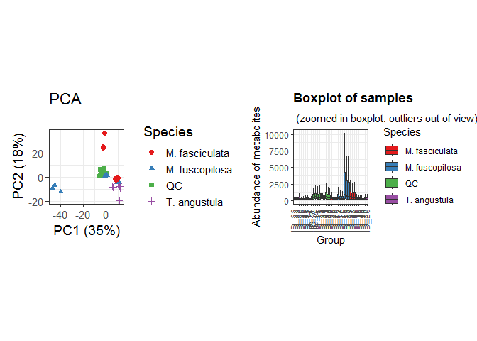<!-- -->

The next step is feature clustering. This step helps us reduce the
number of features of the same molecule that were split due to a 70 eV
electron ionization (EI) environment.

``` r
clustered <- cluster_features(corrected, rt_window = 1/60,
                              corr_thresh = 0.95,
                              d_thresh = 0.80#,
                              #plotting = TRUE,
                              #prefix = "../Result/notame_Result/HS_GCMS/Cluster/"
                              )
```

    ## INFO [2026-08-12 23:30:49] Identified m/z column mass and retention time column RT
    ## INFO [2026-08-12 23:30:49] 
    ## Starting feature clustering at 2026-08-12 23:30:49.598532
    ## INFO [2026-08-12 23:30:49] Finding connections between features in RTX5MS_EI
    ## [1] 100
    ## [1] 200
    ## [1] 300
    ## [1] 400
    ## [1] 500
    ## [1] 600
    ## INFO [2026-08-12 23:31:11] Found 5601 connections in RTX5MS_EI
    ## INFO [2026-08-12 23:31:11] Found 5601 connections
    ## 57 components found
    ## 
    ## 29 components found
    ## 
    ## 2 components found
    ## 
    ## 2 components found
    ## 
    ## 2 components found
    ## 
    ## INFO [2026-08-12 23:31:11] Found 72 clusters of 2 or more features, clustering finished at 2026-08-12 23:31:11.969812

``` r
compressed <- compress_clusters(clustered)
```

    ## INFO [2026-08-12 23:31:12] Clusters compressed, left with 179 features

We can inspect the data using the PCA plot after the clustering
algorithm execution.

``` r
# Boxplot
clust_bp <- plot_sample_boxplots(compressed,
                                 order_by = "Group",
                                 fill_by = "Species")
# PCA
clust_pca <- plot_pca(compressed,
                      center = TRUE,
                      shape = "Species",
                      color = "Species")
# Plot
clust_pca + clust_bp
```

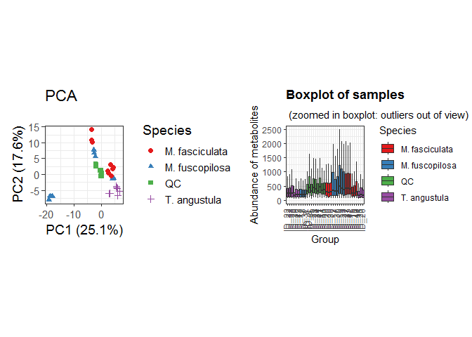<!-- -->

## Processing

We used probabilistic quotient normalization (PQN) with missing value
imputation and scaled using the autoscaling method for downstream
statistical analysis.

The code below imputes the data using a chromatographic noise value.

``` r
# Impute missing values using noise threshold
imputed <- impute_simple(compressed, value = 45, na_limit = 0)
```

We can inspect the data with the PCA plot after data imputation.

``` r
# Boxplot
imp_bp <- plot_sample_boxplots(imputed,
                               order_by = "Group",
                               fill_by = "Species")
# PCA
imp_pca <- plot_pca(imputed,
                    center = TRUE,
                    shape = "Species",
                    color = "Species")
# Plot
imp_pca + imp_bp
```

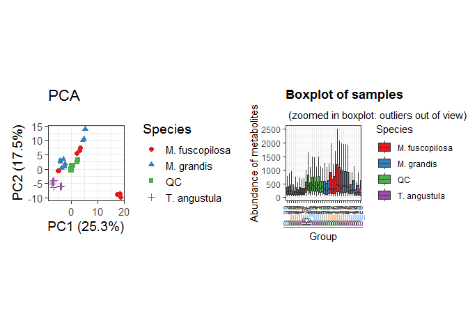<!-- -->

After data imputation, the data were normalized by PQN.

``` r
# Probabilistic quotient normalization
pqn_set <- pqn_normalization(imputed,
                             ref = c("qc", "all"),
                             method = c("median", "mean"),
                             all_features = FALSE)
```

    ## INFO [2026-08-12 23:31:14] Starting PQN normalization
    ## INFO [2026-08-12 23:31:14] Using median of qc samples as reference spectrum

We can inspect the data with the PCA plot after data normalization.

``` r
# Boxplot
pqn_bp <- plot_sample_boxplots(pqn_set,
                               order_by = "Group",
                               fill_by = "Species")
# PCA
pqn_pca <- plot_pca(pqn_set,
                    center = TRUE,
                    shape = "Species",
                    color = "Species")
# Plot
pqn_pca + pqn_bp
```

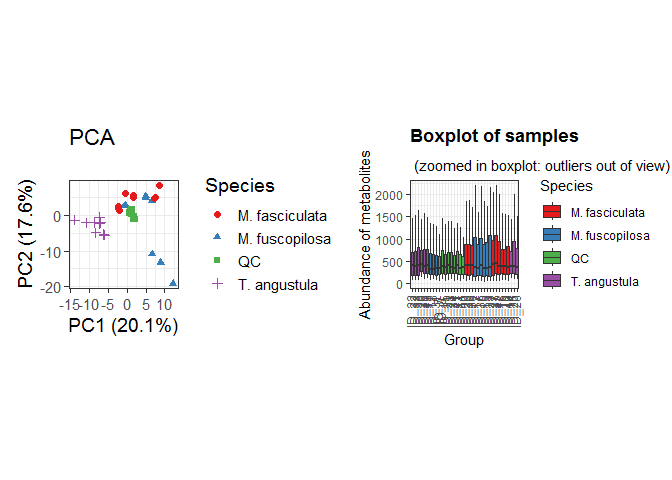<!-- -->

Finally, the data is ready to be exported and proceed with the
statistical analysis.

``` r
#save(compressed, file = paste0(ppath, "Result/notame_Result/HS_GCMS/Notame_HS_GC-MS_out.RData"))
```

# Principal component analysis (PCA)

Extracting the data and metadata of “*notame*” MetaboSet for principal
component analysis (PCA) plot.

``` r
# Extract clean data
pqn_noflag <- drop_flagged(pqn_set)
# Extracting feature height table
peak_height <- exprs(pqn_noflag)
# Extracting phenotypic data
pheno_data <- pqn_noflag@phenoData@data
```

Transposing the feature table and preparing the PCA data.

``` r
# Transposing feature height table
transp_table  <- t(peak_height)
# Centering and Scaling features
ei_pca <- prcomp(transp_table, center = TRUE, scale. = TRUE)
```

## Score PCA

Plotting PCA results.

``` r
# Library to left_join use
library(dplyr)
# PCA scores
scores <- ei_pca$x %>%                   # Get PC coordinates
  data.frame %>%                         # Convert to data frames
  mutate(Sample_ID = rownames(.)) %>%    # Create a new column with the sample names
  left_join(pheno_data)                  # Adding metadata
# PCA plot
pca_plot <- ggplot(scores,
       aes(PC1, PC2, shape = Species, color = Species)) +
  geom_point(size = 3) +
  scale_color_manual(values=c("#7CAE00",
                              "#F8766D",
                              "#00BFC4",
                              "#E76BF3")) +
  scale_shape_manual(values=c(17, 16, 15, 3)) +
  ggforce::geom_mark_ellipse(aes(filter = Species == "T. angustula"),
                             show.legend = FALSE, expand = unit(3, 'mm'),
                             tol = 0.01) +
  ggforce::geom_mark_ellipse(aes(filter = Species == "M. grandis"),
                             show.legend = FALSE, expand = unit(3.5, 'mm'),
                             tol = 0.01) +
  geom_text(aes(label = Site), hjust = 0, nudge_x = 0.55,
            check_overlap = TRUE, show.legend = FALSE) +
  guides(x=guide_axis(title = "PC1 (20.14 %)"),
         y=guide_axis(title = "PC2 (17.62 %)")) +
  labs(shape = 'Bees species', color= 'Bees species') +
  theme_classic() +
  theme(legend.text = element_text(face="italic")) +
  theme(legend.position = c(0.120, 0.230),
        legend.background = element_rect(fill = "white", color = "black")) +
  theme(panel.grid = element_blank(), 
        panel.border = element_rect(fill= "transparent")) +
  geom_vline(xintercept = 0, linetype = "longdash", colour="gray") +
  geom_hline(yintercept = 0, linetype = "longdash", colour="gray")
pca_plot
```

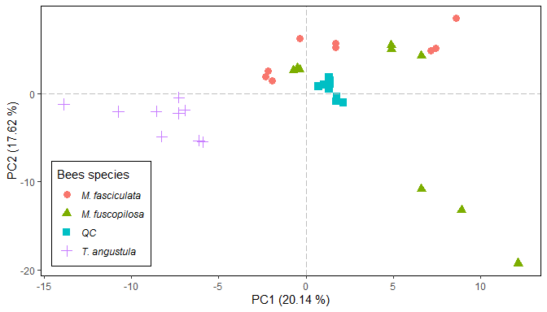<!-- -->

## Loading PCA

Plotting a loading PCA result.

``` r
loadings <- ei_pca$rotation %>%           # Extract loadings
  data.frame(Feature_ID = rownames(.))    # New column with feat name
```

Creating an artificial table with feature names and a column with
compound names (identified metabolites).

``` r
# Extracting feature identified
metab_data <- pqn_noflag[!is.na(pqn_noflag@featureData@data$Metabolite),]
# Extracting metabolite table
meta_table <- metab_data@featureData@data
# Creating a new small table of the annotated compounds
ei_compouds <- left_join(meta_table, loadings)
# Plotting results
load_pca <- ggplot(loadings, aes(PC1, PC2)) + 
  geom_point(alpha = 0.3, size = 2) +
  theme_classic() + 
  geom_point(data = ei_compouds,
             aes(shape = meta_table$IL,
                 color = meta_table$IL),
             size = 2.5) +
  labs(shape = 'Identification level',
       color = 'Identification level') +
  scale_color_manual(values = c("green",
                                "darkblue")) +
  scale_shape_manual(values = c(17, 19)) +
  ggrepel::geom_label_repel(data = ei_compouds,
                            aes(label = meta_table$Metabolite),
                            box.padding = 0.37,
                            label.padding = 0.22,
                            label.r = 0.30,
                            cex = 2.5,
                            max.overlaps = 50,
                            min.segment.length = 0) +
  guides(x=guide_axis(title = "PC1 (20.14 %)"),
         y=guide_axis(title = "PC2 (17.62 %)")) +
  theme(legend.position = c(0.075, 0.090),
        legend.background = element_rect(fill = "white", color = "black")) +
  theme(panel.grid = element_blank(), 
        panel.border = element_rect(fill= "transparent")) +
  geom_vline(xintercept = 0, linetype = "longdash", colour="gray") +
  geom_hline(yintercept = 0, linetype = "longdash", colour="gray")
  #ggsci::scale_color_aaas()
load_pca
```

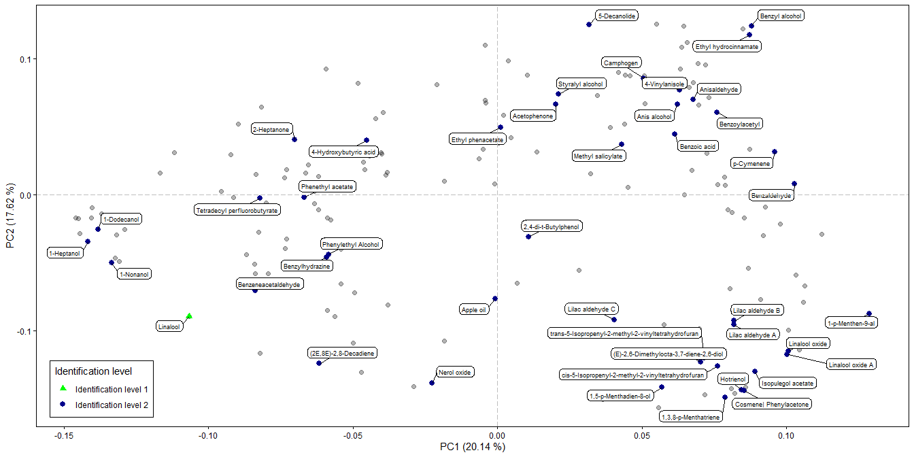<!-- -->

``` r
# Save plot in *.pdf
#ggsave(filename = '../Result/notame_Result/HS_GCMS/load_pca_4A.pdf', plot = load_pca, #width = 14, height = 7, dpi = 300, scale = 0.85)
# Save plot in *.png
#ggsave(filename = '../Result/notame_Result/HS_GCMS/load_pca_4A.png', plot = load_pca, #width = 14, height = 7, dpi = 300, scale = 0.85)
# Save plot in *.jpg
#ggsave(filename = '../Result/notame_Result/HS_GCMS/load_pca_4A.jpg', plot = load_pca, #width = 14, height = 7, dpi = 300, scale = 0.85)
```

# PERMANOVA

## Complete chemical profile

### PERMANOVA

``` r
# Drop QC
pqn_noqc <- drop_qcs(pqn_noflag)
# Extract the feature abundance
permanova_fa <- exprs(pqn_noqc)
# Extract the pheno data
permanova_pd <- pData(pqn_noqc)
permanova_pd$Species <- as.factor(permanova_pd$Species)
permanova_pd$Locality <- as.factor(permanova_pd$Locality)
permanova_pd$Site <- as.factor(permanova_pd$Site)
# Calculate distance matrix
dist_mat <- vegdist(t(permanova_fa), method = "euclidean")
# Implement PERMANOVA Global
permanova_result <- adonis2(dist_mat ~ Species + Locality,
                            data = permanova_pd,
                            permutations = 999,
                            by = "terms")
permanova_result
```

    ## Permutation test for adonis under reduced model
    ## Terms added sequentially (first to last)
    ## Permutation: free
    ## Number of permutations: 999
    ## 
    ## adonis2(formula = dist_mat ~ Species + Locality, data = permanova_pd, permutations = 999, by = "terms")
    ##          Df   SumOfSqs      R2      F Pr(>F)
    ## Species   2 7.2276e+11 0.09953 1.3394  0.164
    ## Locality  1 3.3301e+11 0.04586 1.2342  0.316
    ## Residual 23 6.2057e+12 0.85461              
    ## Total    26 7.2615e+12 1.00000

### Homogeneity of dispersions

``` r
# Test dispersion for Species
disp_sp <- betadisper(dist_mat, permanova_pd$Species)
permutest(disp_sp, permutations = 9999)
```

    ## 
    ## Permutation test for homogeneity of multivariate dispersions
    ## Permutation: free
    ## Number of permutations: 9999
    ## 
    ## Response: Distances
    ##           Df     Sum Sq    Mean Sq      F N.Perm Pr(>F)
    ## Groups     2 2.6754e+11 1.3377e+11 0.5597   9999 0.6617
    ## Residuals 24 5.7362e+12 2.3901e+11

``` r
# Test dispersion for Locality
disp_loc <- betadisper(dist_mat, permanova_pd$Locality)
permutest(disp_loc, permutations = 9999)
```

    ## 
    ## Permutation test for homogeneity of multivariate dispersions
    ## Permutation: free
    ## Number of permutations: 9999
    ## 
    ## Response: Distances
    ##           Df     Sum Sq    Mean Sq      F N.Perm Pr(>F)
    ## Groups     1 9.3349e+10 9.3349e+10 0.3923   9999 0.6135
    ## Residuals 25 5.9485e+12 2.3794e+11

## Annotated features

### PERMANOVA

``` r
# Extracting identified metabolite data
pqn_noqc_ids <- pqn_noqc[!is.na(pqn_noqc@featureData@data$Metabolite),]
# Removing the M. fuscopilosa site 9
#pqn_noqc_ids <- pqn_noqc_ids[, pqn_noqc_ids$Site != "9"]
#pData(pqn_noqc_ids) <- droplevels(pData(pqn_noqc_ids))
# Extract the feature abundance
permanova_fa_ids <- exprs(pqn_noqc_ids)
# Extract the pheno data
permanova_pd_ids <- pData(pqn_noqc_ids)
permanova_pd_ids$Species <- as.factor(permanova_pd_ids$Species)
permanova_pd_ids$Locality <- as.factor(permanova_pd_ids$Locality)
permanova_pd_ids$Site <- as.factor(permanova_pd_ids$Site)
# Calculate distance matrix
dist_mat_ids <- vegdist(t(permanova_fa_ids), method = "euclidean")
# Implement PERMANOVA Global
permanova_result_ids <- adonis2(dist_mat_ids ~ Species + Locality,
                            data = permanova_pd_ids,
                            permutations = 999,
                            by = "terms")
permanova_result_ids
```

    ## Permutation test for adonis under reduced model
    ## Terms added sequentially (first to last)
    ## Permutation: free
    ## Number of permutations: 999
    ## 
    ## adonis2(formula = dist_mat_ids ~ Species + Locality, data = permanova_pd_ids, permutations = 999, by = "terms")
    ##          Df   SumOfSqs      R2      F Pr(>F)  
    ## Species   2 4.5135e+11 0.22810 3.8620  0.019 *
    ## Locality  1 1.8342e+11 0.09269 3.1388  0.082 .
    ## Residual 23 1.3440e+12 0.67921                
    ## Total    26 1.9788e+12 1.00000                
    ## ---
    ## Signif. codes:  0 '***' 0.001 '**' 0.01 '*' 0.05 '.' 0.1 ' ' 1

### Pairwise PERMANOVA

``` r
# Pairwise PERMANOVA with FDR adjustment
pairwise_results_ids <- pairwise.adonis(x = t(permanova_fa_ids),
                                        factors = permanova_pd_ids$Species,
                                        sim.method = "euclidean",
                                        p.adjust.m = "fdr") # 'BH' o 'fdr'
pairwise_results_ids
```

    ##                            pairs Df    SumsOfSqs  F.Model        R2 p.value
    ## 1 T. angustula vs M. fuscopilosa  1 339139267173 3.573791 0.1825804   0.066
    ## 2     T. angustula vs M. grandis  1   6382682226 4.454113 0.2177612   0.002
    ## 3   M. fuscopilosa vs M. grandis  1 331503658394 3.504375 0.1796712   0.176
    ##   p.adjusted sig
    ## 1      0.099    
    ## 2      0.006   *
    ## 3      0.176

### Homogeneity of dispersions

``` r
# Test dispersion for Species
disp_sp_ids <- betadisper(dist_mat_ids, permanova_pd_ids$Species)
permutest(disp_sp, permutations = 9999)
```

    ## 
    ## Permutation test for homogeneity of multivariate dispersions
    ## Permutation: free
    ## Number of permutations: 9999
    ## 
    ## Response: Distances
    ##           Df     Sum Sq    Mean Sq      F N.Perm Pr(>F)
    ## Groups     2 2.6754e+11 1.3377e+11 0.5597   9999 0.6598
    ## Residuals 24 5.7362e+12 2.3901e+11

``` r
# Test dispersion for Locality
disp_loc_ids <- betadisper(dist_mat_ids, permanova_pd_ids$Locality)
permutest(disp_loc_ids, permutations = 9999)
```

    ## 
    ## Permutation test for homogeneity of multivariate dispersions
    ## Permutation: free
    ## Number of permutations: 9999
    ## 
    ## Response: Distances
    ##           Df     Sum Sq    Mean Sq      F N.Perm Pr(>F)   
    ## Groups     1 4.3005e+11 4.3005e+11 8.2234   9999 0.0046 **
    ## Residuals 25 1.3074e+12 5.2296e+10                        
    ## ---
    ## Signif. codes:  0 '***' 0.001 '**' 0.01 '*' 0.05 '.' 0.1 ' ' 1

# Heatmap with HCA

Only the annotated features were used in the heatmap and the
hierarchical cluster analysis (HCA). The ComplexHeatmap package will be
used for the heatmap and the hierarchical cluster analysis (HCA).

ComplexHeatmap package and dependency installation.

``` r
# ComplexHeatmap package installation
#if (!requireNamespace("BiocManager", quietly=TRUE))
#    install.packages("BiocManager")
#BiocManager::install("ComplexHeatmap")
library(ComplexHeatmap)

# ColorRamp2 package installation
#if (!requireNamespace("devtools", quietly = TRUE)) {
#  install.packages("devtools")
#}
#devtools::install_github("jokergoo/colorRamp2")
library(colorRamp2)

# Cowplot package installation
#install.packages("cowplot")
library(cowplot)

# mdatools package installation
#install_github('svkucheryavski/mdatools')
library(mdatools)

# ClassyFire package installation
#remotes::install_github('aberHRML/classyfireR')
library(classyfireR)
```

The metabolites were classified using the
[ClassyFireR](https://doi.org/10.1186/s13321-016-0174-y) to add these
metabolite classifications to the heatmap plot.

``` r
# InChI key of the metabolites you want to classify
InChI_Keys <- c('2-Heptanone' = "SJZRECIVHVDYJC-UHFFFAOYSA-N")
# Get classification
Classification_List <- purrr::map(InChI_Keys, get_classification)
Classification_List
```

Extracting and loading of identified metabolites’ abundance, and data
scaling by the autoscaling method.

``` r
# Drop QC
hm_no_qc <- drop_qcs(pqn_noflag)
# Scaling by autoscaling method
hm_scl <- scale(t(exprs(hm_no_qc)), center = TRUE, scale = TRUE)
hm_scl <- t(hm_scl)
# Adding autoscaling data to notame MetaboSet
hm_scl_set <- hm_no_qc
exprs(hm_scl_set) <- hm_scl
# Extracting identified metabolite data
raw_hm <- hm_scl_set[!is.na(hm_scl_set@featureData@data$Metabolite),]
# Extracting feature height table
hm_height <- exprs(raw_hm)
# Extracting sample information
hm_pdata <- raw_hm@phenoData@data
# Extracting feature information
hm_fdata <- raw_hm@featureData@data
```

Row and top heatmap annotation.

``` r
set.seed(1540)
# Adding row and column names
hm_scl <- hm_height
rownames(hm_scl) <- hm_fdata$Metabolite
colnames(hm_scl) <- hm_pdata$hm_name
# Metabolite class color
cols_metclass <- c("Organic oxygen compounds" = "#800000FF",
                   "Lipids and lipid-like molecules" = "#FFA319FF",
                   "Benzenoids" = "#8A9045FF",
                   "Organoheterocyclic compounds" = "#8DD3C7",
                   "Hydrocarbons" = "#BEBADA",
                   "Organohalogen compounds" = "#FFFFB3")
# Add row anotation to HeatMap
hm_row_ann <- rowAnnotation(`Superclass` = hm_fdata$classyfireR_Superclass,
                            col = list(`Superclass` = cols_metclass),
                            show_annotation_name = T,
                            show_legend = F)
# Species color
cols_species <- c("T. angustula" = "#E76BF3",
                  "M. grandis" = "#F8766D",
                  "M. fuscopilosa" = "#7CAE00")
# Add top anotation to Heatmap
top_info_ann <- HeatmapAnnotation(`Species` = hm_pdata$Species,
                                  col = list(`Species` = cols_species),
                                  show_annotation_name = T,
                                  show_legend = F,
                                  border = T)
# Color scale
mycol <- colorRamp2(c(-4, 0, 4), c("blue", "white", "red"))
# Heatmap matrix plotting
hm_plot <- Heatmap(hm_scl,
                   col = mycol,
                   border_gp = grid::gpar(col = "black", lty = 0.02),
                   rect_gp = grid::gpar(col = "black", lwd = 0.75),
                   clustering_distance_columns = "euclidean",
                   clustering_method_columns = "complete",
                   top_annotation = top_info_ann,
                   column_names_gp = gpar(fontface = "italic"),
                   row_names_max_width = unit(8, "cm"),
                   right_annotation = hm_row_ann,
                   show_heatmap_legend = F,
                   row_km = 3, column_km = 2,
                   row_title = c("a", "b", "c"))
hm_plot
```

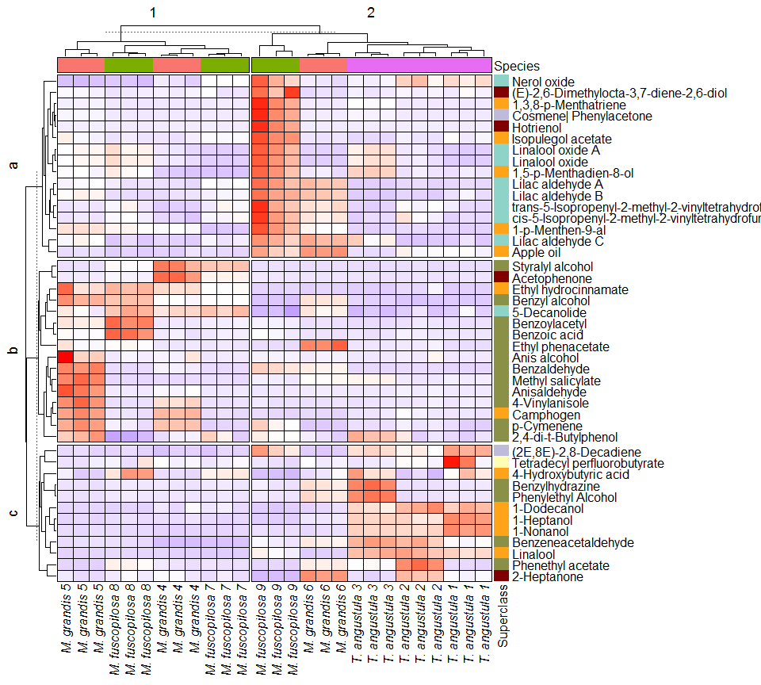<!-- -->

Adding legends to the heatmap.

``` r
# Color scale legend
lgd1 <- Legend(col_fun = mycol,
               title = "Autoscaled abundance",
               direction = "horizontal" )
# Bees species legend
lgd2 <- Legend(labels = gt_render(c("*T. angustula*",
                                    "*M. grandis*",
                                    "*M. fuscopilosa*")),
               legend_gp = gpar(fill = cols_species),
               title = "Bees species", ncol = 1)
# Metabolite class Legend
lgd3 <- Legend(labels = c(unique(hm_fdata$classyfireR_Superclass)) ,
               legend_gp = gpar(fill = cols_metclass), 
               title = "Metabolite superclass", ncol = 2)
```

Plotting the heatmap.

``` r
set.seed(1540)
# Converting to ggplot
gg_heatmap <- grid.grabExpr(draw(hm_plot))
gg_heatmap <- ggpubr::as_ggplot(gg_heatmap)
# Legends
all_legends <- packLegend(lgd1, lgd2, lgd3, direction = "horizontal")
gg_legend <- grid.grabExpr(draw(all_legends))
gg_legend_fn <- ggpubr::as_ggplot(gg_legend)
# Heatmap plot
gcms_hm <- plot_grid(gg_legend_fn,
                     gg_heatmap, ncol = 1,
                     rel_heights = c(0.055, 0.880))
gcms_hm
```

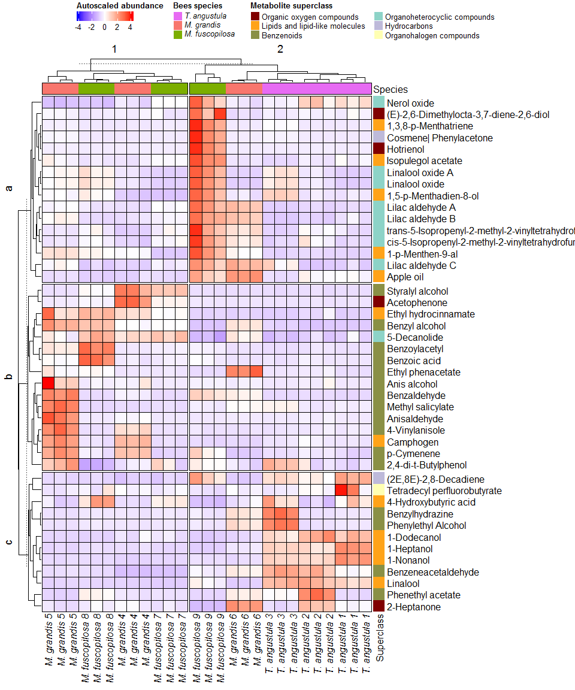<!-- -->

# Antimicrobial activity correlation

Correlation between feature abundance and antibacterial result (zone
inhibition diameter) using the PCA and Pearson’s correlation approaches.

## Using the PCA

Data and metadata preparation, merging the antimicrobial data with
feature abundance.

``` r
# Antimicrobial activity data extraction
bacteria_data <- drop_qcs(modes$na_na)
bacteria_data <- t(exprs(bacteria_data))
# Drop QCs of metabolomics data
no_qc <- drop_qcs(pqn_noflag)
# Extracting feature height table
corr_peak <- t(exprs(no_qc))
# Merge the antimicrobial activity result with the feature list table
bacteria_peak <- cbind(bacteria_data, corr_peak)
# Extracting phenotypic data of metabolomics data
corr_pdata <- no_qc@phenoData@data
```

### Score PCA

PCA scores calculation of the antimicrobial and feature abundance merge
data.

``` r
# Centering and Scaling features
corr_pca <- prcomp(bacteria_peak, center = TRUE, scale. = TRUE)
```

Plotting PCA score.

``` r
# PCA scores
corr_scores <- corr_pca$x %>%            # Get PC coordinates
  data.frame %>%                         # Convert to data frames
  mutate(Sample_ID = rownames(.)) %>%    # Create a new column with the sample names
  left_join(corr_pdata)                  # Adding metadata
# PCA plot
corr_pca_plot <- ggplot(corr_scores,
                        aes(PC1, PC2, shape = Species, color = Species)) +
  scale_color_manual(values=c("#7CAE00",
                              "#F8766D",
                              "#E76BF3")) +
  scale_shape_manual(values=c(17, 16, 3)) +
  geom_point(size = 3) +
  guides(x=guide_axis(title = "PC1 (22.46 %)"),
         y=guide_axis(title = "PC2 (18.82 %)")) +
  labs(shape = 'Bees species', color= 'Bees species') +
  theme_classic() +
  theme(legend.text = element_text(face="italic")) +
  theme(legend.position = c(0.120, 0.200),
        legend.background = element_rect(fill = "white", color = "black")) +
  theme(panel.grid = element_blank(), 
        panel.border = element_rect(fill= "transparent")) +
  geom_vline(xintercept = 0, linetype = "longdash", colour="gray") +
  geom_hline(yintercept = 0, linetype = "longdash", colour="gray")
corr_pca_plot
```

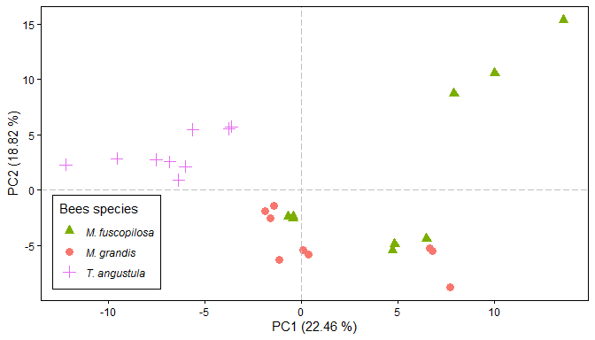<!-- -->

### Loading PCA

Plotting loading results.

``` r
corr_loadings <- corr_pca$rotation %>%    # Extract loadings
  data.frame(Feature_ID = rownames(.))    # New column with feat name
```

Creating an artificial table with feature names and a column with
compound names (identified metabolites).

``` r
# Extracting the antimicrobial metadata
bacteria_table <- drop_qcs(modes$na_na)@featureData@data
bacteria_table$Flag  <- as.character(bacteria_table$Flag)
# Merge the antimicrobial metadata with the metabolite table
corr_table <- merge(meta_table, bacteria_table, all = TRUE)
# Creating a new small table of the annotated compounds and antimicrobial metadata
corr_compouds <- left_join(corr_table, corr_loadings)
# Plotting results
corr_load_plot <- ggplot(corr_loadings, aes(PC1, PC2)) + 
  geom_point(alpha = 0.3, size = 2) +
  theme_classic() +
  geom_point(data = corr_compouds, aes(shape = corr_table$IL,
                                       color = corr_table$IL), size = 2.5) +
  labs(shape = 'Legend of features',
       color = 'Legend of features') +
  scale_color_manual(values = c("red",
                                "green",
                                "darkblue")) +
  scale_shape_manual(values = c(15, 17, 19)) +
  ggrepel::geom_label_repel(data = corr_compouds,
                            aes(label = corr_table$Metabolite,
                                fontface = ifelse(corr_table$IL == "Antimicrobial activity",
                                                  'italic', 'plain')),
                            box.padding = 0.37,
                            label.padding = 0.22,
                            label.r = 0.30,
                            cex = 3.5,
                            max.overlaps = 10,
                            min.segment.length = 0) +
  guides(x=guide_axis(title = "PC1 (22.46 %)"),
         y=guide_axis(title = "PC2 (18.82 %)")) +
  theme(legend.position = c(0.075, 0.127),
        legend.background = element_rect(fill = "white", color = "black")) +
  theme(panel.grid = element_blank(), 
        panel.border = element_rect(fill= "transparent")) +
  geom_vline(xintercept = 0, linetype = "longdash", colour="gray") +
  geom_hline(yintercept = 0, linetype = "longdash", colour="gray")
  #ggsci::scale_color_aaas()
corr_load_plot
```

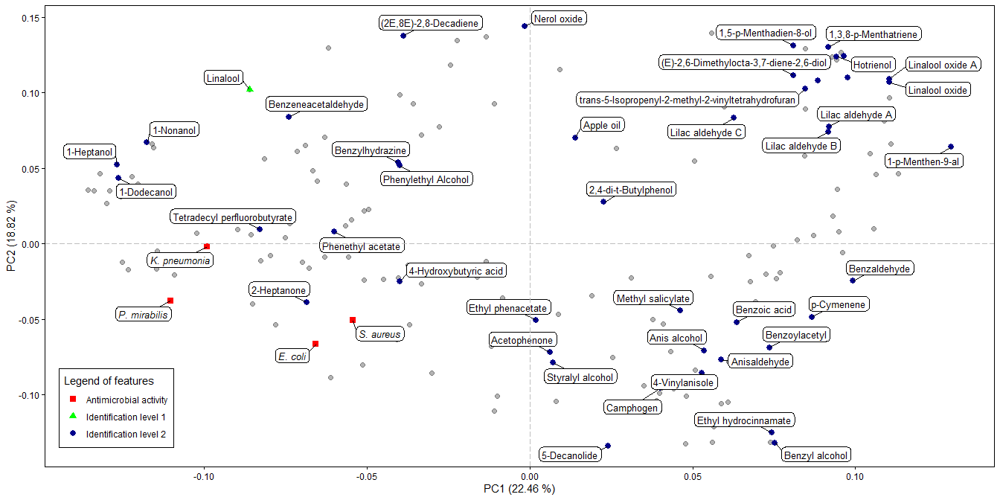<!-- -->

## Using the Pearson correlation

The Pearson correlation between antimicrobial activity and feature
abundance was performed.

### Normality of the antimicrobial data

First, the antimicrobial data normality was evaluated using the
Shapiro-Wilk test.

``` r
# Loading the "readxl" package
library(readxl)
# Loading the antimicrobial activity data
all_bacteria <- read_excel("../Data/Antimicrobial_of_honey.xlsx", sheet = 1)%>%
  group_by(Group) %>%
  # Average of each biological replicate
  summarise(across(where(is.numeric), mean, na.rm = TRUE))
# Deleting the group column to perform Shapiro-Wilk test in batch
no_group <- all_bacteria[,-1]
# Perform the Shapiro-Wilk test
shapiro <- do.call(rbind, lapply(no_group,
                                 function(x) shapiro.test(x)[c("statistic", "p.value")]))
shapiro
```

    ##                 statistic p.value   
    ## E_coli_100      0.8915633 0.2070348 
    ## E_coli_75       0.9183897 0.379074  
    ## K_pneumonia_50  0.9473022 0.6604825 
    ## K_pneumonia_75  0.9263017 0.4469454 
    ## K_pneumonia_100 0.8206819 0.03507457
    ## P_mirabilis_50  0.9100873 0.3164863 
    ## P_mirabilis_75  0.9536608 0.7302173 
    ## P_mirabilis_100 0.9216444 0.4060279 
    ## S_aureus_25     0.7900992 0.01573205
    ## S_aureus_50     0.9109186 0.322357  
    ## S_aureus_75     0.9074646 0.2985305 
    ## S_aureus_100    0.9054863 0.285548

The result showed that all microorganisms have a normal distribution
(p-value \> 0.05), excluding *K. pneumonia* tested with honey at 100 %
v/v, and *S. aureus* tested with honey at 25 % v/v.

The antimicrobial activity result of honey at 75 % v/v was used in the
further analysis because this concentration showed activity in most of
the tested microorganisms (*E. coli*, *K. pneumonia*, *P. mirabilis*,
and *S. aureus*).

### Metabolomics data transformation

Before the Pearson correlation of feature abundance with the
antimicrobial activity (zone inhibition diameter), the previously
normalized data by PQN was transformed using the generalised logarithm
(glog) method.

``` r
# "SummarizedExperiment" package installation
#if (!require("BiocManager", quietly = TRUE))
#    install.packages("BiocManager")
#BiocManager::install("SummarizedExperiment")
library(SummarizedExperiment)
# Convert feature height table to SummarizedExperiment class
pmp_data <- SummarizedExperiment(assays = exprs(pqn_noflag),
                                 colData = pqn_noflag@phenoData@data)
# Package for generalized logarithmic transform
#if (!requireNamespace("BiocManager", quietly = TRUE))
#    install.packages("BiocManager")
#BiocManager::install("pmp")
library(pmp)
# Generalised logarithmic transform
glog_exprs <- glog_transformation(df = pmp_data@assays@data@listData[[1]],
                                  classes = pmp_data$QC,
                                  qc_label = "QC")
# Adding glog transformation to notame MetaboSet
glog_set <- pqn_noflag
exprs(glog_set) <- glog_exprs
# Drop QCs
glog_no_qc <- drop_qcs(glog_set)
```

### Data prepartion

Before correlating metabolomics data with antimicrobial activity,
metabolomics and antimicrobial data were averaged across technical
replicates.

In the following code, the metabolics dataset was used to determine the
average of technical replication for each hive.

``` r
# Extract abundance data (feature abundance)
avrg_exprs <- exprs(glog_no_qc)
# Extract pheno data (sample information)
avrg_pd <- pData(glog_no_qc)
# Transposing the matrix (sample as row and column as feature/ions)
avrg_exprs <- t(avrg_exprs)
# Data matrix to DataFrame
avrg_exprs <- as.data.frame(avrg_exprs)
# Adding the group to the DataFrame
avrg_exprs$Group <- avrg_pd$Group
# Adding the sample ID to the DataFrame
avrg_exprs$Sample_ID <- avrg_pd$Sample_ID
# Calculating the average of the feature abundance
mean_honey <- avrg_exprs %>%
  group_by(Group) %>%
  summarise(across(dplyr::starts_with("RTX5MS_EI_"), ~ mean(.x, na.rm = TRUE)),
            across(everything(), dplyr::first),
            .groups = "drop")
# Preparing the data matrix to use as an exprs dataset (feature abundance)
mean_honey$Group <- NULL
rownames(mean_honey) <- mean_honey$Sample_ID
mean_honey <- t(mean_honey)
mean_honey <- mean_honey[rownames(mean_honey) != "Sample_ID", , drop = FALSE]
```

In the following code, the antimicrobial dataset was used to determine
the average of technical replication for each hive.

``` r
# Create a new pheno data dataframe using the target data
honey_pd <- data.frame(Sample_ID = avrg_pd$Sample_ID,
                       Group = avrg_pd$Group,
                       E_coli_75 = as.numeric(avrg_pd$E_coli_75),
                       K_pneumonia_75 = as.numeric(avrg_pd$K_pneumonia_75),
                       P_mirabilis_75 = as.numeric(avrg_pd$P_mirabilis_75),
                       S_aureus_75 = as.numeric(avrg_pd$S_aureus_75),
                       Species = avrg_pd$Species,
                       Visit = avrg_pd$Visit,
                       Injection_order = avrg_pd$Injection_order,
                       Datafile = avrg_pd$Datafile,
                       QC = avrg_pd$QC)
# Average calculation of antimicrobial activity by each hive
mean_pd <- honey_pd %>%
  group_by(Group) %>%
  summarise(Sample_ID = dplyr::first(Sample_ID),
            E_coli_75 = mean(E_coli_75, na.rm = TRUE),
            K_pneumonia_75 = mean(K_pneumonia_75, na.rm = TRUE),
            P_mirabilis_75 = mean(P_mirabilis_75, na.rm = TRUE),
            S_aureus_75 = mean(S_aureus_75, na.rm = TRUE),
            Species = dplyr::first(Species),
            Visit = dplyr::first(Visit),
            Injection_order = dplyr::first(Injection_order),
            Datafile = dplyr::first(Datafile),
            QC = dplyr::first(QC)) %>%
  relocate(Sample_ID, .before = everything())
mean_pd <- as.data.frame(mean_pd)
row.names(mean_pd) <- mean_pd$Sample_ID
```

The *notame* metaboset was constructed using the metabolomics and
antimicrobial datasets after averaging.

``` r
# Metaboset
mean_set <- construct_metabosets(exprs = mean_honey,
                                 pheno_data = mean_pd,
                                 feature_data = fData(glog_no_qc),
                                 group_col = "Group")
# Data extraction
mean_set <- mean_set$RTX5MS_EI
```

Perform the Pearson correlation analysis.

``` r
# Feature correlation with the E. coli antimicrobial activity
E.coli_corr <- perform_correlation_tests(mean_set,
                                         x = featureNames(mean_set),
                                         y = c("E_coli_75"),
                                         method = "pearson")
```

    ## INFO [2026-08-12 23:31:41] Starting correlation tests.
    ## INFO [2026-08-12 23:31:41] Correlation tests performed.

``` r
# Feature correlation with the K. pneumonia antimicrobial activity
K.pneumonia_corr <- perform_correlation_tests(mean_set,
                                              x = featureNames(mean_set),
                                              y = c("K_pneumonia_75"),
                                              method = "pearson")
```

    ## INFO [2026-08-12 23:31:41] Starting correlation tests.
    ## INFO [2026-08-12 23:31:41] Correlation tests performed.

``` r
# Feature correlation with the P. mirabilis antimicrobial activity
P.mirabilis_corr <- perform_correlation_tests(mean_set,
                                              x = featureNames(mean_set),
                                              y = c("P_mirabilis_75"),
                                              method = "pearson")
```

    ## INFO [2026-08-12 23:31:41] Starting correlation tests.
    ## INFO [2026-08-12 23:31:41] Correlation tests performed.

``` r
# Feature correlation with the S. aureus antimicrobial activity
S.aureus_corr <- perform_correlation_tests(mean_set,
                                           x = featureNames(mean_set),
                                           y = c("S_aureus_75"),
                                           method = "pearson")
```

    ## INFO [2026-08-12 23:31:41] Starting correlation tests.
    ## INFO [2026-08-12 23:31:42] Correlation tests performed.

### Correlation of identified metabolites

Create a matrix for the heatplot of Pearson’s correlation.

``` r
# Correlation table for the heatmap
hm_corr_table <- data.frame(Feature_ID = E.coli_corr$X,
                            E_coli = E.coli_corr$Correlation_coefficient,
                            K_pneumonia = K.pneumonia_corr$Correlation_coefficient,
                            P_mirabilis = P.mirabilis_corr$Correlation_coefficient,
                            S_aureus = S.aureus_corr$Correlation_coefficient)
# Feature data table
feat_corr_table <- data.frame(Feature_ID = hm_fdata$Feature_ID,
                             Metabolite = hm_fdata$Metabolite)
# Adding the metabolie name to the correlation table
hm_corr_table <- left_join(hm_corr_table, feat_corr_table)
# Extracting data of the identified metabolites
hm_corr_table <- hm_corr_table[!is.na(hm_corr_table$Metabolite),]
# Adding row name
rownames(hm_corr_table) <- hm_corr_table$Metabolite
# Delete extra information
hm_corr_table <- subset(hm_corr_table, select = -c(Feature_ID, Metabolite))
# Converting DataFrame to data matrix
hm_corr_table <- data.matrix(hm_corr_table, rownames.force = NA)
# Adding column name
colnames(hm_corr_table) <- c("E. coli", "K. pneumonia", "P. mirabilis", "S. aureus")
```

Create a matrix showing the statistical significance of the correlation
result.

``` r
# Correlation table for the heatmap
hm_sign_table <- data.frame(Feature_ID = E.coli_corr$X,
                            E_coli = E.coli_corr$Correlation_P,
                            K_pneumonia = K.pneumonia_corr$Correlation_P,
                            P_mirabilis = P.mirabilis_corr$Correlation_P,
                            S_aureus = S.aureus_corr$Correlation_P)
# Adding the metabolie name to the correlation table
hm_sign_table <- left_join(hm_sign_table, feat_corr_table)
# Extracting data of the identified metabolites
hm_sign_table <- hm_sign_table[!is.na(hm_sign_table$Metabolite),]
# Adding row name
rownames(hm_sign_table) <- hm_sign_table$Metabolite
# Delete extra information
hm_sign_table <- subset(hm_sign_table, select = -c(Feature_ID, Metabolite))
# Converting DataFrame to data matrix
hm_sign_table <- data.matrix(hm_sign_table, rownames.force = NA)
# Adding column name
colnames(hm_sign_table) <- c("E. coli", "K. pneumonia", "P. mirabilis", "S. aureus")
```

Plot the correlation heatplot.

``` r
# Add top anotation to Heatmap
ann_corr <- HeatmapAnnotation(
  foo = anno_block(gp = gpar(fill = 0, col = "white"),
                   labels = "Pearson\n correlation",
                   labels_gp = gpar(col = "black", fontsize = 12,
                                    fontface = "bold")))
# Color scale
col_fun <- colorRamp2(c(-1, 0, 1), c("blue", "white", "red"))
# Heatmap plot
hm_corr <- Heatmap(hm_corr_table, col = col_fun, cluster_rows = FALSE,
                   cluster_columns = FALSE, column_names_gp = gpar(fontface = "italic"),
                   right_annotation = hm_row_ann,
                   border_gp = grid::gpar(col = "black", lty = 0.02),
                   rect_gp = grid::gpar(col = "black", lwd = 0.75),
                   top_annotation = ann_corr,
                   cell_fun = function(j, i, x, y, w, h, fill) {
                     if(hm_sign_table[i, j] < 0.05) {
                       grid.text(sprintf("%.1f", hm_corr_table[i, j]), x, y,
                                 gp = gpar(fontsize = 8, fontface = "bold"))
                       } else if(hm_sign_table[i, j] > 0.05) {
                         grid.text(sprintf("%.1f", hm_corr_table[i, j]), x, y,
                                   gp = gpar(fontsize = 8))}},
                   show_heatmap_legend = F)
hm_corr
```

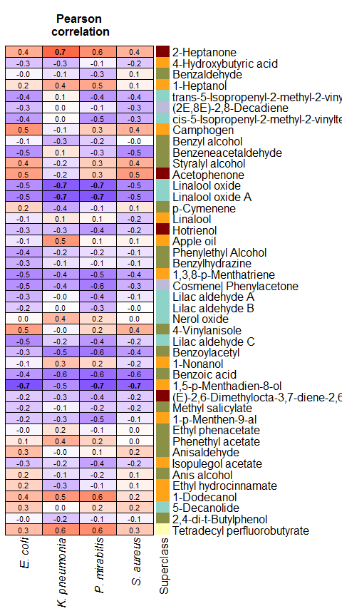<!-- -->

### Correlation of unknown metabolites

Filtering the metabolites with positive and high Pearson’s correlation
coefficient (r \>0.75).

``` r
# Library to change character values
library('stringr')
# Correlation table for the heatmap with the best features
best_feat <- data.frame(Feature_ID = E.coli_corr$X,
                        E_coli = E.coli_corr$Correlation_coefficient,
                        E_coli_p = E.coli_corr$Correlation_P,
                        K_pneumonia = K.pneumonia_corr$Correlation_coefficient,
                        K_pneumonia_p = K.pneumonia_corr$Correlation_P,
                        P_mirabilis = P.mirabilis_corr$Correlation_coefficient,
                        P_mirabilis_p = P.mirabilis_corr$Correlation_P,
                        S_aureus = S.aureus_corr$Correlation_coefficient,
                        S_aureus_p = S.aureus_corr$Correlation_P)
# Filtering the feature with the correlation >= 0.75
best_feat <- best_feat[best_feat$E_coli >= 0.75 |
                         best_feat$K_pneumonia >= 0.75 |
                         best_feat$P_mirabilis >= 0.75 |
                         best_feat$S_aureus >= 0.75, ]
# Adding the metabolite name to the correlation table
best_feat <- left_join(best_feat, feat_corr_table)
# Extracting data of no identified metabolites
best_feat <- best_feat[!complete.cases(best_feat$Metabolite),]
# Replace the column name and ionization type "RTX5MS_EI" with unknown
best_feat$Feature_ID <- sub('RTX5MS_EI_','Unknown-', best_feat$Feature_ID)
best_feat$Feature_ID <- str_replace_all(best_feat$Feature_ID, '_', '.')
```

Create a matrix for the heatplot of Pearson’s correlation.

``` r
# Correlation table for the heatmap
hm_corr_table1 <- data.frame(Feature_ID = best_feat$Feature_ID,
                             E_coli = best_feat$E_coli,
                             K_pneumonia = best_feat$K_pneumonia,
                             P_mirabilis = best_feat$P_mirabilis,
                             S_aureus = best_feat$S_aureus)
# Adding row name
rownames(hm_corr_table1) <- hm_corr_table1$Feature_ID
# Delete extra information
hm_corr_table1 <- subset(hm_corr_table1, select = -c(Feature_ID))
# Converting DataFrame to data matrix
hm_corr_table1 <- data.matrix(hm_corr_table1, rownames.force = NA)
# Adding column name
colnames(hm_corr_table1) <- c("E. coli", "K. pneumonia", "P. mirabilis", "S. aureus")
```

Create a matrix showing the statistical significance of the correlation
result.

``` r
# Correlation table for the heatmap
hm_sign_table1 <- data.frame(Feature_ID = best_feat$Feature_ID,
                             E_coli = best_feat$E_coli_p,
                             K_pneumonia = best_feat$K_pneumonia_p,
                             P_mirabilis = best_feat$P_mirabilis_p,
                             S_aureus = best_feat$S_aureus_p)
# Adding row name
rownames(hm_sign_table1) <- hm_sign_table1$Feature_ID
# Delete extra information
hm_sign_table1 <- subset(hm_sign_table1, select = -c(Feature_ID))
# Converting DataFrame to data matrix
hm_sign_table1 <- data.matrix(hm_sign_table1, rownames.force = NA)
# Adding column name
colnames(hm_sign_table1) <- c("E. coli", "K. pneumonia", "P. mirabilis", "S. aureus")
```

Plot the correlation heatplot.

``` r
# Color scale legend
lgd1a <- Legend(col_fun = col_fun,
                title = "Correlation coefficient",
                direction = "horizontal" )
# Packed legends
pd = packLegend(lgd1a, direction = "horizontal")
# Heatmap plot
#png(file="../Result/notame_Result/HS_GCMS/FigureA1_noFDR.png", width = 5,
#height = 4, units = "in", res= 300)
hm_corr1 <- Heatmap(hm_corr_table1, col = col_fun, cluster_rows = FALSE,
                   cluster_columns = FALSE, column_names_gp = gpar(fontface = "italic"),
                   border_gp = grid::gpar(col = "black", lty = 0.02),
                   rect_gp = grid::gpar(col = "black", lwd = 0.75),
                   top_annotation = ann_corr,
                   cell_fun = function(j, i, x, y, w, h, fill) {
                     if(hm_sign_table1[i, j] < 0.05) {
                       grid.text(sprintf("%.1f", hm_corr_table1[i, j]), x, y,
                                 gp = gpar(fontsize = 10, fontface = "bold"))
                       } else if(hm_sign_table1[i, j] > 0.05) {
                         grid.text(sprintf("%.1f", hm_corr_table1[i, j]), x, y,
                                   gp = gpar(fontsize = 10))}},
                   show_heatmap_legend = F)
hm_corr1
draw(pd, x = unit(7.5, "cm"), y = unit(1, "cm"), just = c("left", "bottom"))
```

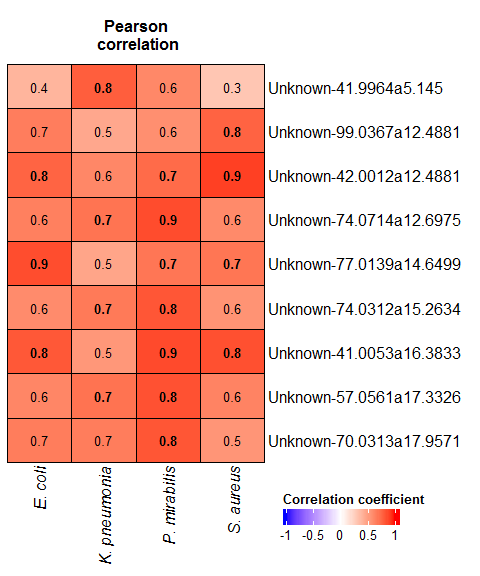<!-- -->

``` r
#dev.off()
```

# UpSet plot

The UpSet plot was implemented to inspect the unique or shared features
of the honeys from each bee species and collection site (beehive).

``` r
# Mean of technical replicate
upset_aver <- summary_statistics(compressed, grouping_cols = "Group")
# Dataframe with average values by the collection sites (beehive)
upset_mat <- data.frame(Feature_ID = upset_aver$Feature_ID,
                        ata001 = upset_aver$ATA001_mean,
                        er001 = upset_aver$ER001_mean,
                        fied001 = upset_aver$FIED001_mean,
                        rgb004 = upset_aver$RGB004_mean,
                        rgy001 = upset_aver$RGY001_mean,
                        rig003 = upset_aver$RIG003_mean,
                        rig005 = upset_aver$RIG005_mean,
                        rymg001 = upset_aver$RYMG001_mean,
                        ryta006 = upset_aver$RYTA006_mean)
# Adding rownames
row.names(upset_mat) <- upset_mat$Feature_ID
upset_mat$Feature_ID <- NULL
# Adding colnames
colnames(upset_mat) <- c("T. angustula ATA001",
                         "T. angustula ER001",
                         "M. fuscopilosa FIED001",
                         "M. grandis RGB004",
                         "M. fuscopilosa RGY001",
                         "M. fuscopilosa RIG003",
                         "M. grandis RIG005",
                         "M. grandis RYMG001",
                         "T. angustula RYTA006")
# Change the values by presence using one (1) or absence using 0
upset_mat[upset_mat > 0] <- 1       # presence 
upset_mat[is.na(upset_mat)] <- 0    # absence
# Make the combination matrix
comb_mat = make_comb_mat(upset_mat)
#png(file="Result/notame_Result/HS_GCMS/FigureA2_1.png", width = 7, height = 3.5, units = "in", res= 300)
upset_plot <- UpSet(comb_mat,
                    row_names_gp = gpar(fontsize = 10, fontface = "italic"),
                    top_annotation =
                      upset_top_annotation(comb_mat,
                                           gp = gpar(fill = "#F8766D",
                                                     col = "#F8766D"),
                                           add_numbers = TRUE,
                                           annotation_name_rot = 90,),
                    right_annotation =
                      upset_right_annotation(comb_mat,
                                             gp = gpar(fill = "#1C6AA8",
                                                     col = "#1C6AA8"),
                                             add_numbers = TRUE),
                    set_order = c("T. angustula ATA001",
                                  "T. angustula ER001",
                                  "T. angustula RYTA006",
                                  "M. fuscopilosa FIED001",
                                  "M. fuscopilosa RGY001",
                                  "M. fuscopilosa RIG003",
                                  "M. grandis RGB004",
                                  "M. grandis RIG005",
                                  "M. grandis RYMG001"))
#pdf(file="Result/notame_Result/HS_GCMS/FigureA2.pdf", width = 7, height = 3.5)
upset_plot
```

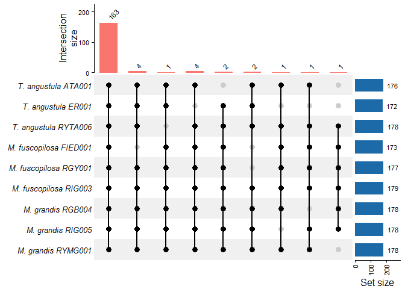<!-- -->

``` r
#dev.off()
```

Finish a record.

``` r
finish_log()
```

    ## INFO [2026-08-12 23:31:45] Finished analysis. Wed Aug 12 23:31:45 2026
    ## Session info:
    ## 
    ## INFO [2026-08-12 23:31:45] R version 4.4.1 (2024-06-14 ucrt)
    ## INFO [2026-08-12 23:31:45] Platform: x86_64-w64-mingw32/x64
    ## INFO [2026-08-12 23:31:45] Running under: Windows 7 x64 (build 7601) Service Pack 1
    ## INFO [2026-08-12 23:31:45] 
    ## INFO [2026-08-12 23:31:45] Matrix products: default
    ## INFO [2026-08-12 23:31:45] 
    ## INFO [2026-08-12 23:31:45] 
    ## INFO [2026-08-12 23:31:45] locale:
    ## INFO [2026-08-12 23:31:45] [1] LC_COLLATE=English_United States.1252 
    ## INFO [2026-08-12 23:31:45] [2] LC_CTYPE=English_United States.1252   
    ## INFO [2026-08-12 23:31:45] [3] LC_MONETARY=English_United States.1252
    ## INFO [2026-08-12 23:31:45] [4] LC_NUMERIC=C                          
    ## INFO [2026-08-12 23:31:45] [5] LC_TIME=English_United States.1252    
    ## INFO [2026-08-12 23:31:45] 
    ## INFO [2026-08-12 23:31:45] time zone: America/Guayaquil
    ## INFO [2026-08-12 23:31:45] tzcode source: internal
    ## INFO [2026-08-12 23:31:45] 
    ## INFO [2026-08-12 23:31:45] attached base packages:
    ## INFO [2026-08-12 23:31:45] [1] stats4    grid      stats     graphics  grDevices utils     datasets 
    ## INFO [2026-08-12 23:31:45] [8] methods   base     
    ## INFO [2026-08-12 23:31:45] 
    ## INFO [2026-08-12 23:31:45] other attached packages:
    ## INFO [2026-08-12 23:31:45]  [1] stringr_1.5.1               pmp_1.14.1                 
    ## INFO [2026-08-12 23:31:45]  [3] SummarizedExperiment_1.34.0 GenomicRanges_1.56.0       
    ## INFO [2026-08-12 23:31:45]  [5] GenomeInfoDb_1.40.1         IRanges_2.38.0             
    ## INFO [2026-08-12 23:31:45]  [7] S4Vectors_0.42.0            MatrixGenerics_1.16.0      
    ## INFO [2026-08-12 23:31:45]  [9] matrixStats_1.3.0           readxl_1.4.3               
    ## INFO [2026-08-12 23:31:45] [11] classyfireR_0.3.8           mdatools_0.14.2            
    ## INFO [2026-08-12 23:31:45] [13] cowplot_1.1.3               colorRamp2_0.1.0           
    ## INFO [2026-08-12 23:31:45] [15] ComplexHeatmap_2.20.0       dplyr_1.1.4                
    ## INFO [2026-08-12 23:31:45] [17] patchwork_1.3.0             pairwiseAdonis_0.4.1       
    ## INFO [2026-08-12 23:31:45] [19] cluster_2.1.6               vegan_2.7-1                
    ## INFO [2026-08-12 23:31:45] [21] permute_0.9-8               notame_0.3.1               
    ## INFO [2026-08-12 23:31:45] [23] magrittr_2.0.3              ggplot2_4.0.1              
    ## INFO [2026-08-12 23:31:45] [25] futile.logger_1.4.3         Biobase_2.64.0             
    ## INFO [2026-08-12 23:31:45] [27] BiocGenerics_0.54.0         generics_0.1.3             
    ## INFO [2026-08-12 23:31:45] 
    ## INFO [2026-08-12 23:31:45] loaded via a namespace (and not attached):
    ## INFO [2026-08-12 23:31:45]   [1] RColorBrewer_1.1-3      sys_3.4.2               rstudioapi_0.16.0      
    ## INFO [2026-08-12 23:31:45]   [4] jsonlite_1.8.8          shape_1.4.6.1           farver_2.1.2           
    ## INFO [2026-08-12 23:31:45]   [7] rmarkdown_2.27          zlibbioc_1.50.0         GlobalOptions_0.1.2    
    ## INFO [2026-08-12 23:31:45]  [10] fs_1.6.4                vctrs_0.6.5             memoise_2.0.1          
    ## INFO [2026-08-12 23:31:45]  [13] askpass_1.2.0           rstatix_0.7.2           itertools_0.1-3        
    ## INFO [2026-08-12 23:31:45]  [16] S4Arrays_1.4.1          htmltools_0.5.8.1       usethis_2.2.3          
    ## INFO [2026-08-12 23:31:45]  [19] missForest_1.5          lambda.r_1.2.4          curl_5.2.1             
    ## INFO [2026-08-12 23:31:45]  [22] broom_1.0.6             cellranger_1.1.0        SparseArray_1.4.8      
    ## INFO [2026-08-12 23:31:45]  [25] plyr_1.8.9              impute_1.80.0           futile.options_1.0.1   
    ## INFO [2026-08-12 23:31:45]  [28] cachem_1.1.0            commonmark_1.9.1        igraph_2.0.3           
    ## INFO [2026-08-12 23:31:45]  [31] lifecycle_1.0.4         iterators_1.0.14        pkgconfig_2.0.3        
    ## INFO [2026-08-12 23:31:45]  [34] Matrix_1.7-0            R6_2.5.1                fastmap_1.2.0          
    ## INFO [2026-08-12 23:31:45]  [37] GenomeInfoDbData_1.2.12 clue_0.3-65             digest_0.6.36          
    ## INFO [2026-08-12 23:31:45]  [40] pcaMethods_1.96.0       colorspace_2.1-0        RSQLite_2.3.7          
    ## INFO [2026-08-12 23:31:45]  [43] ggpubr_0.6.0            labeling_0.4.3          randomForest_4.7-1.1   
    ## INFO [2026-08-12 23:31:45]  [46] fansi_1.0.6             httr_1.4.7              polyclip_1.10-7        
    ## INFO [2026-08-12 23:31:45]  [49] abind_1.4-5             mgcv_1.9-1              compiler_4.4.1         
    ## INFO [2026-08-12 23:31:45]  [52] rngtools_1.5.2          bit64_4.0.5             withr_3.0.0            
    ## INFO [2026-08-12 23:31:45]  [55] doParallel_1.0.17       S7_0.2.1                backports_1.5.0        
    ## INFO [2026-08-12 23:31:45]  [58] carData_3.0-5           DBI_1.2.3               highr_0.11             
    ## INFO [2026-08-12 23:31:45]  [61] ggforce_0.5.0           ggsignif_0.6.4          MASS_7.3-60.2          
    ## INFO [2026-08-12 23:31:45]  [64] openssl_2.2.0           DelayedArray_0.30.1     rjson_0.2.21           
    ## INFO [2026-08-12 23:31:45]  [67] tools_4.4.1             zip_2.3.1               glue_1.8.0             
    ## INFO [2026-08-12 23:31:45]  [70] nlme_3.1-164            gridtext_0.1.5          reshape2_1.4.4         
    ## INFO [2026-08-12 23:31:45]  [73] gtable_0.3.6            tidyr_1.3.1             XVector_0.44.0         
    ## INFO [2026-08-12 23:31:45]  [76] xml2_1.3.6              car_3.1-2               utf8_1.2.4             
    ## INFO [2026-08-12 23:31:45]  [79] ggrepel_0.9.5           foreach_1.5.2           pillar_1.9.0           
    ## INFO [2026-08-12 23:31:45]  [82] markdown_1.13           circlize_0.4.16         splines_4.4.1          
    ## INFO [2026-08-12 23:31:45]  [85] tweenr_2.0.3            lattice_0.22-6          bit_4.0.5              
    ## INFO [2026-08-12 23:31:45]  [88] tidyselect_1.2.1        knitr_1.47              xfun_0.45              
    ## INFO [2026-08-12 23:31:45]  [91] credentials_2.0.1       UCSC.utils_1.0.0        stringi_1.8.4          
    ## INFO [2026-08-12 23:31:45]  [94] yaml_2.3.8              evaluate_0.24.0         codetools_0.2-20       
    ## INFO [2026-08-12 23:31:45]  [97] tibble_3.2.1            cli_3.6.3               Rcpp_1.0.12            
    ## INFO [2026-08-12 23:31:45] [100] gert_2.0.1              png_0.1-8               parallel_4.4.1         
    ## INFO [2026-08-12 23:31:45] [103] blob_1.2.4              doRNG_1.8.6             viridisLite_0.4.2      
    ## INFO [2026-08-12 23:31:45] [106] scales_1.4.0            openxlsx_4.2.8          purrr_1.0.2            
    ## INFO [2026-08-12 23:31:45] [109] crayon_1.5.3            clisymbols_1.2.0        GetoptLong_1.0.5       
    ## INFO [2026-08-12 23:31:45] [112] rlang_1.1.4             formatR_1.14
