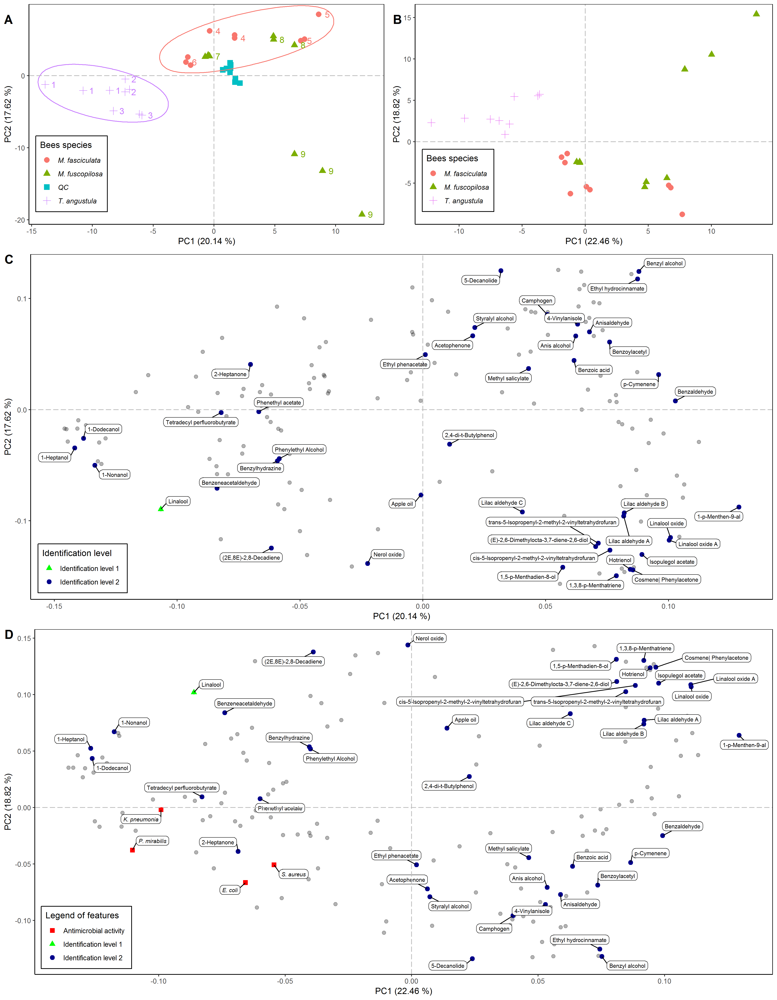
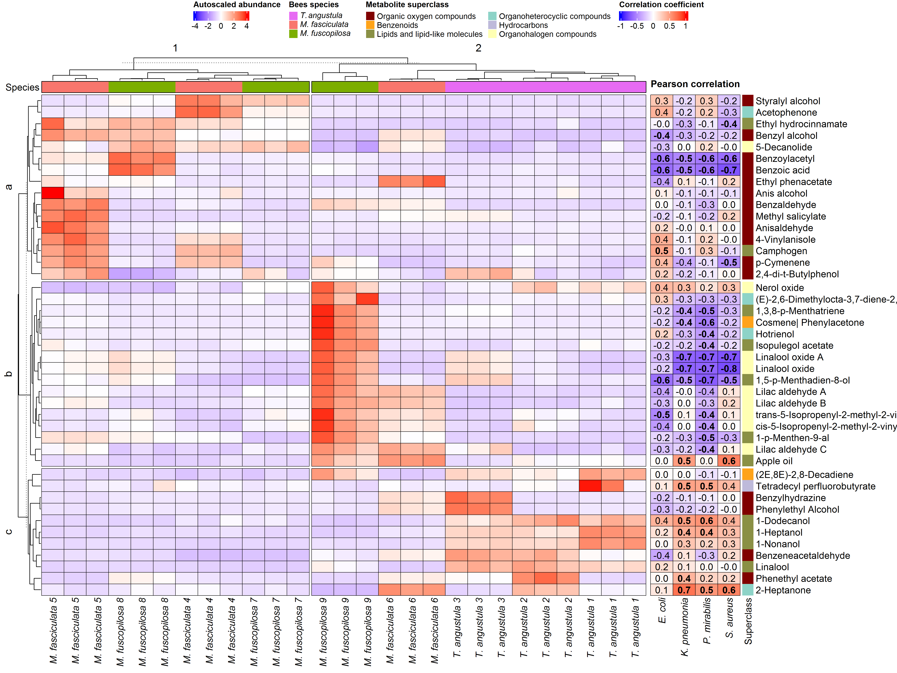

# About this repository

The present document aims to record the procedure given for the statistical analysis and spectral deconvolution of secondary metabolites present in honeys from three different stingless bee species (*Melipona fasciculata*, *Melipona fuscopilosa*, and *Tetragonisca angustula*). For each step, a brief explanation, the code, and the graphics obtained are included.

# Analysis Notebooks

- [GC-MS in-house library](https://github.com/IKIAM-NPLab/I_guayusa_volatilome/blob/main/Noteboks/in-house_Library.md)
- [GC-MS spectral deconvolution](https://github.com/IKIAM-NPLab/Amazonia_Honey/blob/main/Notebooks/HS_GCMS_Spectral_Deconvolution.md)
- [Statistical analysis](https://github.com/IKIAM-NPLab/Amazonia_Honey/blob/main/Notebooks/HS_GCMS_Multivariate_Statistics.md)
- [Antimicrobial analysis](https://github.com/IKIAM-NPLab/Amazonia_Honey/blob/main/Notebooks/Antimicrobial_activity-Statistics.md)

# Useful results

## PCA analysis

PCA analysis of chemical profile only (A and C), and PCA analysis of chemical profile with antimicrobial activity (B and D).

## Heatmap with HCA

Heatmap of the annotated features, and heatplot of feature abundance correlation with antimicrobial activity (zone inhibition diameter).

